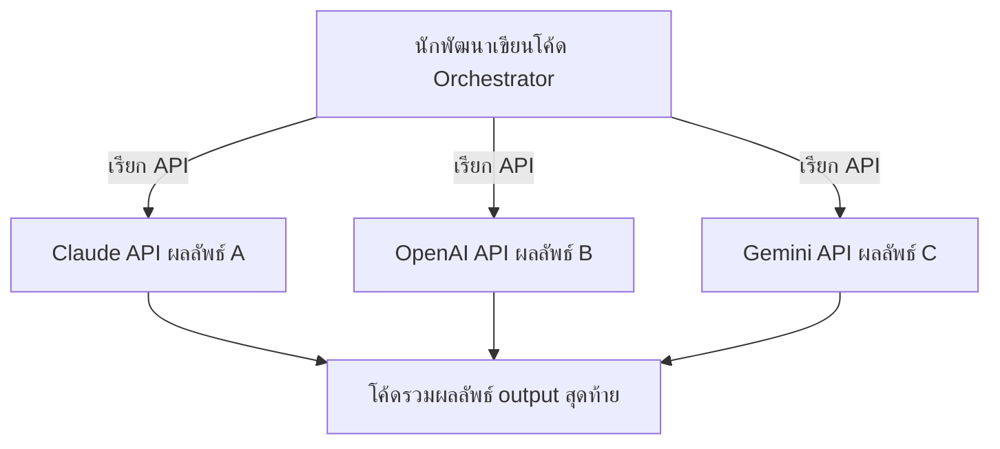

---
tags:
  - claude-code
  - multi-provider
  - architecture
  - limitations
type: note
status: draft
created: "2026-04-09"
source: "https://code.claude.com/docs/en/agent-teams"
parent_note: "[[Claude Code - Multi-Agent MOC]]"
---

# Multi-Provider AI — ความจริงที่ต้องรู้

---

## ❌ สิ่งที่ทำไม่ได้ตอนนี้

AI ต่างเจ้า **ส่งข้อความหากันโดยตรงไม่ได้** — Claude, GPT-4, Gemini ไม่มี protocol มาตรฐานสำหรับ agent-to-agent communication ข้ามเจ้า

```
❌ Claude → GPT-4    ← ทำไม่ได้โดยตรง
❌ Gemini → Claude   ← ทำไม่ได้โดยตรง
```

ระบบที่ **agent คุยกันเองได้จริงๆ** ตอนนี้คือ **Claude Code Agent Teams เท่านั้น**

---

## ✅ Multi-Provider ที่ทำได้จริง

ผ่าน **โค้ดหรือ API เป็นตัวกลาง** — AI แต่ละเจ้าทำงานแยกกัน ไม่รู้จักกัน โค้ดที่นักพัฒนาเขียนเป็นคนประสาน



---

## เปรียบเทียบ

| | Claude Code Agent Teams | Multi-Provider (ผ่านโค้ด) |
|---|---|---|
| **Agent คุยกันได้** | ✅ โดยตรง (mailbox) | ❌ ต้องผ่านโค้ดตัวกลาง |
| **Model ที่ใช้** | Claude เท่านั้น | ใช้ได้ทุกเจ้า |
| **ตั้งค่า** | Natural language | เขียนโค้ด API calls เอง |
| **Status** | Experimental | ขึ้นอยู่กับโค้ดที่เขียน |

---

## พื้นฐานทฤษฎีที่เกี่ยวข้อง

- [[02 AI Systems/AI Agent Fundamentals/12 - LLM พื้นฐาน|LLM พื้นฐาน]] — รายชื่อ LLM ต่างเจ้า (GPT-4, Llama, Gemini, Claude) และความแตกต่างด้านสถาปัตยกรรม
