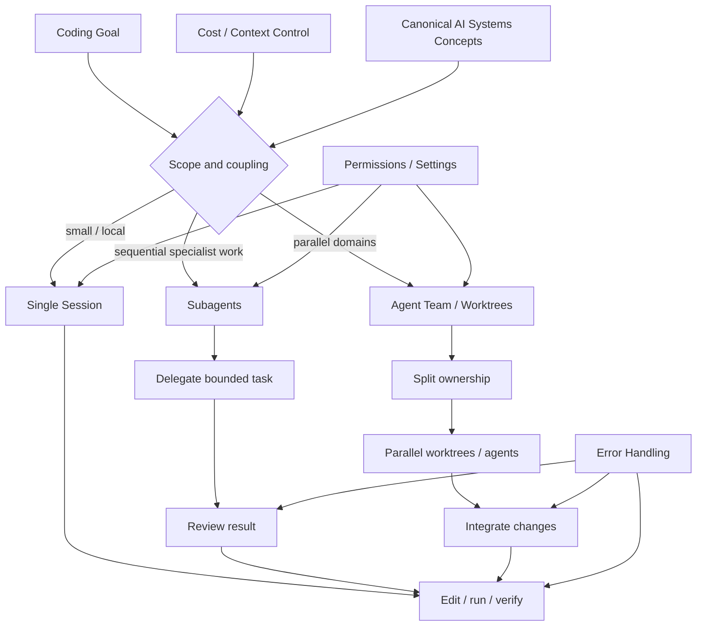

---
tags:
  - claude-code
  - multi-agent
  - ai-tools
  - anthropic
  - moc
type: moc
status: evergreen
created: "2026-04-09"
source: "https://code.claude.com/docs/en/overview · https://code.claude.com/docs/en/agent-teams · https://code.claude.com/docs/en/sub-agents"
parent_note: "[[Home]]"
---

# Claude Code - Multi-Agent MOC

---

## 📌 ภาพรวม

Claude Code คือ **CLI tool** จาก Anthropic สำหรับ agentic coding และ multi-agent workflows ตามเอกสารทางการของ Claude Code

---

## Claude Code Multi-Agent Workflow Map

หมายเหตุ: diagram นี้เป็น `version-sensitive` เพราะผูกกับ behavior, settings, permissions, และ workflow ของ Claude Code ที่อาจเปลี่ยนตาม release



ภาพนี้วาง Claude Code เป็น tooling layer สำหรับเลือกวิธีทำงาน ไม่ใช่ canonical theory ของ agents เอง ถ้าเป็น concept หลักให้กลับไป `AI Agent Fundamentals`, `Agent Frameworks`, `Guardrails`, หรือ `Evals` ก่อน แล้วใช้หน้านี้เป็น workflow/tool reference.

---

## 🗂️ Notes ในชุดนี้

### พื้นฐาน
- [[03 Tools/Claude Code/Core/01 - Claude Code คืออะไร|01 - Claude Code คืออะไร]]
- [[03 Tools/Claude Code/Core/02 - เปรียบเทียบ Agentic Coding Tools|02 - เปรียบเทียบ Agentic Coding Tools]]
- [[03 Tools/Claude Code/Core/03 - Orchestrator Pattern|03 - Orchestrator Pattern]]

### สถาปัตยกรรม Agent
- [[03 Tools/Claude Code/Workflow/04 - 1 Session vs Subagents vs Agent Teams|04 - 1 Session vs Subagents vs Agent Teams]]
- [[03 Tools/Claude Code/Core/05 - รูปแบบการใช้งาน Multi-Agent|05 - รูปแบบการใช้งาน Multi-Agent]]
- [[03 Tools/Claude Code/Core/06 - การควบคุมต้นทุน|06 - การควบคุมต้นทุน]]

### การติดตั้งและตั้งค่า
- [[03 Tools/Claude Code/Reference/07 - การติดตั้งและเริ่มใช้งาน|07 - การติดตั้งและเริ่มใช้งาน]]
- [[03 Tools/Claude Code/Reference/08 - Display Mode (In-Process vs Split Panes)|08 - Display Mode (In-Process vs Split Panes)]]
- [[03 Tools/Claude Code/Reference/09 - Permissions และ Settings|09 - Permissions และ Settings]]
- [[03 Tools/Claude Code/Reference/10 - Session Management และ Commands|10 - Session Management และ Commands]]

### การสร้าง Agent
- [[03 Tools/Claude Code/Reference/11 - โครงสร้างโฟลเดอร์ .claude|11 - โครงสร้างโฟลเดอร์ .claude]]
- [[03 Tools/Claude Code/Reference/12 - CLAUDE File|CLAUDE.md]]
- [[03 Tools/Claude Code/Reference/13 - Custom Commands|13 - Custom Commands]]
- [[03 Tools/Claude Code/Reference/14 - Built-in Subagents|14 - Built-in Subagents]]
- [[03 Tools/Claude Code/Reference/15 - สร้าง Subagent ด้วย agents|15 - สร้าง Subagent ด้วย agents]]
- [[03 Tools/Claude Code/Core/16 - บทบาท Frontend, Backend, QA|16 - บทบาท Frontend, Backend, QA]]

### ลงมือทำ
- [[03 Tools/Claude Code/Workflow/17 - Agent Tool|17 - Agent Tool]]
- [[03 Tools/Claude Code/Workflow/18 - Git Worktree|18 - Git Worktree]]
- [[03 Tools/Claude Code/Workflow/19 - วิธีเริ่ม Agent Team|19 - วิธีเริ่ม Agent Team]]
- [[03 Tools/Claude Code/Core/20 - Multi-Provider AI|20 - Multi-Provider AI]]
- [[03 Tools/Claude Code/Core/21 - กรณีศึกษา|21 - กรณีศึกษา]]
- [[03 Tools/Claude Code/Workflow/22 - Error Handling|22 - Error Handling]]
- [[03 Tools/Claude Code/Workflow/23 - ข้อจำกัด Agent Teams|ข้อจำกัด]]

### Quick Reference
- [[03 Tools/Claude Code/Workflow/24 - Best Practices & Checklist|24 - Best Practices & Checklist]]

### Architecture Deep Dive (จาก source code analysis)
- [[03 Tools/Claude Code/Core/25 - Context Compaction Pipeline|25 - Context Compaction Pipeline]]
- [[03 Tools/Claude Code/Core/26 - Extensibility Mechanisms|26 - Extensibility Mechanisms]]
- [[03 Tools/Claude Code/Core/27 - Claude Code vs OpenClaw|27 - Claude Code vs OpenClaw]]
- [[03 Tools/Claude Code/Core/28 - Session Persistence and Recovery|28 - Session Persistence and Recovery]]

---

## Related Hubs

- [[04 Synthesis/Synthesis - MOC|Synthesis - MOC]]
- [[05 Use Cases/Use Cases - MOC|Use Cases - MOC]]
- [[02 AI Systems/AI Agent Fundamentals/AI Agent Fundamentals - MOC|AI Agent Fundamentals - MOC]]
- [[02 AI Systems/Agent Frameworks/Agent Frameworks - MOC|Agent Frameworks - MOC]]
- [[02 AI Systems/Guardrails/Guardrails - MOC|Guardrails - MOC]]
- [[02 AI Systems/Evals/Evals - MOC|Evals - MOC]]
- [[06 Engineering/Engineering - MOC|Engineering - MOC]]
- [[Knowledge Topic Registry]]

---

## Stable Concepts

หมวดนี้ควรอ่านเป็นแนวคิดและ workflow ที่ค่อนข้างนิ่ง

- [[03 Tools/Claude Code/Core/01 - Claude Code คืออะไร|01 - Claude Code คืออะไร]]
- [[03 Tools/Claude Code/Core/02 - เปรียบเทียบ Agentic Coding Tools|02 - เปรียบเทียบ Agentic Coding Tools]]
- [[03 Tools/Claude Code/Core/03 - Orchestrator Pattern|03 - Orchestrator Pattern]]
- [[03 Tools/Claude Code/Core/05 - รูปแบบการใช้งาน Multi-Agent|05 - รูปแบบการใช้งาน Multi-Agent]]
- [[03 Tools/Claude Code/Core/06 - การควบคุมต้นทุน|06 - การควบคุมต้นทุน]]
- [[03 Tools/Claude Code/Core/16 - บทบาท Frontend, Backend, QA|16 - บทบาท Frontend, Backend, QA]]
- [[03 Tools/Claude Code/Core/21 - กรณีศึกษา|21 - กรณีศึกษา]]
- [[03 Tools/Claude Code/Core/20 - Multi-Provider AI|20 - Multi-Provider AI]]
- [[03 Tools/Claude Code/Core/25 - Context Compaction Pipeline|25 - Context Compaction Pipeline]]
- [[03 Tools/Claude Code/Core/26 - Extensibility Mechanisms|26 - Extensibility Mechanisms]]
- [[03 Tools/Claude Code/Core/27 - Claude Code vs OpenClaw|27 - Claude Code vs OpenClaw]]
 
ถ้าต้องการอ่านกรอบคิดเรื่อง agent / workflow / decision ก่อน ให้ไป `AI Agent Fundamentals`
ถ้าต้องการอ่าน decision path ว่าควรใช้ agent เมื่อไรหรือควรขยายเป็น multi-agent เมื่อไร ให้ไป `05 Use Cases`
ถ้า topic เป็นเรื่อง Claude Code ที่ทับกับ core concepts ให้เลือก canonical home ของ topic นั้นก่อน แล้วค่อยใช้หมวดนี้เป็น volatile tool reference

---

## Version Sensitive Notes

หมายเหตุ: กลุ่มนี้ผูกกับ release, settings, terminal mode, หรือ behavior ที่เปลี่ยนได้

- [[03 Tools/Claude Code/Workflow/04 - 1 Session vs Subagents vs Agent Teams|04 - 1 Session vs Subagents vs Agent Teams]]
- [[03 Tools/Claude Code/Reference/07 - การติดตั้งและเริ่มใช้งาน|07 - การติดตั้งและเริ่มใช้งาน]]
- [[03 Tools/Claude Code/Reference/08 - Display Mode (In-Process vs Split Panes)|08 - Display Mode (In-Process vs Split Panes)]]
- [[03 Tools/Claude Code/Reference/09 - Permissions และ Settings|09 - Permissions และ Settings]]
- [[03 Tools/Claude Code/Reference/10 - Session Management และ Commands|10 - Session Management และ Commands]]
- [[03 Tools/Claude Code/Reference/11 - โครงสร้างโฟลเดอร์ .claude|11 - โครงสร้างโฟลเดอร์ .claude]]
- [[03 Tools/Claude Code/Reference/12 - CLAUDE File|CLAUDE.md]]
- [[03 Tools/Claude Code/Reference/13 - Custom Commands|13 - Custom Commands]]
- [[03 Tools/Claude Code/Reference/14 - Built-in Subagents|14 - Built-in Subagents]]
- [[03 Tools/Claude Code/Reference/15 - สร้าง Subagent ด้วย agents|15 - สร้าง Subagent ด้วย agents]]
- [[03 Tools/Claude Code/Workflow/17 - Agent Tool|17 - Agent Tool]]
- [[03 Tools/Claude Code/Workflow/18 - Git Worktree|18 - Git Worktree]]
- [[03 Tools/Claude Code/Workflow/19 - วิธีเริ่ม Agent Team|19 - วิธีเริ่ม Agent Team]]
- [[03 Tools/Claude Code/Core/20 - Multi-Provider AI|20 - Multi-Provider AI]]
- [[03 Tools/Claude Code/Workflow/22 - Error Handling|22 - Error Handling]]
- [[03 Tools/Claude Code/Workflow/23 - ข้อจำกัด Agent Teams|ข้อจำกัด]]
- [[03 Tools/Claude Code/Workflow/24 - Best Practices & Checklist|24 - Best Practices & Checklist]]
- [[03 Tools/Claude Code/Core/25 - Context Compaction Pipeline|25 - Context Compaction Pipeline]]
- [[03 Tools/Claude Code/Core/26 - Extensibility Mechanisms|26 - Extensibility Mechanisms]]

- ถ้าเป็น concept หลักเรื่อง agent, prompt, context, memory, RAG, guardrails, evals ให้ไป canonical topic ที่ registry ระบุไว้ก่อน
- ถ้าเป็น implementation-level recipe ให้ไป `06 Engineering`
- ถ้าเป็น decision path ว่าควรใช้เครื่องมือ / workflow แบบไหน ให้ไป `05 Use Cases`

---

## ⚡ Quick Decision

```
worker ต้องคุยกันไหม?
├── ใช่ → Agent Teams (parallel, แต่ token สูง)
└── ไม่ → Subagents (sequential, context สะอาด, ถูกกว่า)

งานง่าย ไฟล์น้อย → 1 Session
งานมี workflow A→B→C → Subagents
งานใหญ่ หลาย domain พร้อมกัน → Agent Teams
```

---

## 🔗 Official Docs
[code.claude.com](https://code.claude.com/docs/en/overview)
