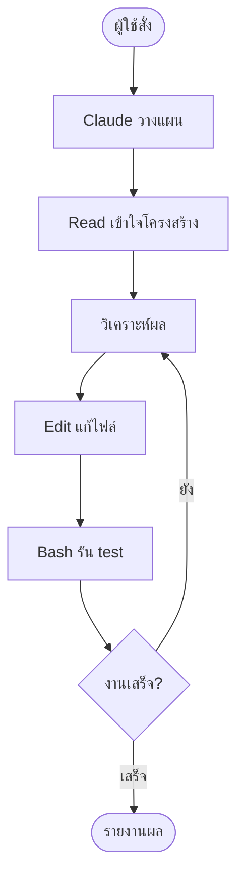
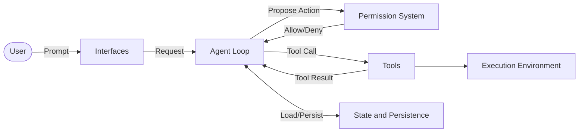
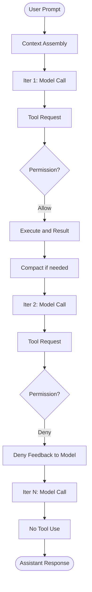
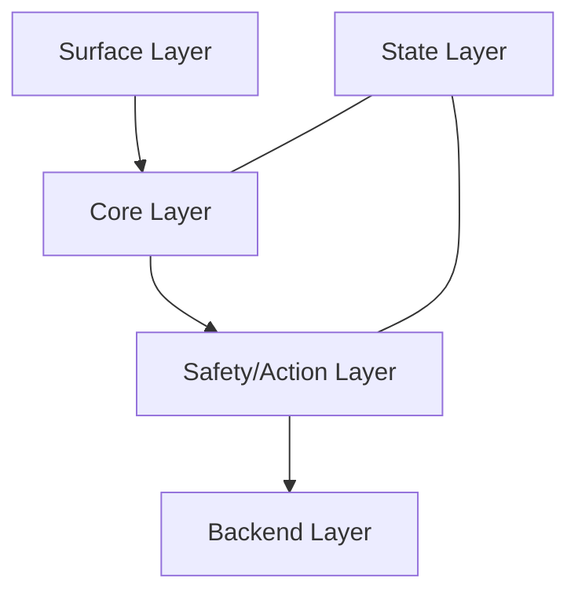

---
tags:
  - claude-code
  - basics
  - cli
type: note
status: evergreen
created: "2026-04-09"
source: "https://code.claude.com/docs/en/overview · arxiv 2604.14228"
parent_note: "[[Claude Code - Multi-Agent MOC]]"
---

# Claude Code คืออะไร?

Claude Code คือ **CLI tool** จาก Anthropic สำหรับ **Agentic Coding**

- ทำงานผ่าน Terminal โดยตรง ไม่ต้องใช้ IDE
- ควบคุมได้เต็มรูปแบบผ่านไฟล์ config
- รองรับการทำงานแบบ Autonomous และ Non-interactive

ถ้าต้องการกรอบคิด agent ทั่วไปให้ดู `AI Agent Fundamentals`
ถ้าต้องการกรอบตัดสินใจว่าเมื่อไรควรใช้ agent หรือ multi-agent ให้ดู `05 Use Cases`

---

## คำสั่งพื้นฐาน

```bash
claude                    # เปิด interactive mode
claude -p "ทำสิ่งนี้"     # สั่งงานโดยไม่ต้องโต้ตอบ (non-interactive)
claude -r                 # ต่อ session เดิม (--resume)
claude -c                 # ต่อจาก message ล่าสุด (--continue)
```

---

## CLI vs Chat ต่างกันอย่างไร?

| | Chat (claude.ai) | Claude Code (CLI) |
|---|---|---|
| **รูปแบบ** | โต้ตอบทีละ message | สั่งงาน → AI ทำงานหลายขั้นเอง |
| **เข้าถึงไฟล์** | ไม่ได้ (ต้อง upload เอง) | ได้โดยตรง — อ่าน/เขียน/แก้ไขไฟล์ใน workspace ตามสิทธิ์ |
| **รันโค้ด** | ไม่ได้ | ได้ — รัน bash, test, build จริง |
| **รู้จักโปรเจกต์** | ไม่รู้ | อ่าน codebase ของโปรเจกต์ได้จากไฟล์และ context ที่มี |
| **automation** | ไม่ได้ | ได้ — รันแบบ non-interactive ใน CI/CD |

> Chat = **ปรึกษาที่ปรึกษา** ที่ให้คำแนะนำ แต่ตัวเองต้องลงมือทำ
> CLI = **จ้างวิศวกร** มานั่งที่เครื่องเราแล้วทำงานให้จริงๆ

---

## Tools ที่ Claude Code มี

```
Read    → อ่านไฟล์จริงในโปรเจกต์
Write   → สร้างไฟล์ใหม่
Edit    → แก้ไขไฟล์ที่มีอยู่
Bash    → รันคำสั่ง terminal (npm install, git, pytest ฯลฯ)
Grep    → ค้นหา pattern ทั้ง codebase
Glob    → ค้นหาไฟล์ตาม pattern
```

---

## Agentic Loop



ทั้งหมดนี้เกิดขึ้น **โดยไม่ต้องให้คนมานั่งสั่งทุก step**

---

## สถาปัตยกรรมเชิงลึก

> section นี้สรุปจาก source code analysis ใน arxiv 2604.14228 (Dive into Claude Code) ซึ่งวิเคราะห์ Claude Code v2.1.88

Agentic Loop ข้างบนคือ **แกนกลาง** ของระบบ แต่ code ส่วนใหญ่ (~98.4%) อยู่ใน **ระบบรอบ loop** ไม่ใช่ตัว loop เอง

ระบบทั้งหมดแบ่งเป็น 7 components หลัก:

| Component | หน้าที่ |
|---|---|
| User | ส่ง prompt, อนุมัติ permissions, ตรวจผลลัพธ์ |
| Interfaces | Interactive CLI, Headless CLI (`claude -p`), Agent SDK, IDE |
| Agent Loop | วนรอบ: เรียก model → dispatch tools → เก็บผล → วนต่อ |
| Permission System | deny-first rule evaluation, ML classifier, hook interception |
| Tools | สูงสุด 54 built-in tools + MCP tools |
| State & Persistence | append-only JSONL session transcripts, prompt history |
| Execution Environment | shell sandbox, filesystem, MCP servers |

ทุก interface (CLI, SDK, IDE) ไหลเข้า **agent loop เดียวกัน** — ไม่มี engine แยกตาม mode

### ระบบรอบ Loop ที่สำคัญ

**High-Level Data Flow (Fig 1)**



**Runtime Turn Flow (Fig 2)**



**5-Layer Subsystem Architecture (Fig 3)**



| Layer | Components |
|---|---|
| Surface | Interactive CLI, Headless CLI, Agent SDK, IDE, UI/renderer |
| Core | Agent Loop, Compaction Pipeline |
| Safety/Action | Permission System + classifier, Hook Pipeline, Extensibility, Built-in Tools, MCP Tools, Shell Sandbox, Subagent Spawning |
| State | Context Assembly, Runtime State, Session Persistence, CLAUDE.md + memory, Sidechain Transcripts |
| Backend | Execution Backends, External Resources (local/cloud/remote) |

- **Permission System** — 7 permission modes ตั้งแต่ `plan` (ต้องอนุมัติทุกอย่าง) ถึง `bypassPermissions` + ML-based classifier สำหรับ auto-mode → ดูเพิ่มที่ [[03 Tools/Claude Code/Reference/09 - Permissions และ Settings|Permissions และ Settings]]
- **Context Compaction** — 5 ชั้นจัดการ context window ก่อนเรียก model ทุกครั้ง (budget reduction → snip → microcompact → context collapse → auto-compact) → ดูเพิ่มที่ [[03 Tools/Claude Code/Core/25 - Context Compaction Pipeline|Context Compaction Pipeline]]
- **Extensibility** — 4 กลไกขยายความสามารถที่ต้นทุน context ต่างกัน → ดูเพิ่มที่ [[03 Tools/Claude Code/Core/26 - Extensibility Mechanisms|Extensibility Mechanisms]]
- **Subagent Delegation** — spawn subagent ใน isolated context window, คืนแค่ summary กลับ parent → ดูเพิ่มที่ [[03 Tools/Claude Code/Core/03 - Orchestrator Pattern|Orchestrator Pattern]]
- **Session Persistence** — append-only JSONL, resume ไม่คืน session-scoped permissions (safety-conservative)

### Design Philosophy

paper ระบุว่า architecture ขับเคลื่อนด้วย 5 human values:

1. **Human Decision Authority** — คนยังเป็นผู้ตัดสินใจสุดท้าย
2. **Safety, Security, and Privacy** — ปกป้องแม้คนไม่ตั้งใจดู
3. **Reliable Execution** — ทำตามที่คนหมายความจริง ๆ
4. **Capability Amplification** — ขยายสิ่งที่คนทำได้ต่อหน่วยเวลา
5. **Contextual Adaptability** — ปรับตัวตาม project, tools, conventions ของผู้ใช้

ปรัชญาหลักคือ **minimal scaffolding, maximal operational harness** — ไม่ใส่ planning graph หรือ state machine ให้ model แต่สร้าง infrastructure (permission, context management, recovery) ที่ดีรอบ ๆ แล้วให้ model ตัดสินใจเอง

### 13 Design Principles

values ทั้ง 5 ถูกแปลงเป็น 13 design principles ที่ตอบ recurring design questions:

| Principle | Values ที่รองรับ | Design Question |
|---|---|---|
| Deny-first with human escalation | Authority, Safety | action ที่ไม่รู้จักควร allow, block, หรือ escalate? |
| Graduated trust spectrum | Authority, Adaptability | permission level คงที่ หรือเป็น spectrum ที่ผู้ใช้เลื่อนได้? |
| Defense in depth with layered mechanisms | Safety, Authority, Reliability | safety boundary เดียว หรือหลายชั้นซ้อนกัน? |
| Externalized programmable policy | Safety, Authority, Adaptability | policy hardcode หรือ externalize เป็น config + hooks? |
| Context as scarce resource with progressive management | Reliability, Capability | resource constraint หลักคืออะไร จัดการอย่างไร? |
| Append-only durable state | Reliability, Authority | state เป็น mutable, checkpoint, หรือ append-only? |
| Minimal scaffolding, maximal operational harness | Capability, Reliability | ลงทุนใน scaffolding-side reasoning หรือ operational infrastructure? |
| Values over rules | Capability, Authority | ใช้ rigid decision procedures หรือ contextual judgment + guardrails? |
| Composable multi-mechanism extensibility | Capability, Adaptability | extension API เดียว หรือ layered mechanisms ต่าง context cost? |
| Reversibility-weighted risk assessment | Capability, Safety | oversight เท่ากันทุก action หรือเบากว่าสำหรับ reversible/read-only? |
| Transparent file-based configuration and memory | Adaptability, Authority | opaque database, embedding retrieval, หรือ user-visible files? |
| Isolated subagent boundaries | Reliability, Safety, Capability | subagent แชร์ context/permissions กับ parent หรือแยก? |
| Graceful recovery and resilience | Reliability, Capability | error แล้วหยุด หรือ recover เงียบ ๆ แล้วเก็บ human attention ไว้สำหรับ unrecoverable? |

principles เหล่านี้ต่างจาก design families อื่น:
- **LangGraph** — ใช้ explicit state graphs (scaffolding over minimal harness)
- **SWE-Agent / OpenHands** — ใช้ Docker isolation (container over layered policy)
- **Aider** — ใช้ Git rollback เป็น safety mechanism หลัก (version-control-as-safety)

---

## พื้นฐานทฤษฎีที่เกี่ยวข้อง

- [[02 AI Systems/AI Agent Fundamentals/Core/01 - AI Agent คืออะไร|AI Agent คืออะไร]] — Claude Code คือ implementation จริงของ Agent: Brain (Claude LLM) + Body (Tools)
- [[02 AI Systems/AI Agent Fundamentals/Core/05 - วงจร Perceive-Think-Act-Check|PTAC Loop]] — Agentic Loop ข้างบนคือ Perceive→Think→Act→Check ที่ทำงานจริง
- [[02 AI Systems/MCP/MCP - MOC|MCP - MOC]] — Read/Write/Edit/Bash/Grep/Glob คือ Tools ตามนิยามใน MCP
