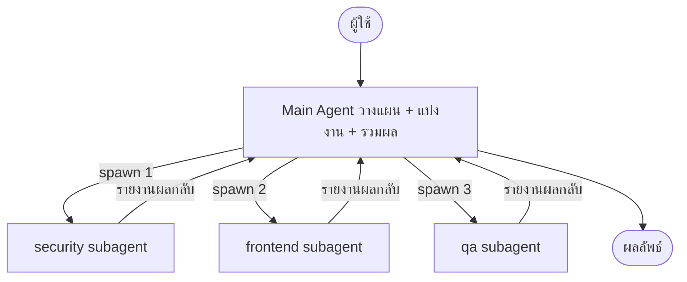
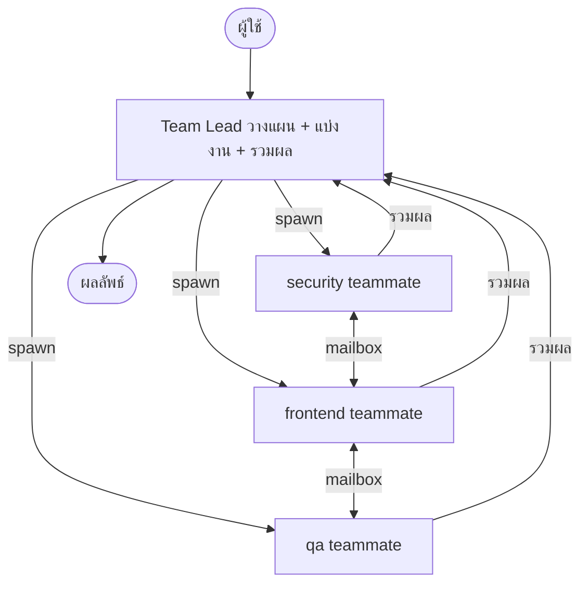
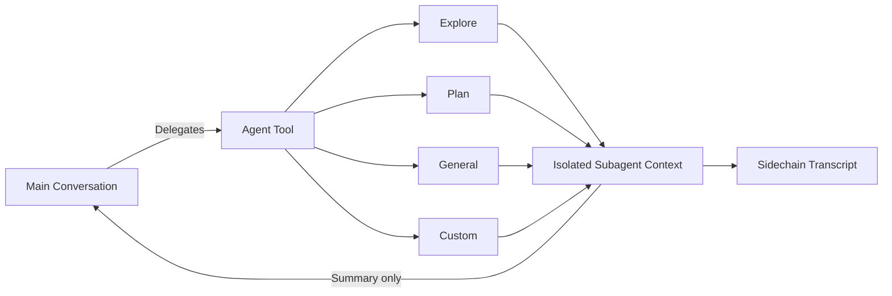

---
tags:
  - claude-code
  - architecture
  - multi-agent
  - pattern
type: note
status: evergreen
created: "2026-04-09"
source: "https://code.claude.com/docs/en/sub-agents · arxiv 2604.14228"
parent_note: "[[Claude Code - Multi-Agent MOC]]"
---

# Orchestrator Pattern

**Orchestrator Pattern** คือแนวคิดการออกแบบ — มีตัวหนึ่งทำหน้าที่วางแผน แบ่งงาน และรวมผล โดยไม่ลงมือทำงานหลักเอง

ใน Claude Code implement ได้ **2 แบบ**:

---

## แบบที่ 1 — Subagents (session เดียว, ทีละตัว)

- **Orchestrator เรียกว่า:** Main Agent
- **Worker เรียกว่า:** Subagent
- **Worker คุยกันได้ไหม:** ❌ (รายงานกลับ main เท่านั้น)

---

## แบบที่ 2 — Agent Teams (session แยก, parallel)

- **Orchestrator เรียกว่า:** Team Lead
- **Worker เรียกว่า:** Teammate
- **Worker คุยกันได้ไหม:** ✅ ผ่าน mailbox

---

## เปรียบเทียบ 2 แบบ

| | Subagents | Agent Teams |
|---|---|---|
| **Orchestrator** | Main Agent | Team Lead |
| **Worker** | Subagent | Teammate |
| **Worker คุยกันได้** | ❌ | ✅ ผ่าน mailbox |
| **Parallelism** | ✅ main agent สั่ง parallel ได้ | ✅ ทำงานพร้อมกัน self-coordinate |
| **เหมาะกับ** | งาน workflow ชัดเจน หรือ focused ที่ต้องการแค่ผลลัพธ์ | งานซับซ้อนที่ agents ต้อง collaborate |

---

## ข้อดีของ Pattern นี้

- แต่ละ agent โฟกัสเฉพาะงานตัวเอง ไม่ปะปนกัน
- ทำงาน parallel ได้ (Agent Teams)
- debug ง่ายกว่า เพราะรู้ว่าส่วนไหนมีปัญหา

---

## ดูเพิ่มเติม
- [[04 - 1 Session vs Subagents vs Agent Teams]]
- [[15 - สร้าง Subagent ด้วย agents]]

---

## Implementation Detail: Subagent Delegation

> section นี้สรุปจาก source code analysis ใน arxiv 2604.14228 (Dive into Claude Code, v2.1.88)

### Agent Tool และ Delegation

**Subagent Isolation Architecture (Fig 7)**

| Isolation Component | หน้าที่ |
|---|---|
| Rebuilt Permission Context | permission rebuild ใหม่ต่อ subagent |
| Permission Mode Override | optional override ตาม agent definition |
| Isolated Worktree | git worktree แยก filesystem (optional) |
| Sidechain Transcript | `.jsonl` + `.meta.json` แยกไฟล์ |
| Summary-only Return | แค่ text + metadata กลับ parent |

AgentTool คือ meta-tool ที่ dispatch ไปยัง subagent types ต่าง ๆ:

- **Explore** — read/search-oriented, write/edit อยู่ใน deny-list
- **Plan** — สร้าง structured plans, execution ผ่าน permission model ปกติ
- **General-purpose** — broadly capable
- **Verification** — รัน test suites, linting
- **Custom** — ผู้ใช้กำหนดผ่าน `.claude/agents/*.md` + plugins

custom agent สามารถกำหนด tools, model, permissions, hooks, memory scope, isolation mode ของตัวเองได้ทั้งหมด

### Isolation Modes

| Mode | กลไก | ใช้เมื่อ |
|---|---|---|
| **In-process** (default) | แชร์ filesystem, แยก conversation context | งานทั่วไป |
| **Worktree** | สร้าง git worktree ชั่วคราว แยก filesystem | ต้องการแก้ไฟล์โดยไม่กระทบ parent |
| **Remote** (internal-only) | รันใน remote environment | background tasks |

### Sidechain Transcripts

subagent แต่ละตัวเขียน transcript แยกเป็น `.jsonl` + `.meta.json` — **summary-only return** กลับ parent:
- full history ของ subagent ไม่เข้า parent context window
- ลด context pressure ตามหลัก "context as bottleneck"
- agent teams ใช้ ~7× tokens ของ standard session ใน plan mode ทำให้ summary-only return ยิ่งสำคัญ

### Permission Override Logic

- ถ้า subagent กำหนด `permissionMode` → override ยกเว้น parent อยู่ใน `bypassPermissions`, `acceptEdits`, หรือ `auto` (modes เหล่านี้ชนะเสมอเพราะเป็น explicit user decision)
- async agents: ระบบตัดสินใจว่าจะ avoid prompts ผ่าน cascade: explicit `canShowPermissionPrompts` → bubble mode → default
- background agents ที่แสดง prompts ได้: `awaitAutomatedChecksBeforeDialog: true` ให้ classifier/hooks resolve ก่อนรบกวนผู้ใช้

### Multi-Instance Coordination

agent teams ใช้ **file locking** แทน message broker:
- tasks ถูก claim จาก shared list ผ่าน lock-file-based mutual exclusion
- trade throughput เพื่อ: zero-dependency deployment + full debuggability (อ่าน plain-text JSON ได้)

---

## พื้นฐานทฤษฎีที่เกี่ยวข้อง

- [[02 AI Systems/AI Agent Fundamentals/Core/04 - สถาปัตยกรรม Agent_ Model + Tools + Orchestration|Orchestration Component]] — Orchestrator Pattern คือการ implement Orchestration component ใน Agent equation (Model + Tools + **Orchestration**)
- [[02 AI Systems/AI Agent Fundamentals/Core/07 - รูปแบบ Agent Architectures|Multi-Agent Workflows]] — Pattern นี้ตรงกับ Multi-Agent Workflows ใน Agent Architectures
