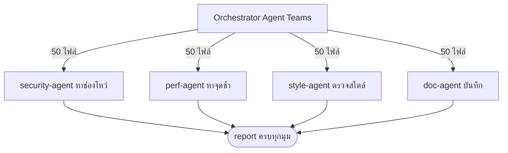
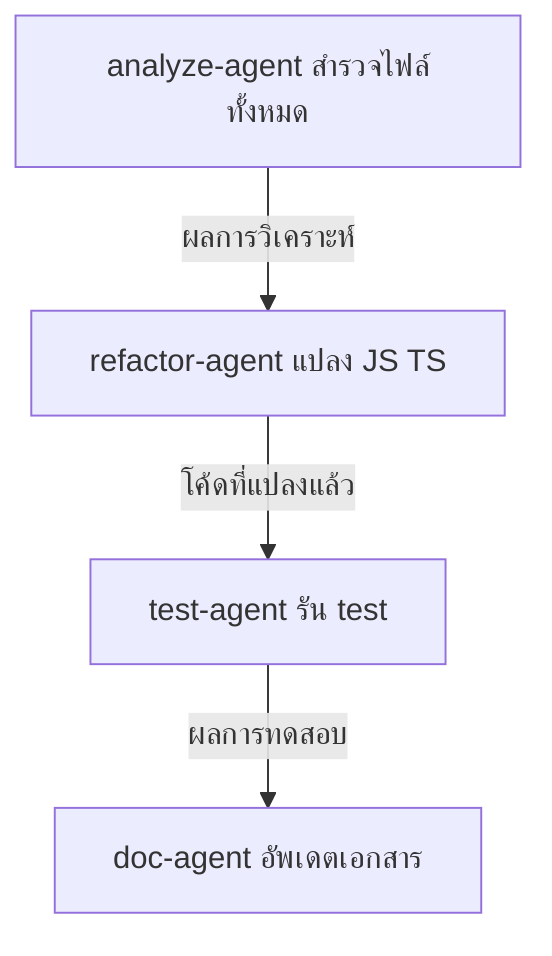

---
tags:
  - claude-code
  - case-study
  - agent-teams
  - subagents
type: note
status: evergreen
created: "2026-04-09"
source: "https://code.claude.com/docs/en/agent-teams"
parent_note: "[[Claude Code - Multi-Agent MOC]]"
---

# กรณีศึกษา: Multi-Agent ในโลกจริง

---

## กรณีที่ 1: ตรวจโค้ดแบบ Parallel (Agent Teams)

**โจทย์:** ตรวจ codebase 200 ไฟล์ ใน 10 นาที



**ผล: 10 นาที แทนที่จะเป็น 3 ชั่วโมง**

**Prompt ที่ใช้:**

```text
Create an agent team to review this codebase (200 files).
Spawn four reviewers:
- security-agent: check /api and /auth for vulnerabilities
- perf-agent: find slow queries and N+1 problems in /db
- style-agent: enforce our coding standards in /src
- doc-agent: verify all public functions have JSDoc comments

Each agent reviews 50 files. Compile results into a final report.
```

---

## กรณีที่ 2: แปลง JavaScript → TypeScript ด้วย Subagents (Sequential)

**โจทย์:** โปรเจกต์มีไฟล์ `.js` หลายร้อยไฟล์ — ต้องการแปลงทั้งหมดเป็น TypeScript โดยอัตโนมัติ

**ทำไมต้องใช้ Subagents?**
งานนี้มีหลายขั้นตอนชัดเจน แต่ละขั้นต้องรอผลจากขั้นก่อน (sequential) — แต่ละ agent มี context ของตัวเอง ไม่ต้องแบกทุกอย่างใน session เดียว



**Prompt ที่ใช้:**

```text
แปลงโปรเจกต์นี้จาก JavaScript เป็น TypeScript โดย:
1. ให้ subagent ตัวแรก (analyze) สำรวจไฟล์ทั้งหมดใน src/ และสรุปว่ามีกี่ไฟล์ มี pattern อะไรบ้าง
2. ให้ subagent ตัวที่สอง (refactor) แปลงไฟล์ทีละกลุ่มตามผลที่ได้จาก analyze
3. ให้ subagent ตัวที่สาม (test) รัน npm test และรายงานว่า test ผ่านกี่ไฟล์
4. ให้ subagent ตัวสุดท้าย (doc) อัพเดต README และ CHANGELOG
```

Claude Code จะ spawn subagent ตามลำดับ — แต่ละตัวทำงานใน context ของตัวเอง รายงานผลกลับ Orchestrator ก่อนขั้นต่อไปจะเริ่ม

---

## สรุปบทเรียน

| กรณี | รูปแบบ | เหมาะเมื่อ |
|---|---|---|
| Code review 200 ไฟล์ | Parallel (Agent Teams) | งานอิสระต่อกัน ทำพร้อมกันได้ |
| JS → TS conversion | Sequential (Subagents) | แต่ละขั้นต้องรอผลก่อนหน้า |

> **หลักเลือก:** ถ้างานขั้นถัดไปต้องรอผลจากขั้นก่อน → Sequential Subagents. ถ้าแต่ละส่วนทำอิสระต่อกัน → Parallel Agent Teams

---

## พื้นฐานทฤษฎีที่เกี่ยวข้อง

- [[02 AI Systems/AI Agent Fundamentals/Core/07 - รูปแบบ Agent Architectures|Agent Architectures]] — กรณีที่ 1 (Parallel review) = Multi-Agent Workflows / กรณีที่ 2 (Sequential JS→TS) = Tool-Using + CodeAct
- [[05 Use Cases/Decision/Use Cases - When to Use an Agent|When to Use an Agent]] — Decision framework ว่าเมื่อไรใช้ agent แบบใด ตรงกับหลักเลือกในกรณีศึกษาเหล่านี้
- [[05 Use Cases/Decision/Use Cases - Move from Single to Multi-Agent]]
