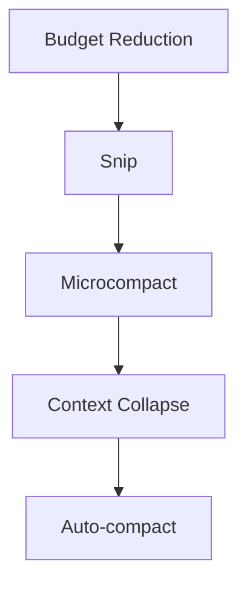

---
tags:
  - claude-code
  - context-management
  - compaction
  - version-sensitive
type: note
status: evergreen
source: "arxiv 2604.14228"
parent_note: "[[Claude Code - Multi-Agent MOC]]"
created: "2026-04-20"
updated: ""
---

# Context Compaction Pipeline

> สรุปจาก source code analysis ใน arxiv 2604.14228 (Dive into Claude Code, v2.1.88)
> version-sensitive: pipeline นี้มี feature flags หลายตัว พฤติกรรมอาจเปลี่ยนตาม build/release

---

## ทำไมต้อง Compaction

context window (200K–1M tokens) คือ **binding resource constraint** ของ Claude Code ไม่ใช่ compute budget หรือ working memory

ทุกครั้งก่อนเรียก model ระบบต้องจัดการ context pressure เพราะ:
- conversation history โตขึ้นทุก turn
- tool results อาจยาวมาก (เช่น output จาก grep ทั้ง codebase)
- subagent summaries, file reads, command outputs สะสม

ถ้าใช้แค่วิธีเดียว (เช่น ตัดข้อความเก่าทิ้ง) จะสูญเสียข้อมูลสำคัญ Claude Code จึงใช้ **5 ชั้น** ที่ทำงานเรียงลำดับจากเบาไปหนัก

---

## 5-Layer Pipeline

| ชั้น | ชื่อ | หน้าที่ | ระดับ |
|---|---|---|---|
| 1 | Budget Reduction | จำกัดขนาด tool result ต่อ message | เบา |
| 2 | Snip | ตัด history เก่าออก | เบา |
| 3 | Microcompact | บีบอัดละเอียด + cache-aware | กลาง |
| 4 | Context Collapse | read-time projection ไม่แก้ history จริง | กลาง |
| 5 | Auto-compact | สรุปด้วย model เมื่อยังเกิน threshold | หนัก |

### 1. Budget Reduction (always active)

- บังคับ per-message size limit สำหรับ tool results
- output ที่เกินขนาดถูกแทนด้วย content reference
- tools ที่ exempt (maxResultSizeChars ไม่จำกัด) ยังคง output เต็ม
- ทำงานก่อน microcompact เพราะ microcompact ดูแค่ tool_use_id ไม่ดู content

### 2. Snip (gated by HISTORY_SNIP)

- ตัด history segments เก่าออกแบบ lightweight
- คืน `{messages, tokensFreed, boundaryMessage}`
- ต้องส่ง tokensFreed ไปให้ auto-compact เพราะ token counter ดูจาก usage field ของ assistant message ล่าสุดซึ่งยังมี pre-snip input_tokens ติดอยู่

### 3. Microcompact (gated by CACHED_MICROCOMPACT)

- fine-grained compression ที่รันทั้ง time-based path และ cache-aware path
- เมื่อ cache-aware path เปิด: boundary messages ถูกเลื่อนไปหลัง API response เพื่อใช้ค่า `cache_deleted_input_tokens` จริงแทนค่าประมาณ
- คืน `{messages, compactionInfo}` ที่อาจมี pendingCacheEdits

### 4. Context Collapse (gated by CONTEXT_COLLAPSE)

- **read-time projection** ไม่ใช่ mutation — ไม่แก้ history ที่เก็บจริง
- แทนที่ messagesForQuery ด้วย collapsed view ผ่าน `applyCollapsesIfNeeded()`
- model เห็น collapsed version แต่ full history ยังอยู่สำหรับ reconstruction
- summary messages อยู่ใน collapse store ไม่ใช่ใน REPL array
- ทำให้ collapses persist ข้าม turns ได้

### 5. Auto-compact (enabled by default, สามารถปิดได้)

- trigger เมื่อ context ยังเกิน pressure threshold หลังผ่าน 4 ชั้นแรก
- เรียก model สร้าง summary ผ่าน `compactConversation()`
- รัน PreCompact hooks ก่อน
- ผลลัพธ์: `[boundaryMarker, ...summaryMessages, ...messagesToKeep, ...attachments, ...hookResults]`
- boundary marker มี preserved-segment metadata (headUuid, anchorUuid, tailUuid) สำหรับ read-time chain patching
- **mostly-append**: compaction ไม่แก้หรือลบ transcript lines เดิม แค่ append boundary + summary events ใหม่

---

## หลักการออกแบบ

- **Lazy degradation** — ใช้วิธีเบาที่สุดก่อน escalate เมื่อไม่พอ
- **Append-only** — compaction ไม่ทำลาย history เดิม เพิ่มแค่ summary events
- **Cache-aware** — microcompact คำนึงถึง prompt cache เพื่อไม่ invalidate cache โดยไม่จำเป็น
- **Transparency trade-off** — budget reduction และ auto-compact มี output ที่ผู้ใช้เห็นได้ แต่ context collapse ทำงานโดยไม่มี user-visible output

---

## นอกจาก Pipeline: กลไกอื่นที่ช่วยลด Context

pipeline 5 ชั้นไม่ใช่ทั้งหมด ระบบยังมีกลไกเสริม:

- **CLAUDE.md lazy loading** — nested-directory instruction files โหลดเมื่อ agent อ่านไฟล์ใน directory นั้นจริง ๆ
- **Deferred tool schemas** — เมื่อ ToolSearch เปิด บาง tools แสดงแค่ชื่อ โหลด full schema เมื่อต้องการ
- **Subagent summary-only return** — subagent คืนแค่ summary text ไม่ใช่ full conversation history
- **Per-tool-result budget** — จำกัดขนาด tool result ต่อตัว ป้องกัน output ยาวเกินกิน context

---

## เปรียบเทียบกับแนวทางอื่น

| แนวทาง | กลไก | ความละเอียด |
|---|---|---|
| Simple truncation | ตัดข้อความเก่าทิ้ง | หยาบ |
| Sliding window | เก็บแค่ history ล่าสุด | กลาง |
| RAG-based | ดึง snippets ที่เกี่ยวข้อง | ละเอียด |
| Single summarization | สรุปรอบเดียว | หยาบ |
| **Graduated compaction (Claude Code)** | **5-layer pipeline** | **ละเอียดมาก** |

---

## Recovery Mechanisms

> สรุปจาก paper Section 4.4

นอกจาก compaction pipeline ระบบยังมี recovery mechanisms สำหรับ edge cases ที่เกี่ยวกับ context:

| Mechanism | พฤติกรรม | จำกัด |
|---|---|---|
| Max output tokens escalation | เมื่อ response ชน output token cap → retry ด้วย limit ที่สูงขึ้น | สูงสุด 3 ครั้งต่อ turn |
| Reactive compaction | เมื่อ context ใกล้เต็ม → สรุปเฉพาะส่วนที่จำเป็น | ทำได้ครั้งเดียวต่อ turn |
| Prompt-too-long handling | API return error → ลอง context-collapse overflow recovery + reactive compaction ก่อน → terminate เมื่อหมดทาง | cascade ก่อน terminate |
| Streaming fallback | streaming API มีปัญหา → retry ด้วย strategy อื่น | ผ่าน callback |
| Fallback model | primary model fail → สลับไป alternative model | ต้องกำหนดไว้ล่วงหน้า |

หลักการคือ **graceful recovery** — ระบบพยายาม recover เงียบ ๆ ก่อน เก็บ human attention ไว้สำหรับ unrecoverable situations เท่านั้น

### Stop Conditions

loop หยุดได้จาก 5 เงื่อนไข:

1. **No tool use** — model ตอบเป็น text เท่านั้น (primary stop)
2. **Max turns** — ถึง configurable limit
3. **Context overflow** — API return prompt_too_long หลัง recovery หมด
4. **Hook intervention** — PostToolUse hook สั่ง stop
5. **Explicit abort** — abortController signal

---

## ความสัมพันธ์กับโน้ตอื่น

- [[03 Tools/Claude Code/Core/01 - Claude Code คืออะไร|Claude Code คืออะไร]] — ภาพรวม architecture ที่ compaction เป็นส่วนหนึ่ง
- [[01 Foundations/Context Windows/Context Windows - MOC|Context Windows - MOC]] — ทฤษฎี context window, token budget, context rot
- [[01 Foundations/Context Windows/Core/02 - การบริหารและ Context Engineering|Context Engineering]] — หลักการบริหาร context ทั่วไป
- [[01 Foundations/Context Windows/Core/03 - Prompt Caching|Prompt Caching]] — cache-aware compaction เชื่อมกับ prompt caching
- [[03 Tools/Claude Code/Core/03 - Orchestrator Pattern|Orchestrator Pattern]] — subagent summary-only return เป็นส่วนหนึ่งของ context conservation
- [[03 Tools/Claude Code/Claude Code - Multi-Agent MOC|Claude Code - Multi-Agent MOC]]
