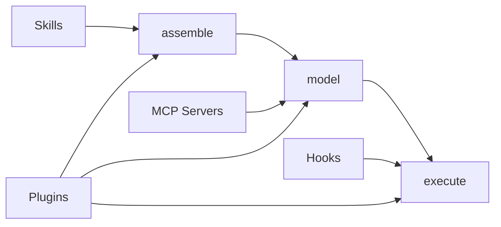

---
tags:
  - claude-code
  - extensibility
  - mcp
  - plugins
  - skills
  - hooks
  - version-sensitive
type: note
status: draft
source: "arxiv 2604.14228"
parent_note: "[[Claude Code - Multi-Agent MOC]]"
created: "2026-04-20"
updated: ""
---

# Extensibility Mechanisms

> สรุปจาก source code analysis ใน arxiv 2604.14228 (Dive into Claude Code, v2.1.88)
> version-sensitive: mechanisms เหล่านี้อาจเปลี่ยนตาม release

---

## ทำไม 4 กลไก ไม่ใช่ 1

คำถามที่เกิดขึ้นคือทำไม Claude Code ใช้ 4 extension mechanisms แทนที่จะรวมเป็น API เดียว

คำตอบอยู่ที่ **ต้นทุน context window ต่างกัน** — กลไกเดียวไม่สามารถครอบคลุมตั้งแต่ zero-context lifecycle hooks ไปจนถึง schema-heavy tool servers โดยไม่บังคับ trade-off ที่ไม่จำเป็นกับผู้พัฒนา extension

---

## 4 Mechanisms และจุดเชื่อมต่อ

ทุก agent loop มี 3 จุดที่ extension เข้าได้:
- **assemble()** — ควบคุมสิ่งที่ model เห็น
- **model()** — ควบคุมสิ่งที่ model เรียกได้
- **execute()** — ควบคุมว่า action จะรันหรือไม่ และรันอย่างไร



| จุดเชื่อม | ชื่อ | หน้าที่ | กลไกที่เข้า |
|---|---|---|---|
| assemble() | model เห็นอะไร | ควบคุม context ที่ model ได้รับ | Skills, Plugins |
| model() | model เรียกอะไรได้ | ควบคุม tool pool | MCP Servers, Plugins |
| execute() | action รันหรือไม่ | ควบคุมการอนุญาตและผลลัพธ์ | Hooks, Plugins |

| Mechanism | ความสามารถเฉพาะ | ต้นทุน Context | จุดเชื่อม |
|---|---|---|---|
| **MCP Servers** | external service integration (multi-transport) | สูง (tool schemas) | model(): tool pool |
| **Plugins** | multi-component packaging + distribution | กลาง (แล้วแต่) | ทั้ง 3 จุด |
| **Skills** | domain-specific instructions + meta-tool invocation | ต่ำ (แค่ descriptions) | assemble(): context injection |
| **Hooks** | lifecycle interception + event-driven automation | ศูนย์ (default) | execute(): pre/post tool |

### MCP Servers

- primary external tool integration path
- config จากหลาย scope: project, user, local, enterprise + plugin/claude.ai servers
- รองรับ transport: stdio, SSE, HTTP, WebSocket, SDK, IDE-specific
- tools จาก MCP servers ถูก merge เข้า tool pool เดียวกับ built-in tools

### Plugins

- ทำหน้าที่ **packaging format + distribution mechanism**
- manifest รองรับ 10 component types: commands, agents, skills, hooks, MCP servers, LSP servers, output styles, channels, settings, user config
- plugin เดียวสามารถขยาย Claude Code ข้ามหลาย component types พร้อมกัน
- เป็น distribution vehicle หลักสำหรับ third-party extensions

### Skills

- กำหนดด้วย SKILL.md file + YAML frontmatter
- frontmatter มี 15+ fields: display name, description, allowed tools, argument hints, model overrides, execution context ('fork'), hooks, effort levels
- เมื่อเรียกใช้ SkillTool meta-tool inject instructions เข้า context
- skills สามารถ define hooks ของตัวเองที่ register dynamically เมื่อ invoke

### Hooks

- 27 hook events ครอบคลุม:
  - tool authorization (5): PreToolUse, PostToolUse, PostToolUseFailure, PermissionRequest, PermissionDenied
  - session lifecycle (5): SessionStart, SessionEnd, Setup, Stop, StopFailure
  - user interaction (3): UserPromptSubmit, Elicitation, ElicitationResult
  - subagent coordination (4): SubagentStart, SubagentStop, TeammateIdle, TaskCreated/Completed
  - context management (4): PreCompact, PostCompact, InstructionsLoaded, ConfigChange
  - workspace events (4): CwdChanged, FileChanged, WorktreeCreate/Remove
  - notifications (1)
- 15 events มี event-specific output schemas รองรับ permission decisions, context injection, input modification, MCP result transformation
- 4 command types: shell, LLM prompt, HTTP, agentic verifier + non-persistable callback (SDK/internal)

---

## Tool Pool Assembly

`assembleToolPool()` เป็น single source of truth สำหรับรวม tools ทั้งหมด:

1. **Base tool enumeration** — สูงสุด 54 tools (19 always + 35 conditional)
2. **Mode filtering** — SIMPLE mode เหลือแค่ Bash, Read, Edit
3. **Deny rule pre-filtering** — ลบ blanket-denied tools ก่อน model เห็น
4. **MCP tool integration** — merge MCP tools เข้ามา
5. **Deduplication** — built-in tools ชนะ MCP tools ที่ชื่อซ้ำ

---

## Context Cost Ordering

graduated context-cost ordering เป็นหลักการสำคัญ:

```
Hooks (ศูนย์) → Skills (ต่ำ) → Plugins (กลาง) → MCP (สูง)
```

extensions ที่ถูกสามารถ scale ได้กว้างโดยไม่กิน context window ส่วน extensions ที่แพงสงวนไว้สำหรับกรณีที่ต้องการ tool surface ใหม่จริง ๆ

---

## ความสัมพันธ์กับโน้ตอื่น

- [[03 Tools/Claude Code/Core/01 - Claude Code คืออะไร|Claude Code คืออะไร]] — ภาพรวม architecture
- [[03 Tools/Claude Code/Core/25 - Context Compaction Pipeline|Context Compaction Pipeline]] — context cost ของ extensions เชื่อมกับ compaction
- [[03 Tools/Claude Code/Reference/09 - Permissions และ Settings|Permissions และ Settings]] — hooks เข้าร่วม permission pipeline
- [[02 AI Systems/MCP/MCP - MOC|MCP - MOC]] — MCP protocol layer
- [[02 AI Systems/MCP/Core/03 - Core Primitives_ Tools, Resources, Prompts|MCP Primitives]] — tools, resources, prompts ที่ MCP servers ให้
- [[03 Tools/Claude Code/Core/03 - Orchestrator Pattern|Orchestrator Pattern]] — AgentTool vs SkillTool: spawn context ใหม่ vs inject เข้า context เดิม
- [[03 Tools/Claude Code/Claude Code - Multi-Agent MOC|Claude Code - Multi-Agent MOC]]
