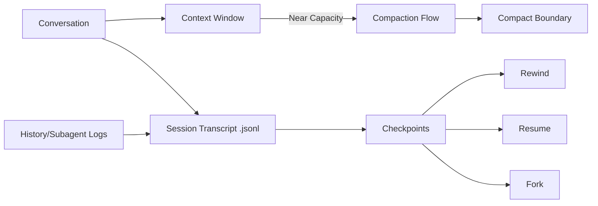

---
tags:
  - claude-code
  - persistence
  - session
  - version-sensitive
type: note
status: draft
source: "arxiv 2604.14228"
parent_note: "[[Claude Code - Multi-Agent MOC]]"
created: "2026-04-20"
updated: ""
---

# Session Persistence and Recovery

> สรุปจาก source code analysis ใน arxiv 2604.14228 (Dive into Claude Code, v2.1.88) Section 9
> version-sensitive: persistence format และ behavior อาจเปลี่ยนตาม release

---

## หลักการ

session persistence ของ Claude Code ยึดหลัก **append-only durable state**:
- conversations outlive context — transcript บน disk เก็บทุกอย่าง compaction recycle แค่ live view
- conversations outgrow a single path — append-only transcript ให้ rewind, resume, หรือ fork ได้โดยไม่สูญเสียงานเดิม

---

## 3 Persistence Channels

**Session Persistence and Compaction (Fig 8)**

| หลักการ | คำอธิบาย |
|---|---|
| Conversations Outlive Context | transcript บน disk เก็บทุกอย่าง compaction recycle แค่ live view ไม่จบ conversation |
| Conversations Outgrow a Single Path | append-only transcript ให้ rewind, resume, fork ได้โดยไม่สูญเสียงานเดิม |

| Channel | เก็บอะไร | Scope | ที่เก็บ |
|---|---|---|---|
| Session transcripts | conversation records ทั้งหมด (user, assistant, attachment, system, compaction markers) | per-project, per-session | `<projectDir>/<sessionId>.jsonl` |
| Global prompt history | user prompts เท่านั้น | global | `history.jsonl` ใน Claude config home |
| Subagent sidechains | transcript แยกต่อ subagent | per-subagent | `.jsonl` + `.meta.json` แยกไฟล์ |

ทั้ง 3 channels ทำงานอิสระจากกัน

---

## Transcript Model

session transcripts เป็น **mostly append-only JSONL** (มี explicit cleanup rewrites เป็น exception)

events ที่เก็บนอกจาก messages ปกติ:
- compaction markers (boundary + summary)
- file-history snapshots
- attribution snapshots
- content-replacement records

### ทำไม Append-Only JSONL

| ทางเลือก | ข้อดี | ข้อเสีย |
|---|---|---|
| Structured database | query ได้ดี | ต้องมี infrastructure, opaque |
| Checkpoint snapshots | restore ง่าย | ใช้ storage มาก |
| **Append-only JSONL** | **human-readable, version-controllable, reconstructable** | **query ซับซ้อนต้อง post-hoc reconstruction** |

---

## Resume, Fork, และ Permission Non-Restoration

- `--resume` rebuild conversation จาก transcript replay
- fork สร้าง session ใหม่จาก session เดิม
- **session-scoped permissions ไม่ถูก restore** เมื่อ resume หรือ fork — ผู้ใช้ต้อง grant ใหม่

นี่คือ **safety-conservative design choice**: sessions เป็น isolated trust domains การ restore permissions เก่าจะเสี่ยงพา stale trust decisions เข้าสู่ context ที่เปลี่ยนไปแล้ว

### Compaction กับ Persistence

compaction ใช้ **mostly-append design**:
- `annotateBoundaryWithPreservedSegment()` บันทึก headUuid, anchorUuid, tailUuid ใน boundary event
- session loader ใช้ boundary metadata เพื่อ patch message chain ตอน read time
- preserved messages เก็บ original parentUuids บน disk — loader link ให้ถูกต้องผ่าน boundary metadata
- compaction ไม่แก้หรือลบ transcript lines เดิม

### File-History Checkpoints

"checkpoints" ใน Claude Code คือ **file-level snapshots** สำหรับ `--rewind-files`:
- เก็บที่ `~/.claude/file-history/<sessionId>/`
- ใช้ revert filesystem changes ไม่ใช่ generic checkpoint store

---

## ความสัมพันธ์กับโน้ตอื่น

- [[03 Tools/Claude Code/Core/01 - Claude Code คืออะไร|Claude Code คืออะไร]] — ภาพรวม architecture
- [[03 Tools/Claude Code/Core/25 - Context Compaction Pipeline|Context Compaction Pipeline]] — compaction ที่ทำงานร่วมกับ persistence
- [[03 Tools/Claude Code/Core/03 - Orchestrator Pattern|Orchestrator Pattern]] — sidechain transcripts ของ subagents
- [[03 Tools/Claude Code/Reference/09 - Permissions และ Settings|Permissions และ Settings]] — permissions ที่ไม่ restore เมื่อ resume
- [[03 Tools/Claude Code/Reference/12 - CLAUDE File|CLAUDE File]] — memory hierarchy ที่ persist ข้าม sessions
- [[03 Tools/Claude Code/Claude Code - Multi-Agent MOC|Claude Code - Multi-Agent MOC]]
