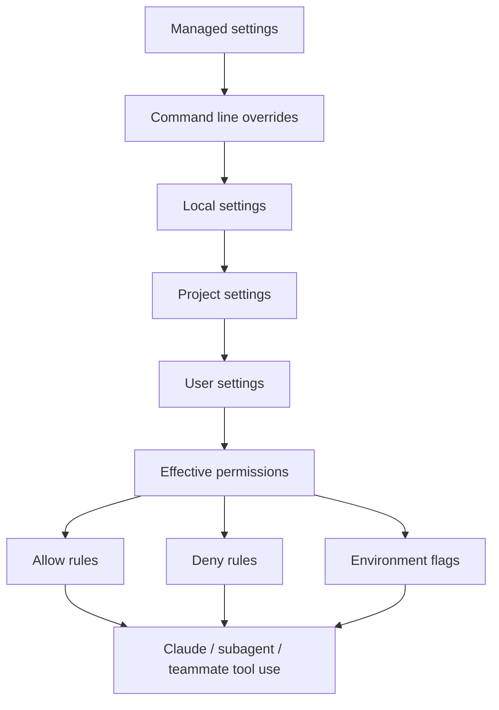
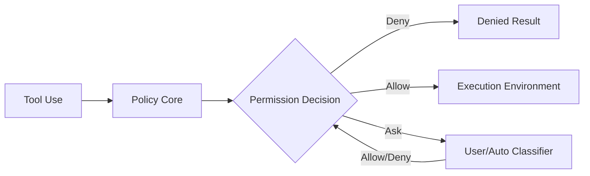
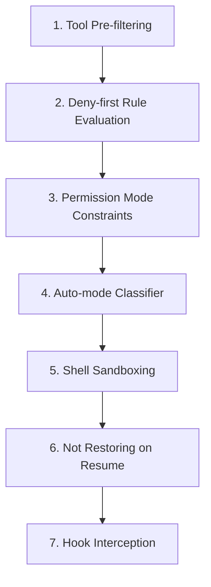

---
tags:
  - claude-code
  - settings
  - permissions
  - configuration
  - version-sensitive
type: note
status: evergreen
created: "2026-04-09"
source: "https://code.claude.com/docs/en/settings · arxiv 2604.14228"
parent_note: "[[Claude Code - Multi-Agent MOC]]"
---

# Permissions และ Settings

---

## Permission Boundary Map

> version-sensitive: settings schema, permission pattern syntax, และ Agent Teams env/config อาจเปลี่ยนตาม Claude Code release



map นี้แสดงว่า permission จริงเกิดจากหลาย scope ซ้อนกัน และ Agent Teams / subagents ใน workflow เดียวกันควรถูกมองผ่าน effective permissions ไม่ใช่ดูแค่ settings ไฟล์เดียว.

---

## โครงสร้าง Settings

| Scope | ที่เก็บ | ใช้กับใคร | Shared? |
|---|---|---|---|
| **Managed** | `managed-settings.json` หรือ MDM / registry | ทุกคนในองค์กร | ✅ Deploy โดย IT |
| **Local** | `.claude/settings.local.json` | เฉพาะเครื่องตัวเอง (gitignore) | ❌ |
| **Project** | `.claude/settings.json` | ทุกคนในโปรเจกต์ | ✅ commit ลง git |
| **User** | `~/.claude/settings.json` | ทุกโปรเจกต์ในเครื่อง | ❌ |

> ℹ️ `~/.claude.json` เก็บ global config บางตัว เช่น IDE connectivity และ editor mode

### ลำดับความสำคัญ (สูง → ต่ำ)

1. **Managed** — ล็อกจาก IT/DevOps ไม่มีใคร override ได้
2. **Command line arguments** — temporary session overrides
3. **Local** — override project และ user
4. **Project** — override user
5. **User** — ใช้เมื่อไม่มีสิ่งอื่น override

---

## settings.json ตัวอย่าง

```json
{
  "permissions": {
    "allow": ["Read", "Write", "Bash", "Edit"],
    "deny": ["WebFetch"]
  },
  "env": {
    "CLAUDE_CODE_EXPERIMENTAL_AGENT_TEAMS": "1"
  }
}
```

| การตั้งค่า | ความหมาย |
|---|---|
| `permissions.allow` | เครื่องมือที่ Claude ใช้ได้โดยไม่ต้องขออนุญาต |
| `permissions.deny` | เครื่องมือที่ห้ามใช้ |
| `CLAUDE_CODE_EXPERIMENTAL_AGENT_TEAMS: "1"` | **เปิดใช้ Agent Teams** |

> ℹ️ **Permission รองรับ pattern syntax** ไม่ใช่แค่ชื่อ tool เช่น:
> - `"Read"` — อนุญาต Read tool ทั้งหมด
> - `"Bash(git log *)"` — อนุญาตเฉพาะ bash `git log` เท่านั้น
> - `"Bash(npm run *)"` — อนุญาตเฉพาะ npm run commands

---

## คำเตือน Agent Teams

> ⚠️ ทดสอบใน branch แยกก่อนเสมอ
> ⚠️ Teammate ใช้ permission rules เดียวกับ team lead ในทีมเดียวกัน

---

## Permission Model Deep Dive

> section นี้สรุปจาก source code analysis ใน arxiv 2604.14228 (Dive into Claude Code, v2.1.88)

### 7 Permission Modes

ระบบ permission มี 7 modes ที่เรียงจาก restrictive ไป permissive:

| Mode | พฤติกรรม | ระดับ autonomy |
|---|---|---|
| `plan` | model ต้องสร้างแผนก่อน ผู้ใช้อนุมัติแล้วค่อยทำ | ต่ำสุด |
| `default` | interactive ปกติ ส่วนใหญ่ต้องขออนุญาต | ต่ำ |
| `acceptEdits` | edits ใน working directory auto-approve, shell commands อื่นต้องขอ | กลาง |
| `auto` | ML classifier ประเมิน tool safety อัตโนมัติ (ต้องเปิด feature flag) | กลาง-สูง |
| `dontAsk` | ไม่ถามผู้ใช้ แต่ deny rules ยังบังคับ | สูง |
| `bypassPermissions` | ข้าม prompt ส่วนใหญ่ แต่ safety-critical checks ยังทำงาน | สูงมาก |
| `bubble` | internal-only สำหรับ subagent escalation ไป parent terminal | (internal) |

5 modes แรก (`plan` ถึง `dontAsk` + `bypassPermissions`) เป็น external modes ที่ผู้ใช้เลือกได้ `auto` เปิดเฉพาะเมื่อ TRANSCRIPT_CLASSIFIER feature flag active `bubble` ใช้ภายในสำหรับ subagent permission escalation เท่านั้น

### ML-Based Auto-Mode Classifier

เมื่อเปิด auto mode ระบบใช้ ML classifier (yoloClassifier) ประเมิน tool invocation:
- โหลด base system prompt + external permissions template
- ประเมิน tool request เทียบกับ conversation transcript
- ผลลัพธ์: allow, deny, หรือ request manual approval
- ถ้า classifier deny → model ได้รับเหตุผล แก้ approach แล้วลองใหม่ (recovery-oriented)

### Permission Gate Overview (Fig 4)



| Policy Core Component | หน้าที่ |
|---|---|
| Rules | declarative allow/deny rules ต่อ tool |
| Modes | 7 permission modes กำหนด baseline |
| Hooks | PreToolUse hooks แก้ไข decisions |

หลักการ 3 ข้อ:
- **Progressive Trust** — agent เริ่มด้วย autonomy ต่ำ ผู้ใช้ขยายโดย approve tool invocations ที่กลายเป็น permanent rules
- **Deny-First, Ask-by-Default** — deny rules ชนะเสมอ ถ้าไม่มี rule match ระบบถามแทนที่จะ allow หรือ block เงียบ ๆ
- **Composable Policy** — 3 กลไก (rules, modes, hooks) ทำงานอิสระ configurable แยกกัน

### Authorization Pipeline (7 ชั้น)

request ต้องผ่านทุกชั้น ชั้นใดชั้นหนึ่งสามารถ block ได้:



| ชั้น | ชื่อ | หน้าที่ |
|---|---|---|
| 1 | Tool Pre-filtering | ลบ blanket-denied tools ก่อน model เห็น |
| 2 | Deny-first Rule Evaluation | deny rules ชนะ allow rules เสมอ |
| 3 | Permission Mode Constraints | mode กำหนด baseline handling |
| 4 | Auto-mode Classifier | ML ประเมิน tool safety |
| 5 | Shell Sandboxing | filesystem + network isolation |
| 6 | Not Restoring on Resume | session-scoped permissions ไม่คืนเมื่อ resume |
| 7 | Hook Interception | PreToolUse hooks แก้ไข permission decisions |

หลักการสำคัญ:
- **deny-first**: deny rule กว้าง ("deny all shell commands") ไม่สามารถถูก override ด้วย allow rule แคบ ("allow npm test")
- **defense in depth**: หลายชั้นทำงานอิสระ ถ้าชั้นหนึ่งพลาด ชั้นอื่นยังจับได้
- **reversibility-weighted**: read-only actions ได้รับ oversight น้อยกว่า state-modifying actions
- **recovery-oriented**: เมื่อ permission deny → model ได้รับเหตุผลและปรับ approach ไม่ใช่แค่หยุด

### ข้อจำกัดที่ค้นพบ

- commands ที่มี >50 subcommands จะ fallback เป็น generic approval prompt แทน per-subcommand check (เพราะ parsing ทำให้ UI ค้าง) — แสดงว่า defense-in-depth อาจ degrade เมื่อ layers แชร์ performance constraints
- pre-trust initialization ordering: code ที่รันระหว่าง project initialization (hooks, MCP connections) อาจทำงานก่อน trust dialog แสดง — เป็น temporal gap ที่ spatial permission pipeline ไม่ครอบคลุม (CVE-2025-59536, CVE-2026-21852)

> หมายเหตุ: ข้อจำกัดเหล่านี้เป็น version-sensitive และอาจถูกแก้ไขใน release ใหม่
