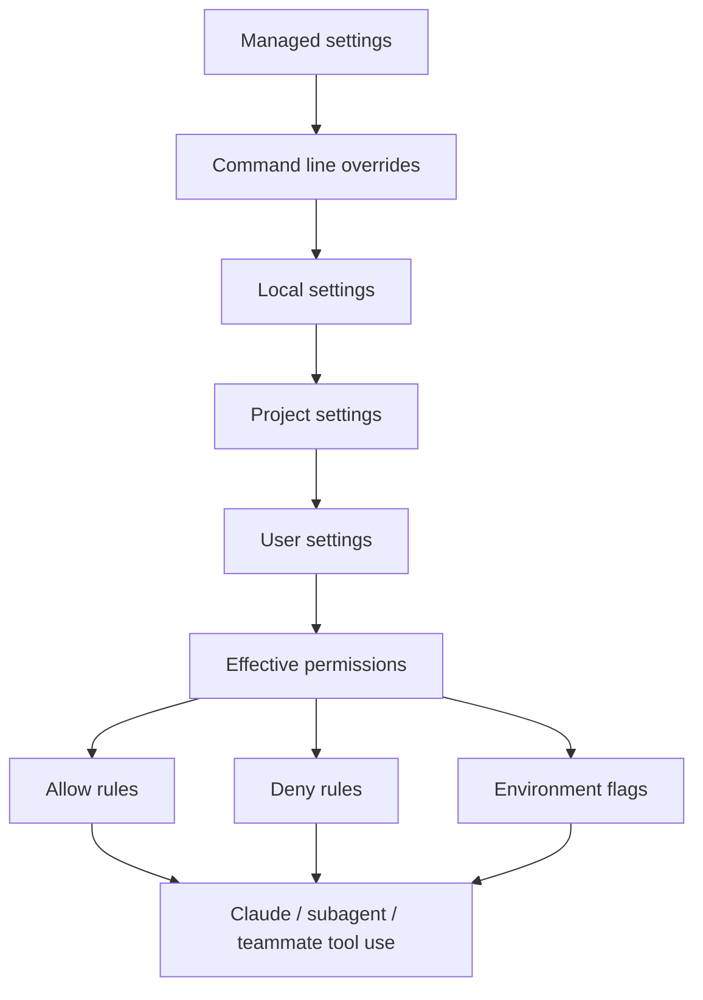

---
tags:
  - claude-code
  - settings
  - permissions
  - configuration
  - version-sensitive
type: note
status: evergreen
created: "2026-04-09"
source: "https://code.claude.com/docs/en/settings"
parent_note: "[[Claude Code - Multi-Agent MOC]]"
---

# Permissions และ Settings

---

## Permission Boundary Map

> version-sensitive: settings schema, permission pattern syntax, และ Agent Teams env/config อาจเปลี่ยนตาม Claude Code release



map นี้แสดงว่า permission จริงเกิดจากหลาย scope ซ้อนกัน และ Agent Teams / subagents ใน workflow เดียวกันควรถูกมองผ่าน effective permissions ไม่ใช่ดูแค่ settings ไฟล์เดียว.

---

## โครงสร้าง Settings

| Scope | ที่เก็บ | ใช้กับใคร | Shared? |
|---|---|---|---|
| **Managed** | `managed-settings.json` หรือ MDM / registry | ทุกคนในองค์กร | ✅ Deploy โดย IT |
| **Local** | `.claude/settings.local.json` | เฉพาะเครื่องตัวเอง (gitignore) | ❌ |
| **Project** | `.claude/settings.json` | ทุกคนในโปรเจกต์ | ✅ commit ลง git |
| **User** | `~/.claude/settings.json` | ทุกโปรเจกต์ในเครื่อง | ❌ |

> ℹ️ `~/.claude.json` เก็บ global config บางตัว เช่น IDE connectivity และ editor mode

### ลำดับความสำคัญ (สูง → ต่ำ)

1. **Managed** — ล็อกจาก IT/DevOps ไม่มีใคร override ได้
2. **Command line arguments** — temporary session overrides
3. **Local** — override project และ user
4. **Project** — override user
5. **User** — ใช้เมื่อไม่มีสิ่งอื่น override

---

## settings.json ตัวอย่าง

```json
{
  "permissions": {
    "allow": ["Read", "Write", "Bash", "Edit"],
    "deny": ["WebFetch"]
  },
  "env": {
    "CLAUDE_CODE_EXPERIMENTAL_AGENT_TEAMS": "1"
  }
}
```

| การตั้งค่า | ความหมาย |
|---|---|
| `permissions.allow` | เครื่องมือที่ Claude ใช้ได้โดยไม่ต้องขออนุญาต |
| `permissions.deny` | เครื่องมือที่ห้ามใช้ |
| `CLAUDE_CODE_EXPERIMENTAL_AGENT_TEAMS: "1"` | **เปิดใช้ Agent Teams** |

> ℹ️ **Permission รองรับ pattern syntax** ไม่ใช่แค่ชื่อ tool เช่น:
> - `"Read"` — อนุญาต Read tool ทั้งหมด
> - `"Bash(git log *)"` — อนุญาตเฉพาะ bash `git log` เท่านั้น
> - `"Bash(npm run *)"` — อนุญาตเฉพาะ npm run commands

---

## คำเตือน Agent Teams

> ⚠️ ทดสอบใน branch แยกก่อนเสมอ
> ⚠️ Teammate ใช้ permission rules เดียวกับ team lead ในทีมเดียวกัน
