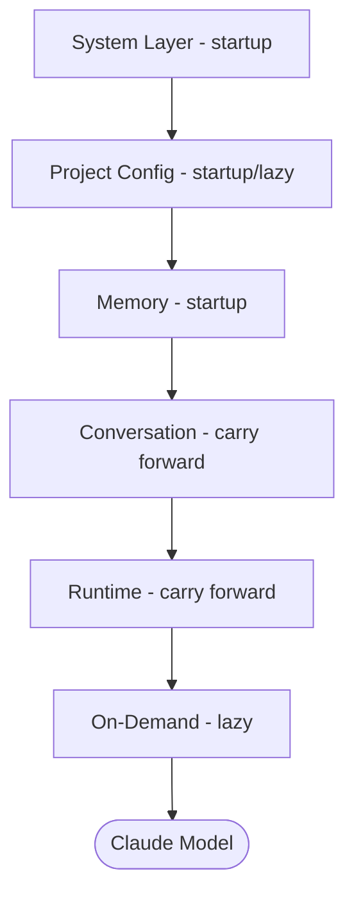

---
tags:
  - claude-code
  - memory
  - configuration
  - CLAUDE-md
  - version-sensitive
type: note
status: evergreen
created: "2026-04-09"
source: "https://code.claude.com/docs/en/memory · arxiv 2604.14228"
parent_note: "[[Claude Code - Multi-Agent MOC]]"
---

# CLAUDE.md: ความจำร่วมของทีม

Claude Code ใช้ **2 กลไกความจำ** ที่ช่วยพก knowledge ข้าม session:

| | **CLAUDE.md files** | **Auto memory** |
|---|---|---|
| **ใครเขียน** | คุณ | Claude |
| **เนื้อหา** | Instructions และ rules | Learnings และ patterns ที่ Claude สังเกต |
| **Scope** | Project, user, หรือ org | Per working tree |
| **โหลดเมื่อ** | ทุก session | ทุก session (200 บรรทัดแรก หรือ 25KB) |
| **ใช้สำหรับ** | Coding standards, workflows, architecture | Build commands, debugging insights, preferences |

---

## CLAUDE.md files

### ตำแหน่งและ Scope

| Scope | ตำแหน่ง | ใช้สำหรับ | Shared กับ |
|---|---|---|---|
| **Managed policy** | macOS: `/Library/Application Support/ClaudeCode/CLAUDE.md`<br>Linux: `/etc/claude-code/CLAUDE.md`<br>Windows: `C:\Program Files\ClaudeCode\CLAUDE.md` | Company-wide standards (deploy โดย IT) | ทุกคนในองค์กร |
| **Project** | `./CLAUDE.md` หรือ `./.claude/CLAUDE.md` | Team-shared standards ของโปรเจกต์ | ทีม (via git) |
| **User** | `~/.claude/CLAUDE.md` | Personal preferences ทุกโปรเจกต์ | เฉพาะตัวเอง |
| **Local** | `./CLAUDE.local.md` | Personal project-specific (เพิ่มใน .gitignore) | เฉพาะตัวเอง |

> ℹ️ CLAUDE.md files ถูกโหลดโดยเดิน up directory tree — ถ้ารัน Claude ใน `foo/bar/` จะโหลด `foo/bar/CLAUDE.md`, `foo/CLAUDE.md` และ `CLAUDE.local.md` ที่พบระหว่างทาง

---

## สร้าง CLAUDE.md

**วิธีที่ 1: ใช้ `/init` (แนะนำ)**

```
> /init
```

Claude ช่วยสร้าง CLAUDE.md ให้เองจากบริบทของโปรเจกต์ พร้อม tech stack, โครงสร้าง และ conventions

> ℹ️ ถ้า CLAUDE.md มีอยู่แล้ว `/init` จะ suggest improvements แทนการ overwrite

**วิธีที่ 2: สั่งเขียนเอง**

```
> อ่านโปรเจกต์ทั้งหมดแล้วสร้าง CLAUDE.md
> ให้มี: tech stack, โครงสร้างโฟลเดอร์, coding conventions และ API endpoints สำคัญ
```

---

## ตัวอย่างเนื้อหา

```markdown
# โปรเจกต์: dohome E-commerce Platform
## Tech Stack
- Frontend: Next.js 14, TypeScript, Tailwind CSS
- Backend: Node.js, PostgreSQL, Redis
## รูปแบบการเขียนโค้ด
- ใช้ TypeScript strict mode เสมอ
## API Endpoints สำคัญ
- /api/products, /api/orders, /api/auth
```

> **เคล็ดลับ:** เขียนเหมือน README แต่เพื่อให้ AI อ่าน — เก็บไว้เป็น facts และ rules ที่ควรจำทุก session

---

## จัดระเบียบด้วย `.claude/rules/`

สำหรับโปรเจกต์ขนาดใหญ่ — แยก instructions เป็นไฟล์ย่อยใน `.claude/rules/`

```
.claude/
├── CLAUDE.md        # คำสั่งหลัก
└── rules/
    ├── code-style.md   # Style guidelines
    ├── testing.md      # Testing conventions
    └── security.md     # Security requirements
```

สามารถ scope rules ให้ match ไฟล์บางประเภทด้วย frontmatter:

```markdown
---
paths:
  - "src/api/**/*.ts"
---
# API Rules
- ทุก endpoint ต้องมี input validation
```

Rules ที่ไม่มี `paths` จะโหลดทุก session เหมือน CLAUDE.md ปกติ

---

## อัพเดต CLAUDE.md

```
> /memory
```

คำสั่ง `/memory` แสดงไฟล์ CLAUDE.md, CLAUDE.local.md, และ rules ทั้งหมดที่ session นี้โหลด — เลือกไฟล์เพื่อเปิดใน editor

---

## Auto Memory

> ℹ️ ต้องใช้ Claude Code **v2.1.59+**

Claude บันทึก notes ให้ตัวเองอัตโนมัติ — build commands, debugging insights, architecture notes, code style preferences, workflow habits

**ที่เก็บ:** `~/.claude/projects/<project>/memory/`

```
memory/
├── MEMORY.md          # Index โหลดทุก session (200 บรรทัดแรก)
├── debugging.md       # Debugging patterns
└── api-conventions.md # API design decisions
```

- เปิด/ปิดได้ผ่าน `/memory` หรือตั้ง `"autoMemoryEnabled": false` ใน project settings
- ไฟล์ทั้งหมดเป็น markdown ธรรมดา — แก้หรือลบได้ตลอดเวลา

---

## Architecture Deep Dive: Memory Hierarchy

> section นี้สรุปจาก source code analysis ใน arxiv 2604.14228 (Dive into Claude Code, v2.1.88)

### Context Window Assembly (Fig 6)

context window ประกอบจาก 6 zones ที่โหลดต่างเวลากัน:



| Zone | เนื้อหา | โหลดเมื่อ | Mutability |
|---|---|---|---|
| 1. System Layer | System Prompt, Environment Info, Output Styles, MCP Tool Names, Skill Descriptions | startup | read-only |
| 2. Project Config | CLAUDE.md hierarchy (5 levels), Path-scoped Rules | startup + lazy | hot-reload |
| 3. Memory | Auto Memory, Compact Summary | startup | sys-write |
| 4. Conversation | Conversation History, Subagent Summaries | accumulate per turn | append |
| 5. Runtime | Read Files, Command Outputs, Tool Results | accumulate per turn | model-trigger |
| 6. On-Demand | Deferred Tool Definitions (full schemas via ToolSearch) | on demand | lazy-load |

context window ไม่ static ตอน assembly — สามารถโตระหว่าง turn ได้จาก relevant-memory prefetch, MCP instructions deltas, agent listing deltas, background agent notifications

### 4-Level Loading Hierarchy

source code กำหนด 4 memory types ที่โหลดตามลำดับ:

| Level | ประเภท | ตำแหน่ง | พฤติกรรม |
|---|---|---|---|
| 1 | Managed memory | `/etc/claude-code/CLAUDE.md` (Linux) | OS-level policy สำหรับทุก user |
| 2 | User memory | `~/.claude/CLAUDE.md` | private global instructions |
| 3 | Project memory | `CLAUDE.md`, `.claude/CLAUDE.md`, `.claude/rules/*.md` | instructions ที่ commit ลง git |
| 4 | Local memory | `CLAUDE.local.md` | gitignored, private project-specific |

file discovery เดินจาก current directory ขึ้นไปถึง root — ไฟล์ที่ใกล้ current directory กว่าจะมี priority สูงกว่า (โหลดทีหลัง ได้รับ model attention มากกว่า)

### Lazy Loading

- **unconditional rules** จาก `.claude/rules/*.md` ใน root-to-CWD directories โหลดตอน startup
- **nested-directory rules** (ต่ำกว่า CWD) โหลด **เมื่อ agent อ่านไฟล์ใน directory นั้นจริง ๆ** เท่านั้น
- ผลคือ instruction set ของ model สามารถ **เปลี่ยนระหว่าง conversation** เมื่อสำรวจส่วนใหม่ของ codebase

### @include Directive

CLAUDE.md รองรับ `@include` สำหรับ modular instruction sets:
- syntax: `@path`, `@./relative`, `@~/home`, `@/absolute`
- ทำงานใน leaf text nodes เท่านั้น (ไม่ทำงานใน code blocks)
- circular references ถูกป้องกันด้วย path tracking
- ไฟล์ที่ไม่มีจริงถูก ignore เงียบ ๆ

### Context Delivery

CLAUDE.md content ถูกส่งเป็น **user context** (user message) ไม่ใช่ system prompt — หมายความว่า model compliance กับ instructions เหล่านี้เป็น **probabilistic** ไม่ใช่ guaranteed

ชั้นที่ enforce แบบ deterministic คือ **permission rules** (deny-first) ใน [[03 Tools/Claude Code/Reference/09 - Permissions และ Settings|Permissions และ Settings]]

นี่คือการแยก **guidance** (CLAUDE.md, probabilistic) ออกจาก **enforcement** (permission rules, deterministic) อย่างตั้งใจ

### Memory Retrieval

ระบบไม่ใช้ embeddings หรือ vector similarity index สำหรับ memory retrieval แต่ใช้ **LLM-based scan** ของ memory file headers เพื่อเลือกไฟล์ที่เกี่ยวข้องสูงสุด 5 ไฟล์ — surface ที่ระดับ file ไม่ใช่ entry

trade-off: embedding-based systems ดึง individual entries ได้เลือกสรรกว่า แต่ต้องมี infrastructure สำหรับ maintain index และ inspectability ต่ำกว่า
