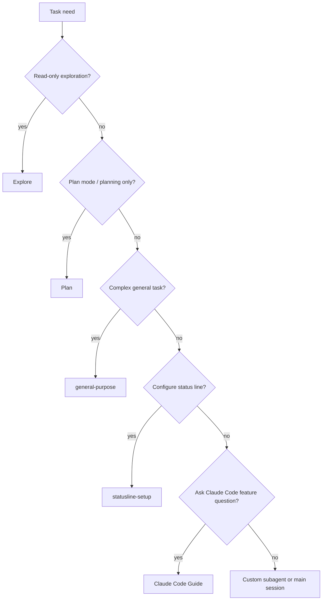

---
tags:
  - claude-code
  - subagents
  - built-in
  - version-sensitive
type: note
status: evergreen
created: "2026-04-09"
source: "https://code.claude.com/docs/en/sub-agents"
parent_note: "[[Claude Code - Multi-Agent MOC]]"
---

# Built-in Subagents

Claude Code มี built-in subagents และ helper agents ที่ใช้โดยอัตโนมัติเมื่อเหมาะสม

## Subagent Selection Map

> version-sensitive: รายชื่อ built-in/helper agents, model, และ tool access อาจเปลี่ยนตาม Claude Code release

selection map นี้ช่วยแยก built-in subagents ตามงานที่เหมาะสม โดยเฉพาะความต่างระหว่าง read-only exploration, planning, general-purpose execution, helper setup, และคำถามเกี่ยวกับ Claude Code.

| Agent | Model | Tools | ใช้เมื่อ |
|---|---|---|---|
| **Explore** | Haiku | Read-only tools | ต้องการค้นหาและวิเคราะห์ codebase โดยไม่แก้ไข |
| **Plan** | Inherits from main conversation | Read-only tools | อยู่ใน plan mode และต้องเก็บ context สำหรับวางแผน |
| **general-purpose** | Inherits from main conversation | All tools | งานซับซ้อนที่ต้องทั้ง explore และ modify |
| **statusline-setup** | Sonnet | - | รัน `/statusline` เพื่อ configure status line |
| **Claude Code Guide** | Haiku | - | ถามคำถามเกี่ยวกับ features ของ Claude Code |

---

## ข้อสำคัญ

> **Subagent ไม่สามารถ spawn subagent ซ้อนกันได้** — ถ้าต้องการ nested delegation ให้ใช้ skills หรือ chain จาก main conversation

> ℹ️ บาง helper agents เช่น `statusline-setup` และ `Claude Code Guide` ถูกใช้โดย Claude เมื่อเหมาะสม ไม่ใช่ subagent ที่ต้องเรียกเองทุกครั้ง

---

## ดูเพิ่มเติม
- [[15 - สร้าง Subagent ด้วย agents]]
