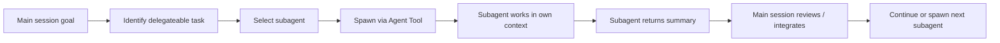

---
tags:
  - claude-code
  - agent-tool
  - subagents
  - version-sensitive
type: note
status: evergreen
created: "2026-04-09"
source: "https://code.claude.com/docs/en/sub-agents"
parent_note: "[[Claude Code - Multi-Agent MOC]]"
---

# Agent Tool (เดิมชื่อ Task Tool)

> ℹ️ ตั้งแต่ Claude Code **v2.1.63** เป็นต้นมา "Task tool" เปลี่ยนชื่อเป็น **"Agent tool"** (ชื่อเก่ายังใช้ได้เป็น alias)

**Agent Tool** = เครื่องมือ internal ที่ Claude ใช้ **โดยอัตโนมัติ** เพื่อ spawn Subagent จากภายใน session

ผู้ใช้ไม่ต้องเรียกเองโดยตรง — แค่บอก Claude ว่าต้องการ delegate งาน:

```text
ช่วย delegate งานตรวจ security ใน /api ให้ security-agent
แล้ว qa-agent เขียน unit test สำหรับ auth.ts ด้วย
```

---

## Agent Tool Lifecycle

> version-sensitive: ชื่อ tool, alias, และ behavior ของ subagent invocation อาจเปลี่ยนตาม Claude Code release



lifecycle นี้ย้ำว่า Agent Tool เป็น orchestration mechanism ภายใน session: งานที่ส่งไปควร bounded, มี output contract ชัด และ main session ต้องเป็นคน review/integrate ผลลัพธ์กลับเข้ากับงานหลัก.

---

## Agent Tool vs Agent Teams

| | Agent Tool (Subagent) | Agent Teams |
|---|---|---|
| ทำงานใน | session เดียวกัน | Claude Code instances แยก |
| Teammate คุยกันได้ | ❌ (รายงานกลับ main เท่านั้น) | ✅ โดยตรง |
| เหมาะกับ | งาน focused ต้องการแค่ผลลัพธ์ | งานซับซ้อนที่ต้อง collaborate |

---

## พื้นฐานทฤษฎีที่เกี่ยวข้อง

- [[02 AI Systems/MCP/Bridge/14 - Tools_ การออกแบบและทำงาน|Tools: การออกแบบและทำงาน]] — Agent Tool คือ Tool ชนิดพิเศษ: แทนที่จะ return data กลับมา มัน spawn agent อีกตัวเป็น output
- [[02 AI Systems/AI Agent Fundamentals/Core/04 - สถาปัตยกรรม Agent_ Model + Tools + Orchestration|Orchestration Component]] — การ spawn subagent ผ่าน Agent Tool คือ Orchestration ที่ทำงานจริง
