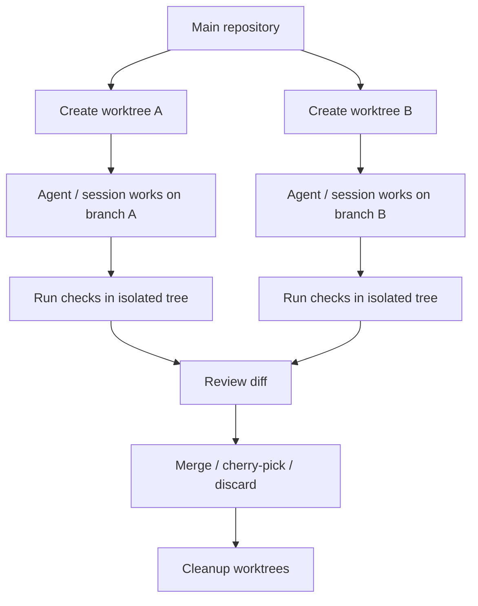

---
tags:
  - claude-code
  - git
  - worktree
  - isolation
  - version-sensitive
type: note
status: evergreen
created: "2026-04-09"
source: "https://code.claude.com/docs/en/common-workflows"
parent_note: "[[Claude Code - Multi-Agent MOC]]"
---

# Git Worktree: ป้องกันการชนกันของโค้ด

**ปัญหา:** หลาย agent แก้ไฟล์เดียวกัน = merge conflict

`git worktree` เป็น **คำสั่ง git ปกติ** (มีมาตั้งแต่ git 2.5) — ให้ checkout branch หลายอันพร้อมกันได้ แต่ละอันมี working directory ของตัวเอง ใช้ repository เดียวกัน

---

## Worktree-Based Parallel Workflow

> version-sensitive: `claude --worktree` และ cleanup behavior ผูกกับ Claude Code release/config



workflow นี้ลดการชนกันของไฟล์เมื่อหลาย agent หรือหลาย session ทำงานพร้อมกัน แต่ยังต้องกำหนด ownership ของ branch/file และ review diff ก่อน merge เสมอ.

---

## 3 วิธีใช้งานกับ Claude Code

### วิธีที่ 1: `claude --worktree` (CLI flag)

```bash
claude --worktree feature-auth    # สร้าง worktree + เปิด Claude
claude --worktree bugfix-123
claude --worktree                 # ให้ Claude generate ชื่อเอง
```

Worktree ถูกสร้างที่ `<repo>/.claude/worktrees/<name>/` — **cleanup อัตโนมัติ** ถ้าไม่มีการเปลี่ยนแปลง

### วิธีที่ 2: `isolation: worktree` ใน Frontmatter

```markdown
---
name: frontend-agent
isolation: worktree
---
```

> ℹ️ "Each subagent gets its own worktree that is automatically cleaned up when the subagent finishes without changes."

### วิธีที่ 3: บอก Claude ตรงๆ

```text
work in a worktree
start a worktree for this task
```

---

## Manual git worktree

```bash
git worktree add ../project-feature-a -b feature-a
git worktree list
git worktree remove ../project-feature-a
```

---

## เลือกวิธีไหน?

```
ต้องการ session แยกสำหรับตัวเอง    → claude --worktree <name>
ต้องการ subagent มี isolation       → isolation: worktree ใน frontmatter
อยากให้ Claude จัดการให้            → "work in a worktree"
ต้องการควบคุมเองเต็มที่             → git worktree add ...
```
