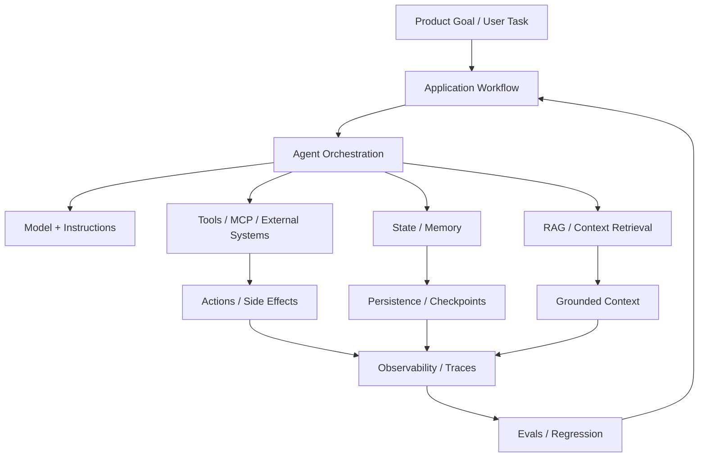

---
tags:
  - synthesis
  - agents
  - runtime
  - orchestration
type: synthesis
status: evergreen
source: "OpenAI Agents Guide · OpenAI Responses API · OpenAI Using Tools · Google ADK Sessions and Memory"
parent_note: "[[04 Synthesis/Synthesis - MOC]]"
---

# Synthesis - Agent Runtime Layers

## Summary

agent systems จะเข้าใจง่ายขึ้นมากถ้าแยกเป็น “runtime layers” แทนการมองว่าเป็นก้อนเดียว

โน้ตนี้เป็น bridge map เท่านั้น:
- ถ้าต้องการความหมายของ layer ต่าง ๆ ให้ดู `AI Agent Fundamentals`
- ถ้าต้องการเรื่อง state/memory ของ framework ให้ดู `Agent Frameworks`
- ถ้าต้องการเรื่อง observability/evals ให้ดู `Evals` และ `Agent Frameworks`

---

## Runtime Layer Stack

stack นี้ช่วยแยกความรับผิดชอบของแต่ละชั้น: product workflow กำหนดงาน, orchestration เลือก step/tool, model ทำ inference, tools/RAG/memory เติม capability และ context, ส่วน observability/evals ใช้คุมคุณภาพทั้ง runtime.

---
## Canonical Notes To Read Instead

| ต้องการ | ไปอ่าน |
|---|---|
| agent concept / loop / orchestration | [[02 AI Systems/AI Agent Fundamentals/Core/04 - สถาปัตยกรรม Agent: Model + Tools + Orchestration]] |
| state / memory in framework runtime | [[02 AI Systems/Agent Frameworks/Core/03 - State and Memory]] |
| tools / capability layer | [[02 AI Systems/MCP/Bridge/14 - Tools: การออกแบบและทำงาน]] |
| observability / eval loop | [[02 AI Systems/Agent Frameworks/Core/06 - Evaluation and Observability]] |
| checkpoint / resumability | [[02 AI Systems/Agent Frameworks/Core/07 - Checkpointing and Resumability]] |

## Cross Links

- [[02 AI Systems/AI Agent Fundamentals/AI Agent Fundamentals - MOC]]
- [[02 AI Systems/Agent Frameworks/Agent Frameworks - MOC]]
- [[02 AI Systems/Evals/Evals - MOC]]
- [[Home]]

---

## Official References

- OpenAI Agents: https://platform.openai.com/docs/guides/agents
- OpenAI Responses API: https://platform.openai.com/docs/api-reference/responses/compact?api-mode=responses
- OpenAI Using Tools: https://platform.openai.com/docs/guides/tools?api-mode=responses
- Google ADK Sessions Overview: https://google.github.io/adk-docs/sessions/
- Google ADK State: https://google.github.io/adk-docs/sessions/state/
- Google ADK Memory: https://google.github.io/adk-docs/sessions/memory/
