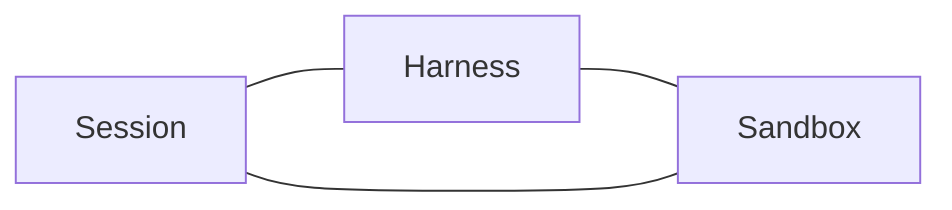
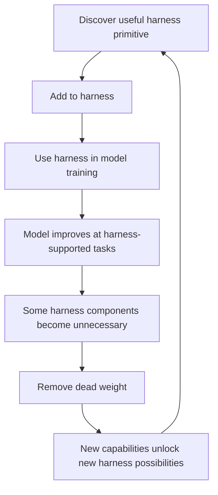

---
tags:
  - synthesis
  - harness
  - evolution
  - agents
type: synthesis
status: evergreen
source: "Anthropic Managed Agents · LangChain Anatomy of Agent Harness · Philipp Schmid Agent Harness 2026"
parent_note: "[[04 Synthesis/Synthesis - MOC]]"
created: "2026-04-23"
updated: ""
---

# Synthesis - Harness Co-Evolution and Lifecycle

> สังเคราะห์จากหลาย sources เรื่อง harness ที่เปลี่ยนไปตาม model capabilities

---

## Core Insight

> "The space of interesting harness combinations doesn't shrink as models improve. Instead, it moves." — Anthropic

harness ไม่ได้หายไปเมื่อ model ดีขึ้น แต่ **เลื่อน** — สิ่งที่เคยต้อง engineer ใน harness อาจถูก model ทำได้เอง แต่ model ที่ดีขึ้นก็เปิดโอกาสให้ harness ทำสิ่งที่ซับซ้อนกว่าเดิม

---

## Assumptions Go Stale

ทุก component ใน harness encode assumption ว่า model ทำอะไรไม่ได้ด้วยตัวเอง — assumptions เหล่านี้ต้องถูก stress test เป็นประจำ

ตัวอย่างจริง:

| Assumption | Model เดิม | Model ใหม่ | ผล |
|---|---|---|---|
| Context anxiety ต้องแก้ด้วย context resets | Sonnet 4.5 (มี anxiety) | Opus 4.5 (หาย anxiety) | resets กลายเป็น dead weight |
| Sprint decomposition จำเป็น | Opus 4.5 (ต้องแบ่ง sprints) | Opus 4.6 (ทำงานยาวได้เอง) | sprint construct ถูกถอดออก |
| Evaluator จำเป็นทุก sprint | Opus 4.5 (ต้องตรวจทุก sprint) | Opus 4.6 (ทำได้ดีเองบางงาน) | evaluator ย้ายไปตรวจรอบเดียวตอนจบ |

> "Every new model release has a different, optimal way to structure agents." — Philipp Schmid

---

## Build-to-Delete Principle

> ที่มา: Philipp Schmid (Bitter Lesson applied to agents)

Rich Sutton's Bitter Lesson: general methods ที่ใช้ computation ชนะ hand-coded knowledge ทุกครั้ง

ใน agent development:
- Manus refactored harness 5 ครั้งใน 6 เดือน
- LangChain re-architected Open Deep Research agent 3 ครั้งใน 1 ปี
- Vercel ลบ 80% ของ agent tools → fewer steps, fewer tokens, faster

**หลักการ**: สร้าง harness ให้ modular พอที่จะ **ถอด logic ที่เขียนเมื่อวาน** ออกได้ ถ้า over-engineer control flow model update ถัดไปจะทำให้ระบบพัง

---

## Managed Agents: Virtualized Harness

> ที่มา: Anthropic (managed-agents)

Anthropic แก้ปัญหา harness ที่ go stale ด้วยการ virtualize components:

| Component | หน้าที่ | เปรียบเทียบ |
|---|---|---|
| Session | append-only log ของทุกอย่างที่เกิดขึ้น | filesystem |
| Harness | loop ที่เรียก model + route tool calls | process scheduler |
| Sandbox | execution environment สำหรับ code + files | container |

แต่ละ component เป็น interface ที่ swap implementation ได้โดยไม่กระทบตัวอื่น — เหมือน OS ที่ virtualize hardware เป็น abstractions (process, file) ที่ outlast hardware

ปัญหาเดิม (pets vs cattle): ทุกอย่างอยู่ใน container เดียว → ถ้า container ตาย session หาย → debug ไม่ได้เพราะ user data อยู่ใน container เดียวกัน

วิธีแก้: decouple "brain" (harness) ออกจาก "hands" (sandbox) และ "memory" (session) → แต่ละตัว fail หรือ replace ได้อิสระ

---

## Harness as Dataset

> ที่มา: Philipp Schmid

harness ไม่ใช่แค่ runtime infrastructure แต่เป็น **data source สำหรับ training**:

- ทุกครั้งที่ agent ทำผิดหลัง step ที่ 100 → เป็น training signal
- trajectories ที่ harness capture → ใช้ train model ให้ไม่ "เหนื่อย" ระหว่าง long tasks
- competitive advantage ไม่ใช่ prompt อีกต่อไป แต่เป็น **trajectories ที่ harness เก็บ**

---

## Co-Evolution Loop

LangChain อธิบายว่า loop นี้สร้าง side effect: model ถูก train กับ harness เฉพาะ → เปลี่ยน tool logic อาจทำให้ performance แย่ลง (เช่น Codex กับ apply_patch tool)

แต่ harness ที่ดีที่สุดสำหรับ task ไม่จำเป็นต้องเป็นตัวที่ model ถูก train ด้วย — Terminal Bench 2.0 แสดงว่า Opus 4.6 ใน Claude Code ได้คะแนนต่ำกว่า Opus 4.6 ใน harness อื่น

---

## ความสัมพันธ์กับโน้ตอื่น

- [[02 AI Systems/AI Agent Fundamentals/Core/08 - Harness Engineering|Harness Engineering]] — definition และ components
- [[02 AI Systems/Agent Frameworks/Core/08 - Harness Patterns|Harness Patterns]] — patterns ที่ evolve ตาม model
- [[04 Synthesis/Bridge/Synthesis - Open Design Directions for Agent Systems|Open Design Directions]] — harness boundary evolution เป็น 1 ใน 6 open directions
- [[03 Tools/Claude Code/Core/25 - Context Compaction Pipeline|Context Compaction Pipeline]] — harness component ที่ evolve (context resets ถูกถอดออก)
- [[04 Synthesis/Synthesis - MOC|Synthesis - MOC]]

---

## References

- Anthropic - Managed Agents: https://www.anthropic.com/engineering/managed-agents
- Anthropic - Harness design for long-running apps: https://www.anthropic.com/engineering/harness-design-long-running-apps
- LangChain - The Anatomy of an Agent Harness: https://www.langchain.com/blog/the-anatomy-of-an-agent-harness
- Philipp Schmid - The importance of Agent Harness in 2026: https://www.philschmid.de/agent-harness-2026
