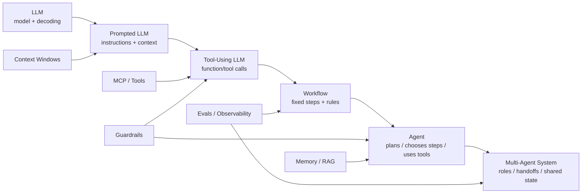

---
tags:
  - synthesis
  - derived
  - llm
  - agent
  - architecture
type: synthesis
status: evergreen
created: "2026-04-12"
source: "vault-local synthesis"
parent_note: "[[04 Synthesis/Synthesis - MOC]]"
---

# LLM to Agent Stack

## Summary

มองแบบเป็นชั้นจะช่วยไม่ปนกันระหว่าง model, context, prompting, tools, และ application behavior

โน้ตนี้เป็น bridge overview เท่านั้น:
- ถ้าต้องการ LLM theory ให้ดู `LLM Foundations`
- ถ้าต้องการ prompt/context management ให้ดู `Prompt Engineering` และ `Context Windows`
- ถ้าต้องการ agent/runtime integration ให้ดู `AI Agent Fundamentals`

---

## LLM to Agent Progression

ภาพนี้แสดง progression จาก model พื้นฐานไปสู่ agent system: ความซับซ้อนเพิ่มจากการใส่ context, tools, workflow, autonomy, handoffs, state, guardrails, และ evals ไม่ใช่แค่เปลี่ยนชื่อจาก LLM เป็น agent.

---

## Layers

1. Tokenization
2. Transformer / model weights
3. Decoding / inference
4. Context window management
5. Prompting and instructions
6. Tools / MCP / external systems
7. Agent orchestration
8. Product workflow and UX

## Canonical Notes To Read Instead

| ต้องการ | ไปอ่าน |
|---|---|
| tokenization / weights / decoding | [[01 Foundations/LLM Foundations/LLM Foundations - MOC]] |
| context management | [[01 Foundations/Context Windows/Context Windows - MOC]] |
| prompt design | [[01 Foundations/Prompt Engineering/Prompt Engineering - MOC]] |
| agent runtime integration | [[02 AI Systems/AI Agent Fundamentals/AI Agent Fundamentals - MOC]] |
| tools / MCP | [[02 AI Systems/MCP/MCP - MOC]] |
