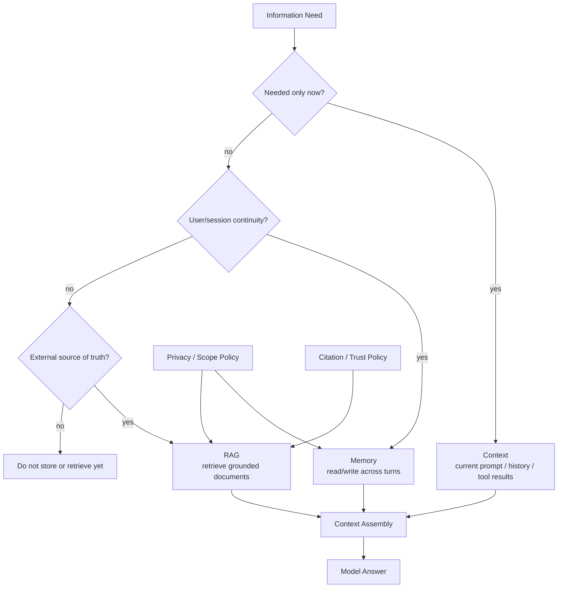

---
tags:
  - synthesis
  - derived
  - memory
  - rag
  - context
type: synthesis
status: evergreen
source: "vault-local synthesis"
parent_note: "[[04 Synthesis/Synthesis - MOC]]"
---

# Synthesis - Memory vs RAG vs Context

## Summary

สามชั้นนี้แก้คนละปัญหา:

- `context` คือสิ่งที่ model เห็นตอนนี้
- `memory` คือสิ่งที่ระบบจำข้ามรอบ
- `RAG` คือการดึง knowledge ภายนอกมา grounding คำตอบในรอบนั้น

## Quick Decision

- ข้อมูลต้องใช้ตอนนี้ → context
- ต้องจำข้ามรอบ → memory
- ต้องอิงเอกสาร/แหล่งข้อมูล → RAG
- ต้องการทั้ง continuity และ grounding → ใช้ memory + RAG ร่วมกัน

## Responsibility Map

แผนที่นี้ช่วยกันการปนหน้าที่: context คือสิ่งที่ใส่ให้ model ตอนนี้, memory คือสิ่งที่ระบบเลือกจำ, ส่วน RAG คือการดึง source of truth ภายนอกเพื่อ grounding และ citation.

## Canonical Notes To Read Instead

| ต้องการ | ไปอ่าน |
|---|---|
| working memory vs long-term memory | [[02 AI Systems/Memory Systems/Core/01 - Working Memory vs Long-Term Memory]] |
| memory taxonomy | [[02 AI Systems/Memory Systems/Core/02 - Episodic vs Semantic vs Procedural Memory]] |
| read/write policies | [[02 AI Systems/Memory Systems/Core/03 - Memory Read and Write Policies]] |
| retrieval vs RAG | [[02 AI Systems/Memory Systems/Core/06 - Memory Retrieval vs RAG]] |
| RAG pipeline | [[02 AI Systems/RAG/RAG - MOC]] |

## Cross Links

- [[02 AI Systems/Memory Systems/Memory Systems - MOC]]
- [[02 AI Systems/RAG/RAG - MOC]]
- [[04 Synthesis/Decision/Synthesis - Agent vs Workflow vs RAG]]
- [[01 Foundations/Context Windows/Context Windows - MOC]]
- [[Home]]

## Boundary Reminder

- ถ้าเป็น memory policy หรือ memory taxonomy ให้กลับไปอ่าน `Memory Systems`
- ถ้าเป็น retrieval pipeline หรือ grounding ให้กลับไปอ่าน `RAG`
- ถ้าต้องการ decision path สั้น ๆ ให้ใช้หน้านี้เป็นจุดเริ่ม แล้วค่อยตาม canonical note
