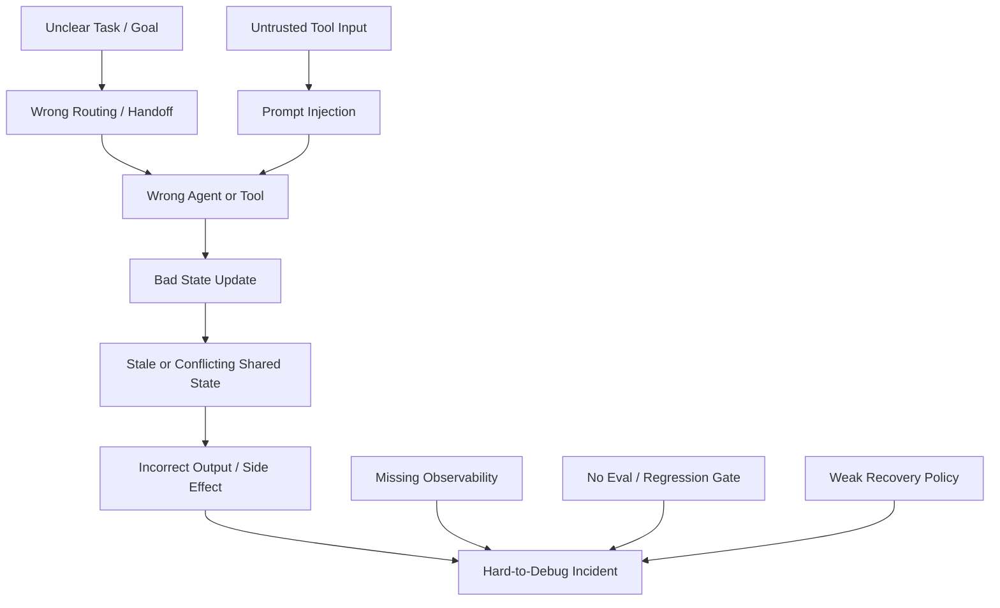

---
tags:
  - synthesis
  - multi-agent
  - failure-modes
  - reliability
  - version-sensitive
  - derived
type: synthesis
status: evergreen
source: "https://platform.openai.com/docs/guides/agent-builder-safety · https://platform.openai.com/docs/guides/trace-grading · https://platform.openai.com/docs/guides/agent-evals · https://docs.langchain.com/oss/javascript/langgraph/persistence · https://docs.langchain.com/oss/javascript/langchain/human-in-the-loop · https://microsoft.github.io/autogen/stable/user-guide/core-user-guide/design-patterns/group-chat.html · https://docs.crewai.com/en/concepts/flows"
parent_note: "[[04 Synthesis/Synthesis - MOC]]"
---

# Synthesis - Multi-Agent Failure Modes

## ภาพรวม

ระบบ multi-agent มักล้มเหลวในแบบที่ single-agent ไม่ค่อยเจอ ความเสี่ยงหลักไม่ใช่แค่คำตอบผิด แต่รวมถึง handoff ที่ขาดตอน, shared state ที่ล้าสมัย, งานซ้ำซ้อน, prompt injection ผ่านทาง tool, และช่องว่างด้าน observability ที่ทำให้ความผิดพลาดมองไม่เห็น

โน้ตนี้แยก failure modes ตามชั้นของระบบ เพื่อให้ debug และป้องกันได้อย่างเป็นระบบ

---

## Failure Propagation Map

failure ใน multi-agent system มักแพร่ผ่าน routing, handoff, shared state, tool use, และ observability gap ดังนั้นการแก้ต้องดู trajectory ทั้งเส้น ไม่ใช่ดู final answer อย่างเดียว.

---

## 1. ความผิดพลาดด้าน Orchestration

### Handoff ที่ไม่มีเจ้าของชัด

agent ตัวหนึ่งส่งงานต่อ แต่ไม่มีใครรับผิดชอบขั้นถัดไป

อาการ:
- งานหายหลังการส่งต่อ
- specialist ทำเสร็จแล้วแต่ไม่มี agent ถัดไปใช้ผลลัพธ์
- orchestrator ไม่มีสัญญาณจบงานที่ชัด

สาเหตุ:
- สัญญา handoff เป็นแบบไม่ชัดเจน
- ownership ของงานไม่ได้ถูกเขียนไว้ใน state
- logic สำหรับ routing ไม่รู้ว่า “เสร็จ” หมายถึงอะไร

### เลือก agent ถัดไปผิด

orchestrator เลือก specialist ผิด หรือวนไปมาระหว่าง agent

อาการ:
- routing ซ้ำไปยัง role ที่ไม่ถูกต้อง
- มีการโต้ตอบกลับไปกลับมาที่ไม่จำเป็น
- งานไม่เคย converge

สาเหตุ:
- ขอบเขตของ role คลุมเครือเกินไป
- เงื่อนไขของ router ระบุไม่พอ
- ไม่มี stop condition

### ลำดับการทำงานที่แฝงอยู่

ระบบดูเหมือนทำงานขนานบนกระดาษ แต่จริง ๆ แล้วรันแบบเรียงลำดับ

อาการ:
- agent หลายตัวไปติดที่ shared state เดียวกัน
- agent ตัวหนึ่งกลายเป็นคอขวด
- turns ถูก serialize โดยไม่ตั้งใจ

AutoGen group chat เป็นตัวอย่างที่ชัดว่าแม้จะเป็น multi-agent ก็ยัง sequential ภายใต้ manager agent ได้ ดังนั้น “multi-agent” ไม่ได้แปลว่า concurrent เสมอไป

---

## 2. ความผิดพลาดด้าน State และ Memory

### Shared state ที่ล้าสมัย

agent ตัวหนึ่งอ่าน state ที่ไม่ถูกต้องแล้ว

จะเกิดได้บ่อยเมื่อ:
- state ถูก persist ข้าม workflow ที่รันนาน
- มี human approval มาขัดจังหวะ flow
- state ถูกอัปเดตโดยผู้มีส่วนร่วมหลายคน

ทั้ง LangGraph persistence และ CrewAI flows แสดงให้เห็นว่าการทำงานของ agent ที่รันนานต้องมี state persistence แบบชัดเจน และนั่นหมายความว่า versioning กับ ownership ของ state ก็สำคัญด้วย

### มุมมอง state ที่ไม่ตรงกัน

agent แต่ละตัวถือ state ของงานเดียวกันคนละเวอร์ชัน

อาการ:
- agent ไม่เห็นตรงกันว่าตอนนี้สถานะคืออะไร
- agent ตัวหนึ่งทำงานจาก context ที่เก่า
- ผลลัพธ์ซ้ำซ้อนหรือขัดกันเอง

### Memory ปนเปื้อน

long-term memory ดูดเอาข้อมูลชั่วคราวหรือข้อมูลผิดเข้าไปเก็บ

อาการ:
- ระบบชอบจำความผิดพลาดที่เกิดครั้งเดียว
- preference ของผู้ใช้ปนกับข้อเท็จจริงของงาน
- thread ที่กู้คืนมาแล้วทำงานไม่เหมือนที่คาด

---

## 3. ความผิดพลาดด้านการสื่อสาร

### งานซ้ำซ้อน

agent สองตัวทำงานเดียวกันเพราะ channel สื่อสารหรือการมอบหมายงานไม่ชัด

### Queue ล่าช้าหรือ Backpressure

การใช้ async messaging ช่วย decouple agent ได้ แต่ก็อาจทำให้ backlog หรือ execution ล่าช้า ถ้าไม่มีใครเฝ้าดู queue

### ข้อความกำกวม

agent ส่งข้อความที่ยาวเกินไป, กว้างเกินไป, หรือขาดฟิลด์สำคัญ

### Context หายตอน Handoff

agent ฝั่งรับได้แค่สรุปที่ตัดหลักฐานหรือข้อจำกัดสำคัญทิ้งไป

เรื่องนี้เจอบ่อยเมื่อทีมพึ่งข้อความมากเกินไป แทนที่จะใช้ structured state หรือ checkpoint

---

## 4. ความผิดพลาดด้าน Tool และ Security

### การโจมตีแบบ Prompt Injection ผ่าน tool input

แนวทาง agent safety ของ OpenAI เตือนชัดว่า ข้อความหรือข้อมูลที่ไม่น่าไว้วางใจซึ่งไหลเข้ามาใน workflow สามารถพยายาม override instruction หรือทำให้เกิด action ที่ไม่ตั้งใจได้

เรื่องนี้ยิ่งสำคัญในระบบ multi-agent เพราะ:
- agent ตัวหนึ่งอาจประมวลผลเนื้อหาที่ไม่น่าไว้วางใจ
- agent อีกตัวอาจรับผลลัพธ์ที่ถูกแปลงแล้วต่อ
- tool call สามารถพา payload อันตรายไหลลงไปต่อได้

### สิทธิ์เข้าถึง tool กว้างเกินไป

ถ้า agent ทุกตัวใช้ tool ได้ทุกตัว ผลกระทบจากการตัดสินใจผิดจะขยายตัวเร็วมาก

### Handoff ที่ไม่ปลอดภัยไปยัง MCP หรือ tool ภายนอก

ถ้าระบบไม่แยก action แบบอ่านอย่างเดียวออกจาก action ที่มีผลข้างเคียง การ route ผิดเพียงครั้งเดียวอาจกลายเป็น action ภายนอกจริงได้

---

## 5. ความผิดพลาดด้าน Observability

### มอง trace ไม่เห็น

OpenAI trace grading เน้นว่า traces ควรจับ decision, tool call, และ reasoning step ไว้ ถ้าไม่มีสิ่งเหล่านี้ ความผิดพลาดระดับ workflow จะตามหายาก

### เห็นแค่ final answer

ผลลัพธ์ดูดี แต่กระบวนการข้างในกลับแพง, ไม่ปลอดภัย, หรือเปราะ

### ไม่มีสัญญาณ regression

ระบบเปลี่ยนไปตามเวลา แต่ไม่มีใครสังเกตว่าคุณภาพของ handoff หรือการ recovery แย่ลง

OpenAI agent evals และ trace grading ถูกออกแบบมาเพื่อทำให้ regression แบบนี้มองเห็นได้

---

## 6. ความผิดพลาดด้าน Recovery

### Retry storm จากการ retry ซ้ำ

agent หลายตัว retry ขั้นตอนที่ล้มเหลวเดียวกันโดยไม่มีนโยบายร่วม

### วนลูปไม่จบ

ทีมกลับไปแตะ branch เดิมที่ยังไม่จบซ้ำ ๆ

### Recovery ได้แค่บางส่วน

subtask หนึ่งกู้คืนได้ แต่ทั้งระบบไม่สามารถ resume workflow เดิมได้อย่างสม่ำเสมอ

แนวคิด interrupt/resume ของ LangGraph และ semantics ของ resume ใน CrewAI แสดงให้เห็นว่าการออกแบบ recovery ต้องทำที่ระดับ workflow ไม่ใช่แค่ระดับ tool call

---

## กติกาป้องกันความผิดพลาด

- ทำให้ ownership ชัดในทุก handoff
- persist state พร้อม versioning และ stable identifier
- จำกัด role ของ agent ให้แคบและสังเกตได้
- แยก agent แบบอ่านอย่างเดียวออกจาก agent ที่ทำ side effect ได้
- บังคับให้มี traces ก่อนค่อย optimize
- ใช้ eval กับ trajectory ไม่ใช่แค่ final answer
- กำหนดขีดจำกัดของ retry และ escalation ไว้ล่วงหน้า

---

## ลิงก์ที่เกี่ยวข้อง

- [[04 Synthesis/Bridge/Synthesis - Single to Multi-Agent Infrastructure]]
- [[06 Engineering/Architecture to Code/Architecture - Multi-Agent Infrastructure]]
- [[06 Engineering/Architecture to Code/Architecture - Multi-Agent Security and Permissions]]
- [[06 Engineering/Architecture to Code/Architecture - Multi-Agent Deployment and Topology]]
- [[06 Engineering/Patterns/Pattern - Sync vs Async Agent Communication]]
- [[02 AI Systems/Evals/Application/09 - Multi-Agent Evals]]
- [[02 AI Systems/Guardrails/Guardrails - MOC]]
- [[02 AI Systems/Agent Frameworks/Core/07 - Checkpointing and Resumability]]
- [[Home]]

---

## แหล่งอ้างอิง

- OpenAI Safety in Building Agents: https://platform.openai.com/docs/guides/agent-builder-safety
- OpenAI Trace Grading: https://platform.openai.com/docs/guides/trace-grading
- OpenAI Agent Evals: https://platform.openai.com/docs/guides/agent-evals
- LangGraph Persistence: https://docs.langchain.com/oss/javascript/langgraph/persistence
- LangGraph HITL: https://docs.langchain.com/oss/javascript/langchain/human-in-the-loop
- AutoGen Group Chat: https://microsoft.github.io/autogen/stable/user-guide/core-user-guide/design-patterns/group-chat.html
- CrewAI Flows: https://docs.crewai.com/en/concepts/flows
