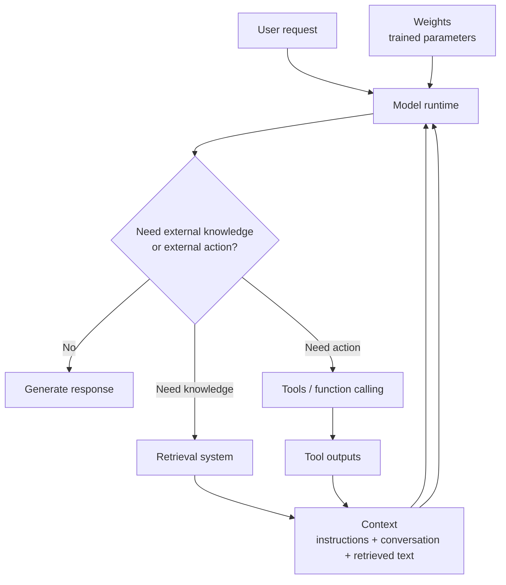
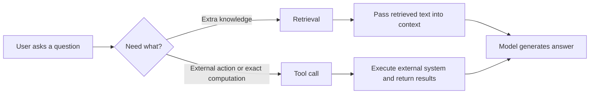
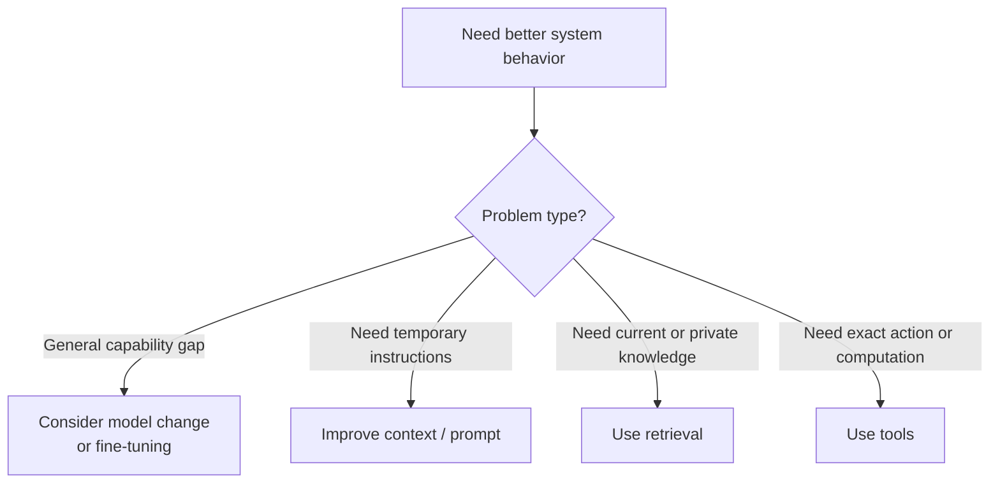

---
tags:
  - llm
  - context
  - retrieval
  - tools
  - synthesis
type: synthesis
status: evergreen
source: "OpenAI, Anthropic, Google Cloud Vertex AI, Microsoft Learn"
parent_note: "[[04 Synthesis/Synthesis - MOC]]"
---
# Weights, Context, Retrieval และ Tools

> โน้ตแกนสำหรับแยกให้ชัดว่า model weights, prompt/context, retrieval, และ tools มีบทบาทต่างกันอย่างไรในระบบ LLM และควรเลือกใช้ชั้นไหนเพื่อแก้ปัญหาแบบใด

---

## Summary

ในระบบ LLM จริง “ความรู้” และ “ความสามารถ” ไม่ได้มาจากที่เดียว แต่กระจายอยู่ 4 ชั้นหลัก:
- **weights**: สิ่งที่โมเดลเรียนระหว่าง training
- **context**: ข้อมูลชั่วคราวที่ส่งมากับ request ปัจจุบัน
- **retrieval**: การดึงข้อมูลภายนอกเข้ามาเสริมก่อนหรือระหว่าง generation
- **tools**: การให้โมเดลเรียกระบบภายนอกเพื่อคำนวณ, ค้นหา, อ่านข้อมูล, หรือกระทำบางอย่าง

การออกแบบระบบที่ดีคือการเลือกชั้นที่เหมาะกับงาน ไม่ใช่ยัดทุกอย่างไว้ใน prompt

---

## ภาพรวมเชิงสถาปัตย์

ภาพนี้สรุปแกนสำคัญ:
- weights ให้ prior knowledge และ behavioral priors
- context ควบคุมงานปัจจุบัน
- retrieval เติมข้อมูลภายนอก
- tools ให้ความสามารถเชิง action และ deterministic computation

---

## 1. Weights: ความรู้ที่อยู่ในโมเดล

weights คือพารามิเตอร์ที่โมเดลเรียนจาก training และ post-training  
ในเชิงสถาปัตย์ของ vault นี้ คำว่า `weights` ใช้เรียกความรู้และพฤติกรรมพื้นฐานที่โมเดลพกมาจาก training lifecycle ไม่ใช่สิ่งที่ถูกใส่เพิ่มเข้ามาตอน request runtime

สิ่งที่ weights ทำได้ดี:
- เก็บ patterns ทางภาษา
- encode world knowledge แบบกว้าง
- สนับสนุน generalization
- ทำ reasoning หรือ generation จากสิ่งที่ learned priors ช่วยได้

ข้อจำกัดของ weights:
- อาจล้าสมัย
- ไม่รับประกันว่าเรียก fact ล่าสุดได้
- อาจ memorize บางอย่างแต่ไม่สามารถ cite source ได้
- เปลี่ยนแปลงได้ยาก เพราะต้อง re-train หรือ fine-tune

สรุป:
- weights เหมาะกับความรู้ทั่วไปและความสามารถพื้นฐาน
- ไม่เหมาะเป็นแหล่ง truth เดียวสำหรับข้อมูลที่เปลี่ยนบ่อยหรือข้อมูลองค์กรเฉพาะ

---

## 2. Context: working memory ของ request ปัจจุบัน

context คือสิ่งที่ถูกส่งเข้าไปพร้อม request เช่น:
- system instructions
- developer instructions
- conversation history
- retrieved passages
- tool outputs
- schemas และ tool definitions

Anthropic และ OpenAI ต่างเน้นว่าข้อมูลอย่าง tools, schemas, conversation history, และ prompts ล้วน consume tokens ใน context budget

ความหมายเชิงระบบ:
- context คือ working memory ระหว่าง request/run
- context ควบคุมงานปัจจุบันได้รวดเร็วโดยไม่ต้องเปลี่ยน model weights
- แต่ context มีข้อจำกัดด้าน token budget, latency, cost, และ quality degradation เมื่อยาวเกินไป

สรุป:
- ถ้าข้อมูลจำเป็นเฉพาะงานปัจจุบัน ให้ใส่ผ่าน context ก่อน
- แต่ถ้าข้อมูลเยอะ, เปลี่ยนบ่อย, หรือค้นเฉพาะส่วนได้ ควรพึ่ง retrieval มากกว่ายัดทั้งหมดลง prompt

---

## 3. Retrieval: ดึงข้อมูลภายนอกเข้ามา grounding

retrieval คือการค้นข้อมูลจาก knowledge base, search index, หรือ vector database แล้วนำผลลัพธ์กลับมาใส่ใน context เพื่อให้โมเดลตอบโดยอ้างอิงข้อมูลภายนอก

Microsoft ระบุว่า Azure AI Search ใช้เป็น vector database หรือ grounding data สำหรับ RAG ได้ และรองรับทั้ง vector search กับ hybrid search  
Google ใช้คำว่า grounding กับ external information sources เช่น Google Search  
OpenAI ก็มี file search / retrieval tools และแนวทางให้ model ใช้ external data นอก training data

retrieval เหมาะเมื่อ:
- ต้องการข้อมูลล่าสุด
- ต้องการข้อมูลองค์กรเฉพาะ
- corpus ใหญ่เกินใส่ใน prompt ตรง ๆ
- ต้องการลด hallucination ด้วย grounding

ข้อจำกัดของ retrieval:
- คุณภาพขึ้นกับ chunking, indexing, query formulation, ranking
- similarity retrieval ไม่รับประกัน correctness
- retrieval เพิ่ม latency และ system complexity

สรุป:
- retrieval คือชั้น “เอาความรู้ภายนอกเข้ามา”
- retrieval ไม่ได้ทำ action แทนระบบภายนอก และไม่ใช่ตัวแทนของ deterministic computation

---

## 4. Tools: ให้โมเดลเรียกระบบภายนอก

OpenAI อธิบาย function calling/tool calling ว่าเป็นวิธีให้โมเดลเข้าถึง functionality และ data ภายนอก training data  
Anthropic อธิบาย tool use ว่าเป็น multi-step interaction ระหว่าง model, tools, และ tool results  
Azure OpenAI ก็อธิบาย function calling แบบเดียวกัน คือโมเดลเลือก function พร้อม arguments แล้วแอปฝั่งคุณเป็นคน execute

tools เหมาะเมื่อโมเดลต้อง:
- เรียก API
- query database
- run code
- อ่านไฟล์หรือค้นระบบที่กำหนดไว้
- กระทำบางอย่างในโลกภายนอก

จุดสำคัญ:
- model ไม่ได้ execute tool เองโดยตรง
- model เสนอ tool call
- application/runtime เป็นคน validate, execute, และส่งผลกลับ

นี่คือความต่างเชิงสถาปัตย์จาก retrieval:
- retrieval = ดึงข้อมูลมาเป็น context
- tools = เปิดทางให้ model ร้องขอ action หรือ structured data จากระบบภายนอก

---

## ความต่างของ 4 ชั้นนี้แบบสั้นที่สุด

| Layer | มีอะไรอยู่ | เหมาะกับอะไร | ข้อจำกัดหลัก |
|---|---|---|---|
| Weights | ความรู้และ patterns ที่เรียนตอน training | ความสามารถพื้นฐาน, general knowledge | ล้าสมัย, เปลี่ยนยาก, อ้างอิงไม่ได้ |
| Context | ข้อมูลชั่วคราวของ request | งานเฉพาะหน้า, instructions, conversation | context budget จำกัด |
| Retrieval | ข้อมูลภายนอกที่ดึงเข้ามา | grounding, current knowledge, private docs | quality ขึ้นกับ retrieval stack |
| Tools | การเชื่อมระบบภายนอกเพื่อ action/data | compute, API calls, transactions, file/db access | เพิ่ม orchestration และ safety complexity |

---

## Retrieval ไม่ใช่ Tool และ Tool ก็ไม่ใช่ Retrieval

แยกให้ชัด:
- ถ้าต้อง “รู้ข้อมูลเพิ่ม” ใช้ retrieval
- ถ้าต้อง “ทำบางอย่าง” หรือ “ขอผลลัพธ์เชิง deterministic” ใช้ tools

ตัวอย่าง:
- ถามนโยบายบริษัทล่าสุด -> retrieval
- ขอเช็กราคาหุ้นล่าสุดจาก API -> tool
- ขอคำนวณภาษี -> tool
- ขอค้นเอกสารสรุปประชุม -> retrieval

---

## Memorization vs Grounding

จุดนี้สำคัญมาก

โมเดลอาจตอบบางเรื่องได้เพราะ:
- learned pattern ใน weights
- context ที่ผู้ใช้ให้มา
- retrieved content
- tool results

แต่ในเชิงความน่าเชื่อถือ:
- **memorization** = model เคยเห็น pattern หรือ fact มาก่อนใน training
- **grounding** = answer ถูกผูกกับ source หรือ external data ในเวลารันจริง

คำว่า `memorization` ใน section นี้เป็น conceptual distinction ที่ใช้ใน vault นี้เพื่อแยก “สิ่งที่ model พกมาจาก training” ออกจาก “สิ่งที่ระบบนำเข้ามา ณ runtime” ไม่ใช่คำจำกัดความที่อ้างตรงจาก vendor หน้าใดหน้าหนึ่ง

Google ใช้คำว่า grounding ชัดในผลิตภัณฑ์ Vertex AI  
Microsoft ก็อธิบาย RAG และ vector search เป็นฐานความรู้เพื่อ grounding data  
OpenAI structured/tool workflows ก็ออกแบบมาเพื่อให้ programmatic systems ควบคุม response quality ได้มากขึ้น

สรุป:
- ถ้างานต้องการความเชื่อถือสูง ควรพึ่ง grounding มากกว่าเชื่อ memorization

---

## Decision Framework: ควรใช้ชั้นไหน

ใช้หลักนี้:

- ใช้ **weights / fine-tuning** เมื่อปัญหาเป็น behavior pattern ที่ต้องปรับกว้างและเกิดซ้ำ
- ใช้ **context** เมื่อปัญหาเป็น task-specific instruction หรือ short-lived constraints
- ใช้ **retrieval** เมื่อปัญหาคือ lack of up-to-date or proprietary knowledge
- ใช้ **tools** เมื่อปัญหาคือต้องคุยกับ external system หรือทำงาน deterministic

---

## Cost, Latency, Reliability Trade-offs

ส่วนนี้เป็น **architectural inference** จากรูปแบบระบบที่ผู้ให้บริการอธิบาย ไม่ใช่ข้อความตรงจากแหล่งอ้างอิงทุกบรรทัด

แต่ละชั้นมี trade-off ต่างกัน:

- weights  
  ต้นทุนล่วงหน้าสูง เปลี่ยนยาก แต่ inference path อาจเรียบง่ายกว่า

- context  
  ยืดหยุ่นสูง แต่กิน tokens และเพิ่ม latency/cost ตามขนาด prompt

- retrieval  
  เพิ่ม retrieval latency และต้องดูแล index quality แต่ช่วย grounding ได้ดี

- tools  
  ให้ capability สูงสุด แต่เพิ่ม orchestration, retries, permissions, และ failure modes

Anthropic ระบุชัดว่า tool definitions, tool use blocks, และ tool results ล้วนเพิ่ม token usage  
OpenAI structured outputs และ function calling ก็ชี้ให้เห็นว่าระบบที่ reliable มักต้องพึ่ง schema, validation, และ multi-step control

---

## Design Rules

- อย่าพยายามแก้ทุกปัญหาด้วย prompt อย่างเดียว
- แยก “knowledge access” ออกจาก “action execution” ให้ชัด
- ข้อมูลที่เปลี่ยนบ่อยหรือเป็น private knowledge ควรอยู่ใน retrieval layer มากกว่า weights
- งานที่ต้อง exactness หรือ side effects ควรผ่าน tools พร้อม validation
- context ควรเก็บเฉพาะสิ่งที่จำเป็นต่อ run ปัจจุบัน
- ถ้าเป้าหมายคือ reliability ต้องคิดทั้ง retrieval quality, tool safety, และ output validation ร่วมกัน

---

## ความสัมพันธ์กับโน้ตอื่น

- [[01 Foundations/LLM Foundations/Core/03 - การฝึกและ Post-Training]]
- [[01 Foundations/LLM Foundations/Core/04 - Inference, Context และ RAG]]
- [[01 Foundations/LLM Foundations/Core/08 - Data, Pretraining และ Model Modes]]
- [[01 Foundations/LLM Foundations/Core/10 - Embeddings และ Semantic Similarity]]
- [[01 Foundations/Context Windows/Context Windows - MOC|Context Windows]]
- [[02 AI Systems/RAG/RAG - MOC|RAG - MOC]]
- [[02 AI Systems/MCP/MCP - MOC|MCP - MOC]]
- [[02 AI Systems/AI Agent Fundamentals/AI Agent Fundamentals - MOC|AI Agent Fundamentals - MOC]]
- [[04 Synthesis/Decision/Synthesis - Prompting vs Fine-tuning vs RAG]]

---

## คำถามที่มักสับสน

- ถ้าโมเดลเคยเห็นข้อมูลใน training แล้ว ยังต้องใช้ RAG ไหม
- retrieval กับ tool call ต่างกันตรงไหน
- prompt ที่ยาวขึ้นแก้ปัญหาได้แทน retrieval หรือไม่
- fine-tuning ควรใช้เมื่อไรแทนการเสริมข้อมูลตอน inference
- file search ถือเป็น retrieval หรือ tool หรือทั้งสองอย่าง

---

## Official References

- OpenAI: Function Calling  
  https://platform.openai.com/docs/guides/function-calling
- OpenAI: Structured Outputs  
  https://platform.openai.com/docs/guides/structured-outputs
- OpenAI API Reference: Vector Stores / Retrieval-related APIs  
  https://platform.openai.com/docs/api-reference/vector-stores
- Anthropic: Tool Use Overview  
  https://docs.anthropic.com/en/docs/agents-and-tools/tool-use/overview
- Anthropic: Prompt Caching  
  https://docs.anthropic.com/en/docs/build-with-claude/prompt-caching
- Google Cloud Vertex AI: Grounding with Google Search  
  https://cloud.google.com/vertex-ai/generative-ai/docs/grounding/grounding-with-google-search
- Google Cloud Vertex AI: Function Calling  
  https://cloud.google.com/vertex-ai/generative-ai/docs/multimodal/function-calling
- Azure AI Search: Vector Search Overview  
  https://learn.microsoft.com/en-us/azure/search/vector-search-overview
- Azure OpenAI: Function Calling  
  https://learn.microsoft.com/en-us/azure/ai-services/openai/how-to/assistant-functions

---

## Next Notes To Create

- Grounding และ Citation
- Tool Calling Reliability
- Fine-tuning Decision Framework
