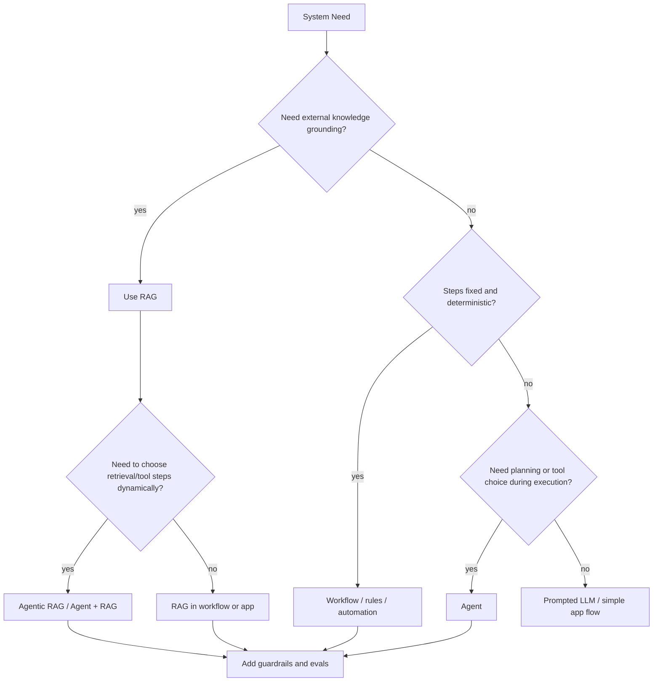

---
tags:
  - synthesis
  - derived
  - agent
  - workflow
  - rag
type: synthesis
status: evergreen
created: "2026-04-12"
source: "vault-local synthesis"
parent_note: "[[04 Synthesis/Synthesis - MOC]]"
---

# Agent vs Workflow vs RAG

## Summary

สามอย่างนี้แก้คนละปัญหา:

- `Workflow` ใช้เมื่อขั้นตอนชัดและ deterministic
- `RAG` ใช้เมื่อข้อมูลไม่พอหรืออยากลด hallucination
- `Agent` ใช้เมื่อระบบต้องตัดสินใจเลือก step หรือ tool เองระหว่างทาง

## Quick Decision

- งานเป็นลำดับแน่นอน → workflow
- งานต้องดึงความรู้ภายนอกแบบแม่น → RAG
- งานต้องวางแผน ปรับตัว หรือเลือกเครื่องมือเอง → agent

## Decision Tree

ใช้ tree นี้เพื่อเลือก architecture จากปัญหาจริง: RAG แก้ knowledge gap, workflow แก้ deterministic process, agent แก้ dynamic planning/tool choice และ hybrid ใช้เมื่อมีมากกว่าหนึ่งแรงขับพร้อมกัน.

## Use the Canonical Notes For

- workflow-vs-agent detail → [[04 Synthesis/Decision/Synthesis - Workflow vs AI Agent|Workflow vs AI Agent]]
- when to use / not use agent → [[05 Use Cases/Decision/Use Cases - When to Use an Agent|When to Use an Agent]]
- RAG grounding layer → [[01 Foundations/LLM Foundations/Core/04 - Inference, Context และ RAG]]

## Cross Links

- [[04 Synthesis/Bridge/Synthesis - Memory vs RAG vs Context]]
- [[Home]]

## Boundary Reminder

- ถ้าต้องการ theory ของ workflow vs agent ให้ไปอ่าน `Synthesis - Workflow vs AI Agent`
- ถ้าต้องการ decision ว่าเมื่อไรควรและไม่ควรใช้ agent ให้ไป `Use Cases - When to Use an Agent`
- ถ้าต้องการรายละเอียด retrieval grounding ให้ไป `RAG - MOC`
- หน้านี้เป็น bridge สำหรับตัดสินใจเร็ว ไม่ใช่ที่อธิบาย canonical theory ซ้ำ
