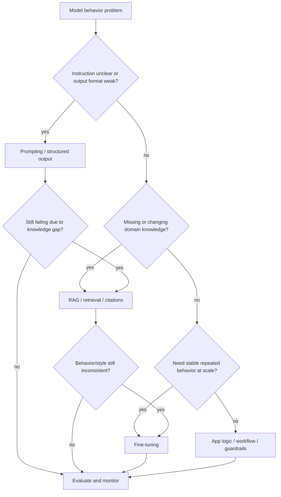

---
tags:
  - synthesis
  - derived
  - prompting
  - finetuning
  - rag
type: synthesis
status: evergreen
created: "2026-04-12"
source: "vault-local synthesis"
parent_note: "[[04 Synthesis/Synthesis - MOC]]"
---

# Prompting vs Fine-tuning vs RAG

## Summary

สามแนวทางนี้ใช้แก้คนละชั้น:

- `Prompting` ปรับวิธีสั่งงาน
- `RAG` ปรับข้อมูลที่โมเดลเห็น
- `Fine-tuning` ปรับพฤติกรรมจากน้ำหนักโมเดล

## Use This When

- Prompting: งานยังอยู่ใน capability ของโมเดล แต่คำสั่งยังไม่ชัด
- RAG: โมเดลขาดข้อมูลเฉพาะโดเมน หรือข้อมูลต้องอัปเดตตลอด
- Fine-tuning: ต้องการ style / format / behavior ที่เสถียรในสเกลสูง

## Rule of Thumb

เริ่มจาก prompting ก่อน ถ้ายังติดเรื่อง knowledge gap ค่อยเพิ่ม RAG และถ้าปัญหาคือ behavior ซ้ำ ๆ ที่ต้องแก้ถาวรค่อยพิจารณา fine-tuning

## Intervention Choice Diagram

diagram นี้ช่วยแยก intervention ตามชั้นที่แก้: prompt แก้ instruction, RAG แก้ knowledge/context, fine-tuning แก้ behavior ที่ต้องการให้เสถียรซ้ำ ๆ และ app logic/guardrails แก้ control boundary.

## Cross Links

- [[01 Foundations/Prompt Engineering/Prompt Engineering - MOC]]
- [[01 Foundations/LLM Foundations/Core/04 - Inference, Context และ RAG]]
- [[01 Foundations/LLM Foundations/Core/03 - การฝึกและ Post-Training]]
- [[04 Synthesis/Bridge/Synthesis - Memory vs RAG vs Context]]
- [[Home]]
