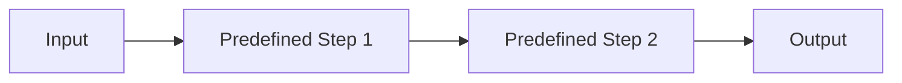
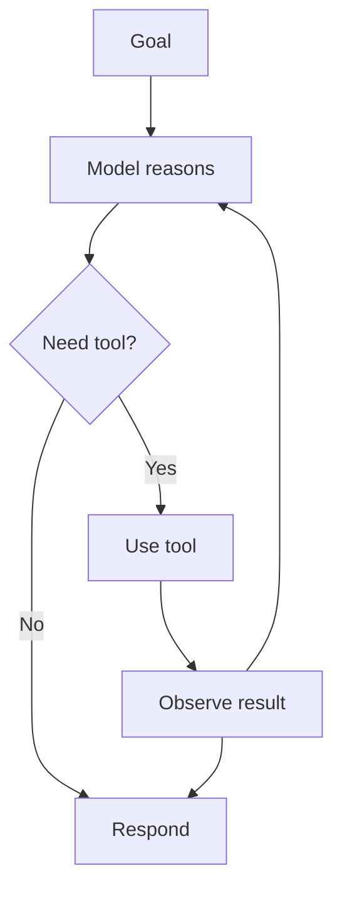

---
tags:
  - agent
  - workflow
  - comparison
type: synthesis
status: evergreen
source: "OpenAI Agents Guide · Google Skills — Agent Fundamentals · Anthropic Tool Use Overview"
parent_note: "[[04 Synthesis/Synthesis - MOC]]"
---

# Workflow vs AI Agent


---

## ความต่างหลัก

| | Workflow | AI Agent |
|---|---|---|
| **การตัดสินใจ** | Predefined — โปรแกรมเมอร์กำหนดไว้ล่วงหน้า | Dynamic — LLM ตัดสินใจว่าจะทำอะไรต่อ |
| **ลำดับขั้นตอน** | Fixed code paths | ปรับได้ตาม context |
| **การรับมือ variation** | ต้องเขียน branch สำหรับทุก case | ปรับแผนได้ระหว่างทำงาน |
| **ความซับซ้อน** | ต่ำ ถ้างานชัดเจน | สูง แต่ flexible กว่า |
| **ต้นทุน** | ต่ำกว่า | สูงกว่า (LLM calls หลายรอบ) |

---

## Workflow

> LLMs and tools are orchestrated through **predefined code paths**

- เส้นทางการทำงานถูกกำหนดไว้ล่วงหน้า
- โปรแกรมเมอร์เป็นคนตัดสินใจว่าจะทำขั้นตอนใดก่อนหลัง
- LLM เป็นส่วนหนึ่งของ flow แต่ไม่ได้ควบคุม flow เองมากนัก

```
Input → Predefined Step 1 → Predefined Step 2 → Output
```



---

## AI Agent

> LLMs **dynamically direct** their usage

- LLM มีบทบาทตัดสินใจว่าควรใช้ tool ไหน
- ลำดับงานไม่จำเป็นต้อง fix ตายตัว
- ระบบสามารถเปลี่ยนแนวทางตามสิ่งที่พบระหว่างทางได้

```
Goal → LLM Thinks → Need Tool? → Use Tool → Observe Result → Loop → Respond
```



diagram นี้เป็น conceptual abstraction ของโน้ตนี้ เพื่อเทียบ fixed workflow กับ dynamic agent loop ไม่ใช่ runtime trace จาก provider รายใดรายหนึ่ง

---

## เมื่อไรควรใช้อะไร

### ใช้ Workflow เมื่อ:
- งานชัดเจน เส้นทางตายตัว
- งาน deterministic สูง
- ต้องการ predictability และ cost efficiency
- ตัวอย่าง: "ถ้า order > $100 ให้ free shipping"

### ใช้ Agent เมื่อ:
- งานคลุมเครือ มีหลายทางเลือก
- ต้องปรับตัวระหว่างทาง
- มี ambiguity สูง
- ต้องการ reasoning เพื่อหาเส้นทาง
- ตัวอย่าง: "จองทริปที่เหมาะกับปฏิทินและงบของฉัน"

### ตัวเลือกกลาง:
- งานเสี่ยงสูงและต้องมี approval หลายจุด → `Workflow + guarded tool calls`

---

## Agent เป็น Paradigm Shift

Agent abstraction ไม่ใช่แค่ improvement เล็กน้อย แต่เป็นการเปลี่ยนกรอบคิด:

| เดิม | ใหม่ |
|---|---|
| Reactive | Proactive |
| Isolated | Integrated |
| Advisory | Executive |
| Static | Adaptive |

ระบบไม่ควรถูกคิดเป็นแค่ **prompt-response pair** แต่ควรถูกคิดเป็น **goal-seeking runtime**

---

## ดูต่อ

- [[05 Use Cases/Decision/Use Cases - When to Use an Agent|Use Cases - When to Use an Agent]]
- [[02 AI Systems/AI Agent Fundamentals/Core/04 - สถาปัตยกรรม Agent: Model + Tools + Orchestration]]
- [[05 Use Cases/Application/Use Cases - Build an AI Agent]]

## ตัวอย่าง Implementation จริง

- [[03 Tools/Claude Code/Workflow/04 - 1 Session vs Subagents vs Agent Teams|1 Session vs Subagents vs Agent Teams]] — Workflow = 1 Session หรือ Sequential Subagents / Agent = Dynamic Agent Teams ที่ตัดสินใจเองว่าจะทำอะไรต่อ

## Official References

- OpenAI: Agents  
  https://platform.openai.com/docs/guides/agents
- Anthropic: Tool Use Overview  
  https://docs.anthropic.com/en/docs/agents-and-tools/tool-use/overview
