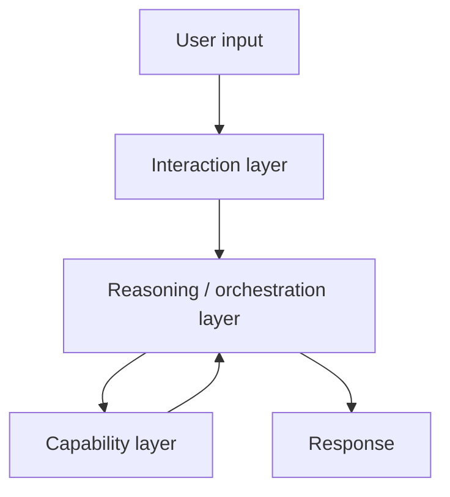
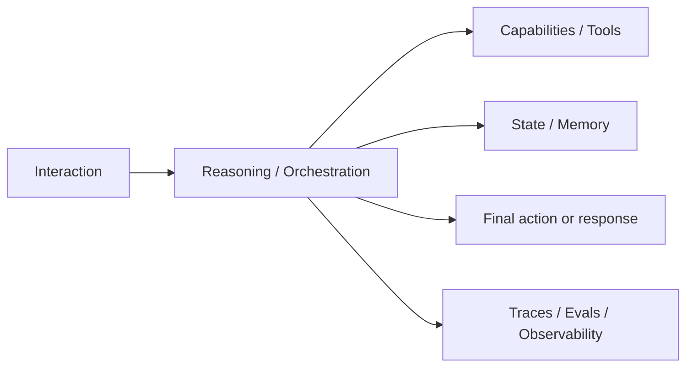

---
tags:
  - synthesis
  - agents
  - runtime
  - orchestration
type: synthesis
status: evergreen
source: "OpenAI Agents Guide · OpenAI Responses API · OpenAI Using Tools · Google ADK Sessions and Memory"
parent_note: "[[Home]]"
---

# Synthesis - Agent Runtime Layers

## Summary

agent systems จะเข้าใจง่ายขึ้นมากถ้าแยกเป็น “runtime layers” แทนการมองว่าเป็นก้อนเดียว

จาก official docs ของ OpenAI และ Google ADK เรามองระบบ agent เป็นชั้น ๆ ได้ดังนี้:
- interaction layer
- reasoning and orchestration layer
- capability layer
- state and memory layer
- observability and evaluation layer

---

## 1. Interaction Layer

หน้า `Responses` ของ OpenAI อธิบายว่า runtime interface รับ text/image inputs และสร้าง model responses พร้อมรองรับ stateful interactions  
ชั้นนี้รับผิดชอบ:
- user input
- conversation turn
- output contract
- session continuity ระดับ interface

---

## 2. Reasoning And Orchestration Layer

หน้า `Agents` และ `Agent Builder` ของ OpenAI อธิบายว่าการสร้าง agents คือการออกแบบ workflows ที่รวม models, tools, knowledge, และ logic เข้าด้วยกัน

ชั้นนี้จึงรับผิดชอบ:
- planning
- routing
- control flow
- handoffs
- stopping conditions

นี่คือชั้นที่แยก agent systems ออกจาก prompt-response systems ทั่วไป

---

## 3. Capability Layer

หน้า `Using tools` ของ OpenAI ระบุว่า model capabilities ถูก extend ผ่าน:
- function calling
- file search
- web search
- remote MCP
- built-in tools อื่น ๆ

ดังนั้น capability layer คือชั้นของ:
- tool eligibility
- tool invocation
- external system access
- retrieval-backed knowledge access

นี่ทำให้ “what the system can do” ไม่ได้อยู่ใน model weights อย่างเดียว

---

## 4. State And Memory Layer

Google ADK แยกระหว่าง:
- `Session` เป็น current conversation thread
- `State` เป็น scratchpad ของ interaction นั้น
- `Memory` เป็น long-term knowledge ผ่าน `MemoryService`

มุมนี้ช่วยแยก 3 อย่างที่คนชอบปนกัน:
- current interaction state
- session-scoped working memory
- long-term memory

ในเชิง runtime layer สิ่งนี้สำคัญมาก เพราะ state/memory ส่งผลต่อ:
- continuity
- personalization
- resumability
- multi-step behavior

---

## 5. Observability And Evaluation Layer

OpenAI `Trace grading` และ `Agent evals` ชี้ว่า systems ที่มี tools และ workflows ต้องมี:
- traces
- structured grading
- reproducible evaluations

ชั้นนี้ไม่ได้สร้าง behavior โดยตรง แต่เป็นชั้นที่ทำให้ระบบ:
- inspect ได้
- diagnose ได้
- improve ได้

---

## Architectural Inference For This Vault

การมองเป็น runtime layers ช่วยตอบคำถามสำคัญได้ง่ายขึ้น:
- ปัญหานี้อยู่ที่ prompt/interface หรือ orchestration
- ปัญหานี้อยู่ที่ capability/tool layer หรือ state/memory
- ปัญหานี้มองไม่เห็นเพราะไม่มี observability layer หรือไม่

---

## ทำไมมุมนี้สำคัญ

ถ้าไม่แยกเป็น layers คนมักจะ:
- โทษ model ทั้งที่ปัญหาอยู่ที่ tool policy
- ใช้ memory ทั้งที่จริงควรเป็น RAG
- เพิ่ม prompt complexity ทั้งที่จริงควรเพิ่ม orchestration
- มองไม่เห็นว่าปัญหาเกิดตรงไหนใน multi-step systems

---

## Failure Modes

- ซ่อน orchestration ไว้ใน prompts จน layer boundaries ไม่ชัด
- ไม่แยก retrieval/tool use ออกจาก reasoning
- ใช้ session state ปนกับ long-term memory
- ไม่มี observability layer ทำให้ runtime opaque

---

## Design Rules

- แยก interface, orchestration, capability, memory, และ observability ออกจากกันตั้งแต่คิดระบบ
- อย่าฝังทุกอย่างไว้ใน prompt layer
- state กับ memory ควรมี scope ชัด
- tools และ retrieval ควรถูกมองเป็น capability layer ไม่ใช่แค่ prompt trick
- systems ที่มีหลาย layer ควรมี evals ที่มองข้าม final output ไปถึง traces

---

## Cross Links

- [[02 AI Systems/AI Agent Fundamentals/AI Agent Fundamentals - MOC]]
- [[02 AI Systems/Agent Frameworks/Agent Frameworks - MOC]]
- [[02 AI Systems/Memory Systems/Memory Systems - MOC]]
- [[02 AI Systems/MCP/MCP - MOC]]
- [[02 AI Systems/Evals/Evals - MOC]]
- [[Home]]

---

## Official References

- OpenAI Agents: https://platform.openai.com/docs/guides/agents
- OpenAI Responses API: https://platform.openai.com/docs/api-reference/responses/compact?api-mode=responses
- OpenAI Using Tools: https://platform.openai.com/docs/guides/tools?api-mode=responses
- Google ADK Sessions Overview: https://google.github.io/adk-docs/sessions/
- Google ADK State: https://google.github.io/adk-docs/sessions/state/
- Google ADK Memory: https://google.github.io/adk-docs/sessions/memory/
