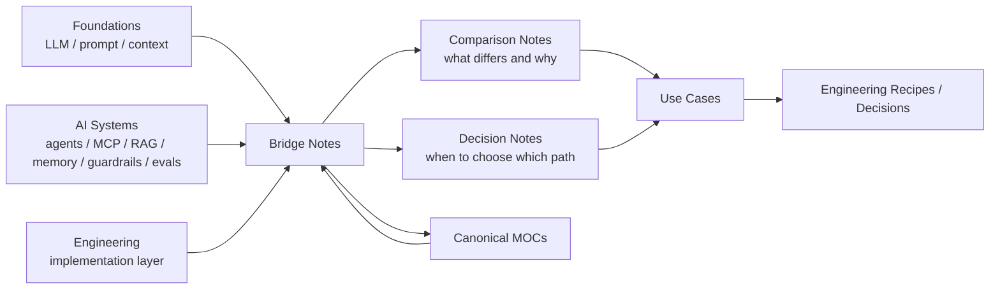

---
tags:
  - synthesis
  - moc
type: moc
status: evergreen
source: "vault-local synthesis hub"
parent_note: "[[Home]]"
---

# Synthesis - MOC

หมวดนี้รวบรวมโน้ตสังเคราะห์ที่เชื่อมหลาย domain เข้าด้วยกันเพื่อใช้เป็น reference ชั้นกลาง

หมายเหตุการใช้งาน:
- หมวดนี้เป็น bridge layer สำหรับ comparison, synthesis, และ decision support
- ถ้าเรื่องใดมี canonical note อยู่ใน `02 AI Systems` หรือ `06 Engineering` แล้ว ให้หลีกเลี่ยงการเล่าพื้นฐานซ้ำ และลิงก์กลับไปที่โน้ตแม่แทน

---

## Synthesis Layer Map

ภาพนี้แยก synthesis ออกจาก canonical notes: หมวดนี้ไม่ควรเป็นที่เก็บทฤษฎีต้นทาง แต่เป็นชั้นกลางที่เชื่อมหลาย domain เพื่อให้เห็น tradeoff, boundary, และ decision path ก่อนลง use case หรือ implementation.

---

## Notes Map

- [[04 Synthesis/Bridge/Synthesis - Agent Runtime Layers|Synthesis - Agent Runtime Layers]]
- [[04 Synthesis/Bridge/Synthesis - Weights, Context, Retrieval และ Tools|Synthesis - Weights, Context, Retrieval และ Tools]]
- [[04 Synthesis/Decision/Synthesis - Workflow vs AI Agent|Synthesis - Workflow vs AI Agent]]
- [[04 Synthesis/Decision/Synthesis - Agent vs Workflow vs RAG|Synthesis - Agent vs Workflow vs RAG]]
- [[04 Synthesis/Bridge/Synthesis - LLM to Agent Stack|Synthesis - LLM to Agent Stack]]
- [[04 Synthesis/Bridge/Synthesis - Memory in Agents|Synthesis - Memory in Agents]]
- [[04 Synthesis/Bridge/Synthesis - Memory vs RAG vs Context|Synthesis - Memory vs RAG vs Context]]
- [[04 Synthesis/Decision/Synthesis - Prompting vs Fine-tuning vs RAG|Synthesis - Prompting vs Fine-tuning vs RAG]]
- [[04 Synthesis/Bridge/Synthesis - Safety, Reliability, and Evals|Synthesis - Safety, Reliability, and Evals]]
- [[04 Synthesis/Bridge/Synthesis - Single to Multi-Agent Infrastructure|Synthesis - Single to Multi-Agent Infrastructure]]
- [[04 Synthesis/Bridge/Synthesis - Multi-Agent Failure Modes|Synthesis - Multi-Agent Failure Modes]]

---

## Related Hubs

- [[01 Foundations/LLM Foundations/LLM Foundations - MOC|LLM Foundations - MOC]]
- [[02 AI Systems/AI Agent Fundamentals/AI Agent Fundamentals - MOC|AI Agent Fundamentals - MOC]]
- [[02 AI Systems/Agent Frameworks/Agent Frameworks - MOC|Agent Frameworks - MOC]]
- [[02 AI Systems/MCP/MCP - MOC|MCP - MOC]]
- [[02 AI Systems/RAG/RAG - MOC|RAG - MOC]]
- [[02 AI Systems/Memory Systems/Memory Systems - MOC|Memory Systems - MOC]]
- [[02 AI Systems/Guardrails/Guardrails - MOC|Guardrails - MOC]]
- [[02 AI Systems/Evals/Evals - MOC|Evals - MOC]]
- [[05 Use Cases/Use Cases - MOC|Use Cases - MOC]]
- [[06 Engineering/README|Engineering - README]]

---

## Implementation Bridge

- [[06 Engineering/README]]
- [[Knowledge Topic Registry]]
