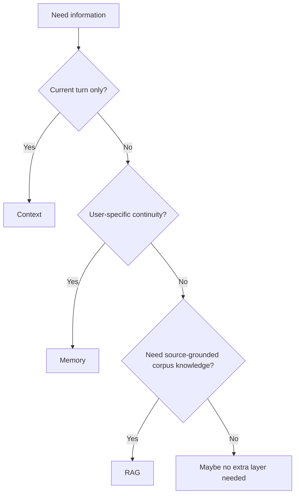
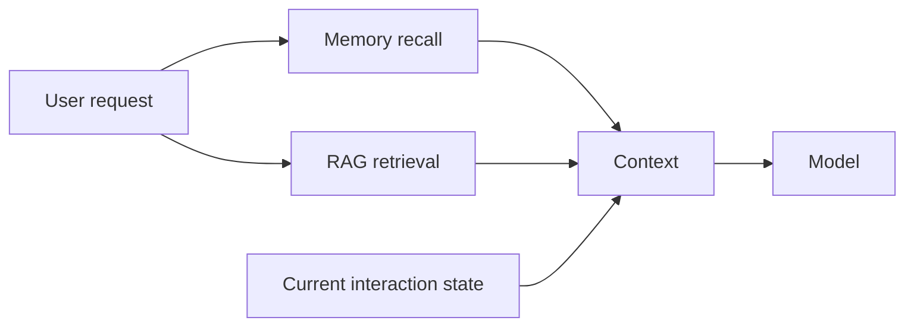

---
tags:
  - synthesis
  - memory
  - rag
  - context
type: synthesis
status: evergreen
source: ""
parent_note: "[[Home]]"
---

# Synthesis - Memory vs RAG vs Context

## Summary

สามอย่างนี้ถูกสับสนบ่อยที่สุดในระบบ LLM แต่จริง ๆ ทำหน้าที่คนละชั้น: `context` คือสิ่งที่ model เห็นตอนนี้, `memory` คือสิ่งที่ระบบจำข้ามรอบ, และ `RAG` คือการดึง knowledge ภายนอกมา grounding คำตอบในรอบนั้น

---

## คำถามหลัก

ถ้าระบบต้อง “จำ” บางอย่าง เราควร:
- ใส่ไว้ใน context เลย
- เขียนเป็น memory
- ดึงจาก RAG corpus

คำตอบขึ้นกับ:
- ข้อมูลนั้นชั่วคราวหรือถาวร
- เป็น user-specific หรือ corpus-wide
- ต้องการ grounding/citations หรือไม่
- ต้องใช้เดี๋ยวนี้หรือข้าม session

---

## 1. Context

context คือ working memory ของรอบปัจจุบัน

เหมาะกับ:
- current task state
- recent tool outputs
- active conversation
- current retrieved evidence

ข้อดี:
- model เห็นทันที
- reasoning ง่าย

ข้อจำกัด:
- จำกัดด้วย context window
- ไม่ durable
- cost โตตามขนาด

---

## 2. Memory

memory คือสิ่งที่ระบบเก็บไว้ข้ามรอบแล้วเรียกกลับมาใช้ทีหลัง

เหมาะกับ:
- user preferences
- recurring facts
- prior task outcomes
- reusable patterns

ข้อดี:
- continuity
- personalization

ข้อจำกัด:
- ต้องมี write/read policies
- เสี่ยง stale / wrong recall
- ต้องคุม privacy และ scope

---

## 3. RAG

RAG คือการ retrieve ข้อมูลจาก corpus ภายนอกเพื่อ grounding คำตอบในรอบนั้น

เหมาะกับ:
- document-backed answers
- updatable knowledge
- citations
- enterprise knowledge bases

ข้อดี:
- grounded
- อัปเดตได้โดยไม่ retrain

ข้อจำกัด:
- retrieval quality สำคัญมาก
- latency เพิ่ม
- ไม่ได้แทน personalization memory

---

## เปรียบเทียบแบบสั้น

| Layer | หน้าที่หลัก | scope | durability | groundedness |
|---|---|---|---|---|
| Context | สิ่งที่ model เห็นตอนนี้ | current turn | ต่ำ | แล้วแต่ว่าใส่อะไรเข้าไป |
| Memory | สิ่งที่ระบบจำไว้ | user/task/system dependent | สูงกว่า | ไม่จำเป็นต้องมี citations |
| RAG | ดึงความรู้จาก corpus | external knowledge base | corpus-dependent | สูง ถ้า retrieval ดี |

---

## สิ่งที่คนมักสับสน

### Context ใหญ่ ไม่ได้แปลว่ามี memory

เพราะ context ยังไม่ durable

### Memory ไม่ได้แปลว่ามี grounding

memory recall อาจให้ continuity แต่ไม่รับประกัน citation-backed answers

### RAG ไม่ได้แปลว่ามี personalization

RAG อาจตอบจาก corpus ได้ดี แต่ยังไม่รู้ user preferences

---

## วิธีคิดแบบสถาปัตย์

### ใช้ Context เมื่อ

- ข้อมูลมีอายุแค่ current task
- ต้องการ near-term reasoning

### ใช้ Memory เมื่อ

- ต้องจำข้ามรอบ
- ข้อมูลมีค่าแบบ user-specific หรือ experience-specific

### ใช้ RAG เมื่อ

- ต้องอิง corpus ภายนอก
- ต้องการ updatable knowledge และ grounding

### ใช้ร่วมกันเมื่อ

- มีทั้ง user continuity และ external evidence

---

## Failure Modes

- ใช้ context แทน long-term memory
- ใช้ memory แทน grounded retrieval
- ใช้ RAG แทน user-specific continuity
- ดึงทั้ง memory และ RAG มาเยอะเกินจน context noisy

---

## Design Rules

- เริ่มจากแยกหน้าที่ของ 3 ชั้นนี้ให้ชัดก่อนออกแบบ
- อย่าให้ memory กับ RAG ใช้ retrieval path เดียวแบบไม่แยก intent
- context เป็นที่รวมของสิ่งที่จะใช้ “ตอนนี้” ไม่ใช่ที่เก็บทุกอย่าง
- ถ้าต้องการทั้ง personalization และ grounding ให้ใช้ memory + RAG ร่วมกันอย่างตั้งใจ

---

## Cross Links

- [[01 Foundations/Context Windows/01 - Context Window คืออะไร]]
- [[02 AI Systems/Memory Systems/Memory Systems - MOC]]
- [[02 AI Systems/RAG/RAG - MOC]]
- [[04 Synthesis/Synthesis - Memory in Agents]]
- [[04 Synthesis/Synthesis - Agent vs Workflow vs RAG]]
- [[Home]]

