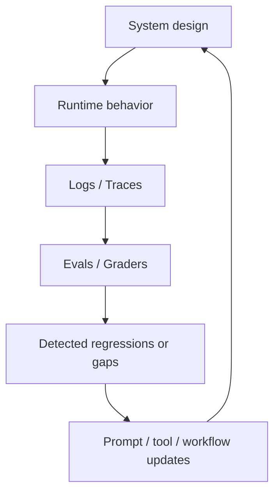
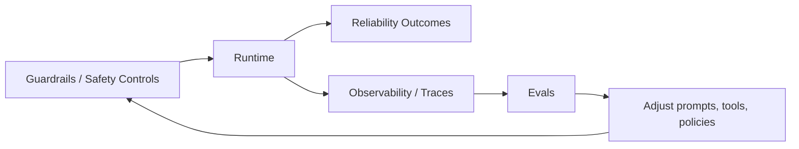

---
tags:
  - synthesis
  - safety
  - reliability
  - evals
type: synthesis
status: evergreen
source: "OpenAI Evaluation Best Practices · OpenAI Trace Grading · Azure AI Content Safety"
parent_note: "[[Home]]"
---

# Synthesis - Safety, Reliability, and Evals

## Summary

สามอย่างนี้ไม่ใช่เรื่องเดียวกัน แต่ต้องออกแบบร่วมกัน:
- `safety` = ป้องกันพฤติกรรมหรือผลลัพธ์ที่ไม่ควรเกิด
- `reliability` = ทำให้ระบบให้ผลลัพธ์ที่สม่ำเสมอและคาดการณ์ได้
- `evals` = กลไกที่ใช้วัด ตรวจ regressions และขับการปรับปรุง

ถ้าขาดอย่างใดอย่างหนึ่ง ระบบจะโตได้ยากในระยะยาว

---

## 1. Safety

จาก Microsoft Learn ฝั่ง Azure AI Content Safety:
- Prompt Shields ใช้ตรวจ `User Prompt attacks` และ `Document attacks`
- Task Adherence ใช้ตรวจ tool actions ที่ misaligned กับ user intent หรือ task objectives

ดังนั้น safety ใน agentic systems ไม่ได้มีแค่ moderation content แต่รวมถึง:
- adversarial input defense
- unsafe tool use detection
- task misalignment detection
- escalation to human review

---

## 2. Reliability

ในเชิงระบบ reliability หมายถึง:
- format ไม่หลุด
- tool calls สอดคล้องกับ intent
- retrieval และ outputs มีความคงเส้นคงวา
- behavior ไม่ regress เมื่อเปลี่ยน prompt, tool, หรือ workflow

OpenAI Evaluation Best Practices ชี้ว่าระบบที่ดีต้องมี evaluators หลายแบบ และ eval set ควรโตตามระบบจริง ไม่ใช่ทำครั้งเดียวจบ

---

## 3. Evals

OpenAI อธิบาย evals เป็นกลไก reproducible สำหรับวัด model/application behavior  
ส่วน `Trace grading` ช่วยวัด workflow-level behavior ผ่าน traces แทนที่จะดูแค่ final output

ในเชิงสถาปัตย์:
- evals คือ bridge ระหว่าง desired behavior กับ observable behavior
- trace grading คือ bridge ระหว่าง runtime complexity กับ diagnosable failures

---

## ความสัมพันธ์ระหว่างสามชั้น

### Safety without evals

มี policy หรือ filters แต่ไม่รู้ว่าระบบยังปลอดภัยจริงไหมเมื่อเวลาผ่านไป

### Reliability without safety

ระบบอาจเสถียร แต่เสถียรในพฤติกรรมที่เสี่ยงหรือไม่พึงประสงค์

### Evals without safety model

อาจวัดได้แค่ quality หรือ task completion แต่ไม่วัด harmful behavior หรือ misalignment

---

## Architectural Inference For This Vault

มุมมองที่ใช้ได้ดีคือ:
- `guardrails` เป็น control layer
- `reliability patterns` เป็น design target
- `evals` เป็น measurement layer

ทั้งสามต้องปิดลูปเข้าหากัน

---

## สิ่งที่ควรวัดแยกกัน

เพื่อไม่ให้ปนกัน ควรวัดอย่างน้อย:
- task success
- format adherence
- tool correctness
- groundedness / citation quality
- policy violations
- unsafe or misaligned actions
- latency and retries

นี่ทำให้ safety ไม่ถูกกลบด้วย average quality scores

---

## Failure Modes

- วัดแต่ quality ไม่วัด safety
- ใช้ moderation อย่างเดียวแล้วคิดว่าระบบปลอดภัย
- ไม่มี trace visibility สำหรับ multi-step workflows
- ไม่มี regression suite สำหรับ prior failures

---

## Design Rules

- safety controls ต้องแปลงเป็น measurable criteria ได้
- reliability goals ต้องถูกนิยามเป็น success criteria ชัดเจน
- evals ต้องครอบ both output quality และ behavior quality
- systems ที่มี tools ควรดู traces ไม่ใช่ final answer อย่างเดียว
- production failures ควรถูก feed กลับเข้า eval suite

---

## Cross Links

- [[02 AI Systems/Guardrails/Guardrails - MOC]]
- [[02 AI Systems/Evals/Evals - MOC]]
- [[02 AI Systems/Guardrails/Core/03 - Tool Safety]]
- [[02 AI Systems/Guardrails/Operations/06 - Monitoring and Incidents]]
- [[02 AI Systems/Evals/Core/03 - LLM-as-Judge]]
- [[02 AI Systems/Evals/Core/09 - Observability and Feedback Loops]]
- [[Home]]

## Boundary Reminder

- ถ้าเป็น control policy, fallback, approval, หรือ permission boundary ให้กลับไปอ่าน `Guardrails`
- ถ้าเป็น benchmark, rubric, judge, หรือ regression suite ให้กลับไปอ่าน `Evals`
- หน้านี้ใช้สรุปความสัมพันธ์ของสามชั้น ไม่ใช่ที่เล่ารายละเอียดซ้ำกับ canonical notes

---

## Official References

- OpenAI Evaluation Best Practices: https://platform.openai.com/docs/guides/evaluation-best-practices
- OpenAI Trace Grading: https://platform.openai.com/docs/guides/trace-grading
- Azure AI Content Safety Overview: https://learn.microsoft.com/en-us/azure/ai-services/content-safety/overview
- Azure OpenAI Prompt Shields: https://learn.microsoft.com/en-us/azure/ai-services/openai/concepts/content-filter-prompt-shields
- Azure AI Content Safety Task Adherence: https://learn.microsoft.com/en-us/azure/ai-services/content-safety/concepts/task-adherence
