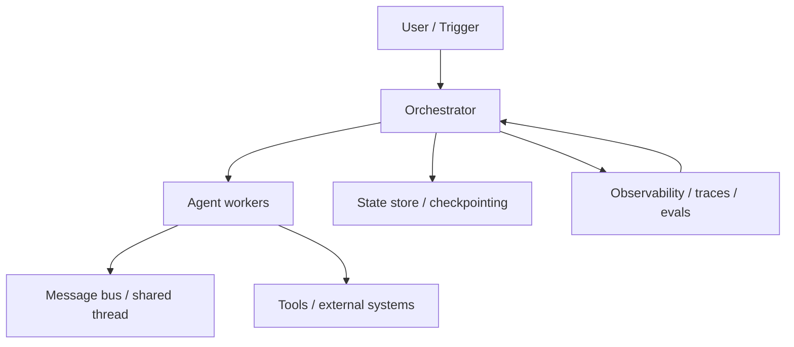

---
tags:
  - synthesis
  - multi-agent
  - infrastructure
  - orchestration
  - messaging
  - state
  - observability
  - version-sensitive
  - derived
type: synthesis
status: evergreen
source: "https://www.digitalocean.com/community/tutorials/single-to-multi-agent-infrastructure · https://platform.openai.com/docs/guides/trace-grading · https://platform.openai.com/docs/guides/agent-evals · https://docs.langchain.com/oss/javascript/langgraph/persistence · https://docs.langchain.com/oss/javascript/langchain/human-in-the-loop · https://microsoft.github.io/autogen/dev/user-guide/core-user-guide/design-patterns/group-chat.html · https://docs.crewai.com/en/concepts/flows · https://docs.crewai.com/how-to/LLM-Connections"
parent_note: "[[04 Synthesis/Synthesis - MOC]]"
---

# Synthesis - Single to Multi-Agent Infrastructure

## ภาพรวม

การขยับจาก single-agent systems ไปเป็น multi-agent systems ไม่ใช่แค่ “เพิ่มจำนวน agent” แต่เป็นการเพิ่มชั้น infrastructure ใหม่สำหรับ orchestration, messaging, shared state, observability, และ failure recovery

จุดสำคัญจาก official docs และ docs ของบริษัท tech ขนาดใหญ่คือ:
- การแบ่งงานหลาย agent เหมาะเมื่อ task ใหญ่เกินกว่าหนึ่ง agent จะรับไหว หรือเมื่ออยากแยก expertise / parallelism
- ถ้าระบบเริ่มต้องมี shared state, interrupt/resume, human approval, หรือ traceable handoffs แปลว่าโครงสร้าง infra เริ่มสำคัญกว่าตัว prompt แล้ว
- การออกแบบ multi-agent ที่ดีต้องคิดทั้ง “ใครตัดสินใจ”, “ใครคุยกับใคร”, “state อยู่ที่ไหน”, และ “ความล้มเหลวถูกกู้คืนอย่างไร”

---

## อะไรเปลี่ยนเมื่อไป Multi-Agent

### 1. Orchestration ต้องชัด

จาก DigitalOcean tutorial และ docs ของ framework ใหญ่ ๆ:
- centralized orchestrator ให้ determinism และ debug ง่าย
- state-based handoff หรือ group chat ให้ความยืดหยุ่นมากขึ้น
- workflow graph เหมาะกับงานที่ต้องคุม flow ชัด

แนวคิดนี้สอดคล้องกับ AutoGen group chat ที่มีผู้จัดลำดับ turn และกับ CrewAI Flows/Tasks ที่ให้กำหนด start/listen/router และ process types ได้

### 2. การสื่อสารต้องมี channel จริง

multi-agent ไม่ควรคิดว่า “คุยกันได้เอง” แบบไม่ต้องออกแบบ communication layer

รูปแบบที่พบบ่อย:
- synchronous call เมื่ออยากได้ ordering และ latency คุมง่าย
- asynchronous queue / pub-sub เมื่ออยาก decouple, รองรับ retries, และเพิ่ม throughput
- shared thread / shared topic เมื่ออยากให้หลาย agent อ่านบริบทเดียวกัน

### 3. State ต้อง persist ได้

เมื่อ workflow ยาวขึ้นหรือมี human approval:
- state ต้องถูก checkpoint
- thread หรือ run id ต้องชัด
- resume flow ต้องทำซ้ำได้

LangGraph persistence และ interrupts เป็นตัวอย่างที่ชัดว่า graph state ต้องถูก save เป็น checkpoints ตาม `thread_id`
CrewAI Flows ก็รองรับ state persistence และ resume long-running workflows

### 4. Observability ไม่ใช่ของเสริม

ถ้าระบบมีหลาย agent, tool calls, และ handoffs:
- final answer อย่างเดียวไม่พอ
- ต้องดู traces, logs, metrics, และ decision trail
- eval ควรวัด workflow-level behavior ไม่ใช่แค่ output text

OpenAI trace grading อธิบายตรง ๆ ว่า trace คือ end-to-end log ของ decisions, tool calls, และ reasoning steps เพื่อใช้หาจุดผิดพลาดใน orchestration

---

## ชั้น Infrastructure หลัก

### ชั้น 1: Orchestrator

- ตัดสินใจว่า task ไป agent ไหน
- คุม ordering, branching, retries และ stop conditions
- เหมาะกับงานที่ต้องการ determinism และ debuggability

### ชั้น 2: Messaging

- ส่งงานแบบ direct call หรือผ่าน queue/topic
- รองรับ sync หรือ async
- ต้องคิดเรื่อง backpressure, retries และ dead-letter handling ถ้าเป็น async

### ชั้น 3: State และ Memory

- short-term state เก็บ context ของ run ปัจจุบัน
- shared state ใช้สำหรับ handoff และ coordination
- long-term memory ใช้เก็บ knowledge ข้ามงานหรือข้าม session

### ชั้น 4: Observability และ Evals

- traces เก็บ decision path
- evals วัดคุณภาพและ regressions
- logs/metrics ช่วย diagnose failure modes และ emergent behavior

### ชั้น 5: Deployment และ Runtime

- agent อาจรันเป็น process, thread, container, หรือ service
- production stack มักต้องคิดเรื่อง scaling, service discovery และ isolation

---

## สัญญาณเชิงปฏิบัติว่าควรย้าย

ควรเริ่มแยกจาก single-agent ไป multi-agent เมื่อ:
- งานเริ่มมีหลาย subtask ที่ต่าง domain กันชัด
- งานต้องทำ parallel กันจริง
- ต้องมี human approval หรือ resume หลัง pause
- ต้อง audit ว่า agent ไหนตัดสินใจอะไร
- ต้อง scale/recover เฉพาะบางส่วนของ workflow

ไม่จำเป็นต้องไป multi-agent เมื่อ:
- ปัญหายัง small and linear
- workflow ยัง deterministic สูง
- overhead ของ orchestration สูงกว่าประโยชน์

---

## รูปแบบความล้มเหลวที่พบบ่อย

- เพิ่ม agent แต่ไม่ได้เพิ่ม orchestration quality
- ใช้ async messaging โดยไม่มี idempotency หรือ retry policy
- แชร์ state แบบไม่มี ownership ชัด
- ไม่มี trace จึง debug ไม่ได้ว่า failure เกิดตรงไหน
- เปลี่ยนเป็น multi-agent เร็วเกินไป ทั้งที่ single-agent ยังพอแก้ได้

---

## ลิงก์ที่เกี่ยวข้อง

- [[02 AI Systems/AI Agent Fundamentals/04 - สถาปัตยกรรม Agent: Model + Tools + Orchestration]]
- [[02 AI Systems/AI Agent Fundamentals/08 - Workflow vs AI Agent]]
- [[02 AI Systems/Agent Frameworks/Core/04 - Tool Orchestration]]
- [[02 AI Systems/Agent Frameworks/Core/03 - State and Memory]]
- [[02 AI Systems/Memory Systems/Core/03 - Memory Read and Write Policies]]
- [[02 AI Systems/Evals/Core/09 - Observability and Feedback Loops]]
- [[06 Engineering/Architecture to Code/Architecture - Multi-Agent Infrastructure]]
- [[06 Engineering/Frameworks/Framework - OpenAI Agents and Responses Patterns]]
- [[Home]]

---

## แหล่งอ้างอิง

- DigitalOcean: https://www.digitalocean.com/community/tutorials/single-to-multi-agent-infrastructure
- OpenAI Trace Grading: https://platform.openai.com/docs/guides/trace-grading
- OpenAI Agent Evals: https://platform.openai.com/docs/guides/agent-evals
- LangGraph Persistence: https://docs.langchain.com/oss/javascript/langgraph/persistence
- LangGraph Interrupts / HITL: https://docs.langchain.com/oss/javascript/langchain/human-in-the-loop
- AutoGen Group Chat: https://microsoft.github.io/autogen/dev/user-guide/core-user-guide/design-patterns/group-chat.html
- CrewAI Flows: https://docs.crewai.com/en/concepts/flows
- CrewAI Agents / Tasks / Deploy: https://docs.crewai.com/how-to/LLM-Connections
