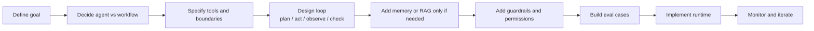

---
tags:
  - usecase
  - agents
type: usecase
status: evergreen
created: "2026-04-12"
source: ""
parent_note: "[[05 Use Cases/Use Cases - MOC]]"
---

# Use Cases - Build an AI Agent

## Goal

ใช้หน้านี้เป็น reading path เร็ว ๆ สำหรับการออกแบบ agent ตั้งแต่พื้นฐานจนถึง tools และ protocol

รายละเอียดเชิงทฤษฎีของ agent runtime อยู่ใน `AI Agent Fundamentals` และรายละเอียด implementation อยู่ใน `06 Engineering` แล้ว หน้านี้เป็นทางเข้าใช้งานจริงเท่านั้น

---

## End-to-End Build Flow

ใช้ flow นี้เป็นทางลัดก่อนลงอ่าน canonical notes: เริ่มจาก goal และ decision ว่าควรเป็น agent จริงหรือไม่ จากนั้นค่อยเพิ่ม tools, loop, memory/RAG, guardrails, evals, และ implementation.

---

## Reading Order

1. [[02 AI Systems/AI Agent Fundamentals/Core/01 - AI Agent คืออะไร]]
2. [[02 AI Systems/AI Agent Fundamentals/Core/04 - สถาปัตยกรรม Agent_ Model + Tools + Orchestration]]
3. [[02 AI Systems/AI Agent Fundamentals/Core/05 - วงจร Perceive-Think-Act-Check]]
4. [[02 AI Systems/AI Agent Fundamentals/Core/07 - รูปแบบ Agent Architectures]]
5. [[02 AI Systems/AI Agent Fundamentals/Core/08 - Harness Engineering]]
6. [[05 Use Cases/Decision/Use Cases - When to Use an Agent|When to Use an Agent]]
6. [[02 AI Systems/MCP/Bridge/14 - Tools_ การออกแบบและทำงาน]]
7. [[02 AI Systems/MCP/Core/01 - MCP คืออะไรและแก้ปัญหาอะไร]]
8. [[02 AI Systems/MCP/Core/03 - Core Primitives_ Tools, Resources, Prompts]]

---

## Design Checklist

- เป้าหมายของ agent คืออะไร
- อะไรควรเป็น tool และอะไรไม่ควร
- อะไรควรเป็น workflow ตายตัวแทน agent
- จะจำกัด cost, latency, และ risk อย่างไร

---

## Cross Links

- [[04 Synthesis/Decision/Synthesis - Agent vs Workflow vs RAG]]
- [[04 Synthesis/Bridge/Synthesis - Memory in Agents]]
- [[Home]]
