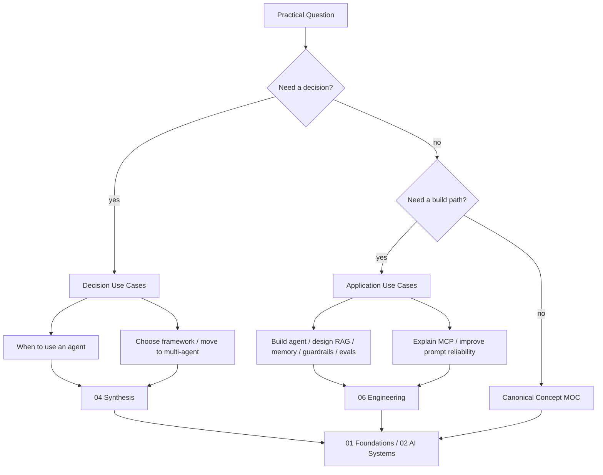

---
tags:
  - usecase
  - moc
type: moc
status: evergreen
source: ""
parent_note: "[[Home]]"
---

# Use Cases - MOC

หมวดนี้รวบรวม reading paths แบบใช้งานจริงสำหรับการออกแบบ agentic systems และ tooling

หมวดนี้เป็น canonical home ของ decision paths และ application-oriented examples  
ถ้าเป็น theory / foundation ให้ไปหมวด `01` และ `02` แทน
ถ้าเป็นรายละเอียดเชิงทฤษฎีของ topic หลัก ให้คงไว้ใน canonical note ของ topic นั้น แล้วใช้หมวดนี้เป็นทางเข้าใช้งานจริงเท่านั้น
ถ้าเป็น comparison หรือ tradeoff ระหว่างหลาย topic ให้ดู `04 Synthesis` ก่อน แล้วค่อยกลับมาใช้หมวดนี้เลือก path ที่เหมาะกับงานจริง
ถ้าเป็น implementation / code-level detail ให้ไป `06 Engineering` แทน

---

## Use Case Navigation Map

ภาพนี้ทำให้หมวด use cases เป็นทางเข้าเชิงงานจริง: เริ่มจากคำถามหรือเป้าหมายของผู้อ่าน แล้วค่อยโยงกลับไป synthesis, canonical concept, หรือ engineering implementation ตามระดับที่ต้องใช้.

---

## Notes Map

- [[05 Use Cases/Decision/Use Cases - When to Use an Agent|Use Cases - When to Use an Agent]]
- [[05 Use Cases/Application/Use Cases - Build an AI Agent|Use Cases - Build an AI Agent]]
- [[05 Use Cases/Decision/Use Cases - Choose an Agent Framework|Use Cases - Choose an Agent Framework]]
- [[05 Use Cases/Application/Use Cases - Design a RAG System|Use Cases - Design a RAG System]]
- [[05 Use Cases/Application/Use Cases - Design Guardrails for Tool Use|Use Cases - Design Guardrails for Tool Use]]
- [[05 Use Cases/Application/Use Cases - Design Memory for an AI Agent|Use Cases - Design Memory for an AI Agent]]
- [[05 Use Cases/Application/Use Cases - Evaluate an AI Agent|Use Cases - Evaluate an AI Agent]]
- [[05 Use Cases/Application/Use Cases - Explain MCP Quickly|Use Cases - Explain MCP Quickly]]
- [[05 Use Cases/Application/Use Cases - Improve Prompt Reliability|Use Cases - Improve Prompt Reliability]]
- [[05 Use Cases/Decision/Use Cases - Move from Single to Multi-Agent|Use Cases - Move from Single to Multi-Agent]]

---

## Related Hubs

- [[02 AI Systems/AI Agent Fundamentals/AI Agent Fundamentals - MOC|AI Agent Fundamentals - MOC]]
- [[02 AI Systems/Agent Frameworks/Agent Frameworks - MOC|Agent Frameworks - MOC]]
- [[02 AI Systems/MCP/MCP - MOC|MCP - MOC]]
- [[02 AI Systems/RAG/RAG - MOC|RAG - MOC]]
- [[02 AI Systems/Memory Systems/Memory Systems - MOC|Memory Systems - MOC]]
- [[02 AI Systems/Guardrails/Guardrails - MOC|Guardrails - MOC]]
- [[02 AI Systems/Evals/Evals - MOC|Evals - MOC]]
- [[04 Synthesis/Synthesis - MOC|Synthesis - MOC]]
- [[06 Engineering/README|Engineering - README]]

## Boundary Reminder

- ถ้าเป็น concept หลัก ให้ไป canonical note ของ topic นั้นก่อน
- ถ้าเป็น decision path ให้ใช้หมวดนี้
- ถ้าเป็นการ compare หรือสรุป tradeoff ข้าม topic ให้ไป `04 Synthesis`
- ถ้าเป็น implementation จริง ให้ไป `06 Engineering`

---

## Implementation Bridge

- [[06 Engineering/README]]
- [[Knowledge Topic Registry]]
