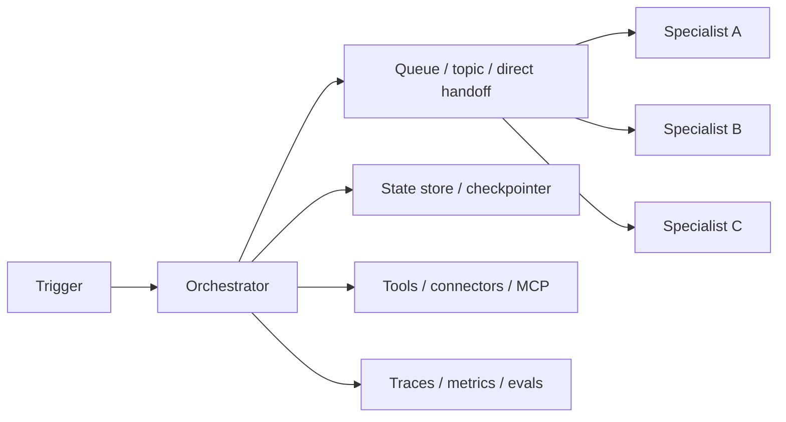

---
tags:
  - engineering
  - architecture
  - multi-agent
  - deployment
  - topology
  - runtime
  - version-sensitive
  - derived
type: note
status: evergreen
source: "https://docs.langchain.com/oss/javascript/langgraph/overview · https://docs.langchain.com/oss/javascript/langgraph/durable-execution · https://docs.langchain.com/langsmith/deployments · https://microsoft.github.io/autogen/stable/user-guide/core-user-guide/design-patterns/concurrent-agents.html · https://docs.crewai.com/concepts/flows · https://docs.crewai.com/learn/kickoff-async · https://www.digitalocean.com/community/tutorials/single-to-multi-agent-infrastructure"
parent_note: "[[06 Engineering/Architecture to Code/Architecture to Code - MOC]]"
---

# Architecture - Multi-Agent Deployment and Topology

## ภาพรวม

การ deploy ระบบ multi-agent เป็นเรื่องของ topology ไม่ใช่แค่รายละเอียดการ implement คำถามหลักคือ state อยู่ที่ไหน, agent สื่อสารกันอย่างไร, resume ความล้มเหลวอย่างไร, และ runtime จะเป็น local, containerized, หรือ hosted บน platform ที่เข้าใจ long-running stateful workflows

---

## ตัวเลือกการวางระบบ

### 1. ต้นแบบแบบ Process เดียว

เหมาะกับ:
- การทดลองระยะแรก
- debug บนเครื่องตัวเอง
- concurrency ต่ำ
- workflow แบบ sequential ที่ไม่ซับซ้อน

ลักษณะ:
- มี orchestrator process เดียว
- ใช้ in-memory coordination หรือ local checkpointing
- trace ย้อนกลับง่ายที่สุด
- isolation อ่อนที่สุด

LangGraph ถูกออกแบบมาเป็น low-level orchestration runtime สำหรับ long-running, stateful agents อย่างชัดเจน โมเดล durable execution ของมันยังมีประโยชน์แม้ใน prototype แบบ single-process ถ้าต้องการ resumability ภายหลัง

### 2. Runtime แบบขับด้วย Event สำหรับ Multi-Agent

เหมาะกับ:
- งานที่ทำพร้อมกันได้
- async handoffs
- งานที่พึ่ง queue
- การร่วมมือแบบ topic-based

ลักษณะ:
- ใช้ message bus หรือ queue
- มี multiple processors / subscribers
- backpressure และ retries จัดการได้ชัดขึ้น
- scale ได้ดีกว่าการ chain แบบ sync ตรง ๆ

รูปแบบ concurrent agents ของ AutoGen เข้ากับ topology แบบนี้ได้ตรง:
- single message & multiple processors
- multiple messages & multiple processors
- direct messaging

### 3. แพลตฟอร์ม Workflow แบบเก็บสถานะได้

เหมาะกับ:
- งานที่รันนาน
- human-in-the-loop
- pause/resume
- workflow ที่แตกแขนงเยอะ

ลักษณะ:
- มี persisted state
- ใช้ explicit thread หรือ run IDs
- มี checkpointing
- มีกติกา deterministic replay

LangGraph durable execution และ CrewAI Flows แสดงโมเดลนี้ชัดเจน: ทำให้ state persist ได้, resume จาก checkpoints ได้, และถือว่า interrupts เป็นเรื่องหลักของ workflow

### 4. แบบ Production ที่แยกเป็น Service

เหมาะกับ:
- trust boundary แยกกัน
- ความต้องการ scale ต่างกัน
- failure domain ต่างกัน
- หลายทีม หรือหลาย runtime

ลักษณะ:
- ใช้ containerized services
- มี persistent store สำหรับ workflow state
- มี queue หรือ broker สำหรับ async work
- มี observability และ rollout controls

LangSmith deployment ถูกสร้างมาเพื่อ stateful, long-running agents โดยตรง และวางตัวต่างจาก stateless web hosting แบบดั้งเดิมอย่างชัดเจน

---

## ชั้น Runtime หลัก

### Orchestrator

ดูแล:
- routing
- sequencing
- stop conditions
- retry policy
- resume policy
- workflow state visibility

### ชั้นการสื่อสาร

เลือกอย่างใดอย่างหนึ่ง:
- direct messaging สำหรับ handoff ที่แคบ
- topic / queue สำหรับงาน async
- shared thread สำหรับการร่วมมือแบบ conversational

### ชั้น State

แยก:
- transient step state
- checkpointed workflow state
- long-term memory

LangGraph durable execution ต้องมี checkpointer และ thread identifier และ docs ของมันเน้นการจัดการ side effect แบบ deterministic / idempotent เพื่อให้ replay workflow ได้

### ชั้น Deployment

เลือกตาม scale และ failure domain:
- local single process สำหรับ prototype
- async / queue-backed runtime สำหรับ concurrency
- containerized services สำหรับทีมหรือ production
- managed deployment เมื่อ persistent state และ background execution สำคัญ

---

## กติกาการนำขึ้นใช้งาน

- เก็บ state ไว้นอก process เมื่อเรื่อง resume สำคัญ
- ทำ side effect ให้ idempotent
- อย่าพึ่ง in-memory state สำหรับ recovery
- แยก orchestration ออกจาก worker execution เมื่อ concurrency โต
- กำหนดวิธีส่ง traces ออกก่อน rollout ขึ้น production

async kickoff ของ CrewAI ทำให้ concurrency ชัด, durable execution ของ LangGraph ทำให้ checkpointing ชัด, และ LangSmith deployment ทำให้สมมติฐานเรื่อง stateful hosting ชัด ทั้งสามอย่างชี้ไปข้อสรุปเดียวกันว่า multi-agent systems ต้องมี runtime support ไม่ใช่แค่ prompt logic

---

## แนวทางเลือกการวางระบบ

ใช้ process เดียว ถ้า:
- workflow สั้น
- handoff มีน้อย
- รับมือ failure แบบ manual ได้

ใช้ topology แบบ async / queue-backed ถ้า:
- agent หลายตัวทำงานพร้อมกันได้
- งานอาจล่าช้าหรือ retry ได้
- throughput สำคัญ

ใช้ runtime แบบ workflow ที่เก็บสถานะได้ ถ้า:
- interrupts และ resumes สำคัญ
- human approval เป็นส่วนหนึ่งของ flow
- traceability เป็น requirement ของระบบ

ใช้แบบแยกเป็น service ถ้า:
- agent ต้องมี privilege ต่างกัน
- ระบบข้าม trust boundary
- ต้องการ scaling หรือ rollout แบบแยกส่วน

---

## Checklist การลงมือทำ

ก่อนลงมือทำ:
1. ตัดสินใจว่า topology เป็น sync หรือ async
2. กำหนด source of truth ของ state
3. กำหนด thread / run identity
4. ตัดสินใจว่าจะเขียน checkpoints ที่ไหน
5. ตัดสินใจว่า retry และ idempotency ทำอย่างไร
6. ตัดสินใจว่าจะเก็บ traces และ metrics ไว้ที่ไหน
7. ตัดสินใจว่าต้องใช้ queue, broker หรือ direct messaging
8. ตัดสินใจว่าส่วนใดต้อง containerize หรือ isolate

---

## หลักออกแบบ

- อย่าเพิ่ม service boundary ถ้ายังไม่มี state boundary
- อย่าเพิ่ม concurrency ถ้ายังไม่มี observability
- อย่าเพิ่ม async messaging ถ้ายังไม่มี retry และ backpressure rules
- อย่าเลือก production topology ก่อนจะกำหนด durable execution ให้ชัด
- อย่ามอง deployment แยกจาก orchestration

---

## ลิงก์ที่เกี่ยวข้อง

- [[04 Synthesis/Bridge/Synthesis - Single to Multi-Agent Infrastructure]]
- [[04 Synthesis/Bridge/Synthesis - Multi-Agent Failure Modes]]
- [[06 Engineering/Architecture to Code/Architecture - Multi-Agent Infrastructure]]
- [[06 Engineering/Architecture to Code/Architecture - Multi-Agent Ownership and Handoffs]]
- [[06 Engineering/Patterns/Pattern - Sync vs Async Agent Communication]]
- [[02 AI Systems/Evals/Core/09 - Observability and Feedback Loops]]
- [[02 AI Systems/Agent Frameworks/Core/07 - Checkpointing and Resumability]]
- [[Home]]

---

## แหล่งอ้างอิง

- LangGraph Overview: https://docs.langchain.com/oss/javascript/langgraph/overview
- LangGraph Durable Execution: https://docs.langchain.com/oss/javascript/langgraph/durable-execution
- LangSmith Deployment: https://docs.langchain.com/langsmith/deployments
- AutoGen Concurrent Agents: https://microsoft.github.io/autogen/stable/user-guide/core-user-guide/design-patterns/concurrent-agents.html
- CrewAI Flows: https://docs.crewai.com/concepts/flows
- CrewAI Async Kickoff: https://docs.crewai.com/learn/kickoff-async
- DigitalOcean Infrastructure Guide: https://www.digitalocean.com/community/tutorials/single-to-multi-agent-infrastructure
