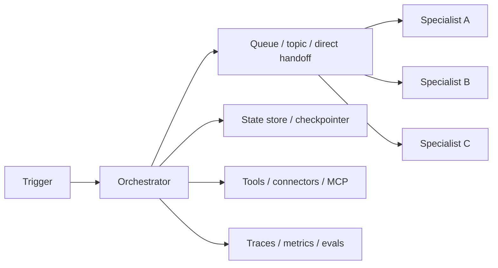

---
tags:
  - engineering
  - architecture
  - multi-agent
  - deployment
  - topology
  - runtime
  - version-sensitive
  - derived
type: note
status: evergreen
source: "https://docs.langchain.com/oss/javascript/langgraph/overview · https://docs.langchain.com/oss/javascript/langgraph/durable-execution · https://docs.langchain.com/langsmith/deployments · https://microsoft.github.io/autogen/stable/user-guide/core-user-guide/design-patterns/concurrent-agents.html · https://docs.crewai.com/concepts/flows · https://docs.crewai.com/learn/kickoff-async · https://www.digitalocean.com/community/tutorials/single-to-multi-agent-infrastructure"
parent_note: "[[06 Engineering/Architecture to Code/Architecture to Code - MOC]]"
---

# Architecture - Multi-Agent Deployment and Topology

## ภาพรวม

Multi-agent deployment is a topology choice, not just an implementation detail. The main questions are where state lives, how agents communicate, how failures are resumed, and whether the runtime is local, containerized, or hosted on a platform that understands long-running stateful workflows.

---

## ตัวเลือก Topology

### 1. Prototype แบบ Single Process

Best for:
- early experiments
- local debugging
- low concurrency
- simple sequential workflows

Characteristics:
- one orchestrator process
- in-memory coordination or local checkpointing
- easiest traceability
- weakest isolation

LangGraph is explicitly designed as a low-level orchestration runtime for long-running, stateful agents. Its durable execution model makes sense even in a single-process prototype if you want resumability later.

### 2. Runtime แบบ Event-driven Multi-Agent

Best for:
- concurrent tasks
- async handoffs
- queue-backed work
- topic-based collaboration

Characteristics:
- message bus or queue
- multiple processors / subscribers
- clearer backpressure and retries
- better scaling than direct sync chaining

AutoGen’s concurrent-agent patterns map naturally to this topology:
- single message & multiple processors
- multiple messages & multiple processors
- direct messaging

### 3. แพลตฟอร์ม Workflow แบบ Stateful

Best for:
- long-running work
- human-in-the-loop
- pause/resume
- branchy workflows

Characteristics:
- persisted state
- explicit thread or run IDs
- checkpointing
- deterministic replay rules

LangGraph durable execution and CrewAI Flows both show this model clearly: keep state durable, resume from checkpoints, and treat interrupts as a first-class workflow concern.

### 4. Topology สำหรับ Production แบบ Service-based

Best for:
- separate trust boundaries
- different scaling needs
- distinct failure domains
- multiple teams or runtimes

Characteristics:
- containerized services
- persistent store for workflow state
- queue or broker for async work
- observability and rollout controls

LangSmith deployment is purpose-built for stateful, long-running agents and explicitly contrasts that with traditional stateless web hosting.

---

## ชั้น Runtime หลัก

### Orchestrator

Owns:
- routing
- sequencing
- stop conditions
- retry policy
- resume policy
- workflow state visibility

### ชั้นการสื่อสาร

Choose one of:
- direct messaging for narrow handoffs
- topic/queue for async work
- shared thread for conversational collaboration

### ชั้น State

Separate:
- transient step state
- checkpointed workflow state
- long-term memory

LangGraph durable execution requires a checkpointer and a thread identifier, and its docs emphasize deterministic / idempotent handling of side effects for replayable workflows.

### ชั้น Deployment

Choose based on scale and failure domain:
- local single process for prototype
- async / queue-backed runtime for concurrency
- containerized services for team or production use
- managed deployment when persistent state and background execution matter

---

## กติกาการ Deploy

- keep state external when resume matters
- make side effects idempotent
- do not rely on in-memory state for recovery
- separate orchestration from worker execution when concurrency grows
- define how traces are exported before production rollout

CrewAI’s async kickoff methods make concurrency explicit; LangGraph’s durable execution makes checkpointing explicit; LangSmith deployment makes the stateful-hosting assumption explicit. Those three facts point to the same rule: multi-agent systems need runtime support, not just prompt logic.

---

## แนวทางเลือก Topology

Use single-process if:
- the workflow is short
- handoffs are rare
- failure recovery can be manual

Use async / queue-backed topology if:
- multiple agents can run in parallel
- work may be delayed or retried
- throughput matters

Use stateful workflow runtime if:
- interrupts and resumes matter
- human approval is part of the flow
- traceability is a product requirement

Use service-based deployment if:
- agents need different privileges
- the system crosses trust boundaries
- you need independent scaling or rollout

---

## Checklist การลงมือทำ

Before implementation:
1. Decide whether the topology is sync or async.
2. Define the source of truth for state.
3. Define the thread / run identity.
4. Decide where checkpoints are written.
5. Decide how retries and idempotency work.
6. Decide where traces and metrics are stored.
7. Decide whether you need a queue, a broker, or direct messaging.
8. Decide which parts must be containerized or isolated.

---

## หลักออกแบบ

- do not add service boundaries without a state boundary
- do not add concurrency without observability
- do not add async messaging without retry and backpressure rules
- do not choose a production topology before durable execution is defined
- do not treat deployment as separate from orchestration

---

## ลิงก์ที่เกี่ยวข้อง

- [[04 Synthesis/Synthesis - Single to Multi-Agent Infrastructure]]
- [[04 Synthesis/Synthesis - Multi-Agent Failure Modes]]
- [[06 Engineering/Architecture to Code/Architecture - Multi-Agent Infrastructure]]
- [[06 Engineering/Architecture to Code/Architecture - Multi-Agent Ownership and Handoffs]]
- [[06 Engineering/Patterns/Pattern - Sync vs Async Agent Communication]]
- [[02 AI Systems/Evals/Core/09 - Observability and Feedback Loops]]
- [[02 AI Systems/Agent Frameworks/Core/07 - Checkpointing and Resumability]]
- [[Home]]

---

## แหล่งอ้างอิง

- LangGraph Overview: https://docs.langchain.com/oss/javascript/langgraph/overview
- LangGraph Durable Execution: https://docs.langchain.com/oss/javascript/langgraph/durable-execution
- LangSmith Deployment: https://docs.langchain.com/langsmith/deployments
- AutoGen Concurrent Agents: https://microsoft.github.io/autogen/stable/user-guide/core-user-guide/design-patterns/concurrent-agents.html
- CrewAI Flows: https://docs.crewai.com/concepts/flows
- CrewAI Async Kickoff: https://docs.crewai.com/learn/kickoff-async
- DigitalOcean Infrastructure Guide: https://www.digitalocean.com/community/tutorials/single-to-multi-agent-infrastructure
