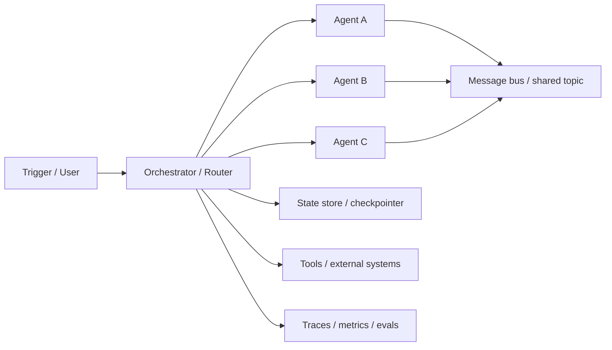

---
tags:
  - engineering
  - architecture
  - multi-agent
  - messaging
  - state
  - observability
  - deployment
  - version-sensitive
  - derived
type: note
status: evergreen
source: "https://www.digitalocean.com/community/tutorials/single-to-multi-agent-infrastructure · https://platform.openai.com/docs/guides/trace-grading · https://platform.openai.com/docs/guides/agent-evals · https://docs.langchain.com/oss/javascript/langgraph/persistence · https://docs.langchain.com/oss/javascript/langchain/human-in-the-loop · https://microsoft.github.io/autogen/dev/user-guide/core-user-guide/design-patterns/group-chat.html · https://docs.crewai.com/en/concepts/flows"
parent_note: "[[06 Engineering/Architecture to Code/Architecture to Code - MOC]]"
---

# Architecture - Multi-Agent Infrastructure

## ภาพรวม

นี่คือมุมมองเชิง implementation ของการ migrate จาก single-agent ไป multi-agent ต้องแยก orchestrator, messaging layer, state persistence, observability, และ recovery policy ออกจากกันให้ชัด

---

## โครงระบบเป้าหมาย

### Orchestrator และ Router

หน้าที่:
- route งานไปยัง agent ที่เหมาะสม
- คุม sequencing, branching, retries และ stop conditions
- เป็น owner ของ shared workflow state

จาก DigitalOcean tutorial:
- centralized orchestrators ให้ determinism และ debug ง่าย
- router pattern / pipeline pattern / handoff pattern เป็นทางเลือกหลัก

### ชั้น Messaging

แบ่งเป็น 2 แบบหลัก:
- synchronous: request-response, ลำดับชัด, debug ง่าย, caller จะ block
- asynchronous: queue/pub-sub, decouple ดี, รองรับ retries และ backpressure

หมายเหตุการ implement:
- ถ้าใช้ async ควรมี idempotent handlers
- ควรมี retry policy และ dead-letter handling
- ถ้ามีหลาย agent อ่าน topic เดียวกัน ให้กำหนด ownership และ namespace ชัด

AutoGen group chat เป็นตัวอย่างของ shared thread / shared topic pattern โดยมี group chat manager คุมลำดับ turn

### ชั้น State และ Memory

ต้องแยก:
- run state ของ workflow ปัจจุบัน
- checkpointed state ของ long-running flow
- long-term memory ที่ใช้ข้ามงาน

LangGraph ให้ persistence layer แบบ checkpoint ตาม `thread_id`
CrewAI Flows มี `@persist()` สำหรับเก็บ state ข้าม restart และ workflow execution

กติกาในการ implement:
- ทุก conversation/thread ต้องมี stable id
- state ที่แชร์กันต้องชัดว่าใครเขียนได้
- memory write/read policy ต้องแยกจาก tool output

### ชั้น Observability และ Evaluation

ต้องมี:
- traces ของ decision path
- logs ของ tool calls และ inter-agent handoffs
- metrics ของ latency, retries, failures
- evals สำหรับ workflow-level regressions

OpenAI trace grading ระบุชัดว่า trace คือ log ของ decisions, tool calls, reasoning steps และใช้หาจุดผิดพลาดใน orchestration

### ชั้น Deployment

จาก DigitalOcean tutorial:
- multi-agent systems อาจรันเป็น processes หรือ threads ได้ใน local prototype
- production ควรคิดเป็น scalable services / containers / orchestration platform

ตัวเลือกการ implement:
- local prototype: single process + in-memory queue
- team/dev: containerized services + shared state backend
- production: service boundary ชัด, monitored queue, persistent storage และ controlled rollout

---

## Checklist การย้ายระบบ

ก่อนย้ายจาก single-agent:
1. ระบุว่าต้องการ parallelism จริงไหม
2. แบ่ง role ของแต่ละ agent ให้ชัด
3. เลือก communication mode: sync หรือ async
4. กำหนด state ownership และ persistence
5. ใส่ retry / recovery policy
6. ใส่ traces / metrics / evals
7. ทดสอบ human approval และ failure path

---

## หลักออกแบบ

- อย่าเพิ่ม agent ถ้า orchestration ยังไม่ชัด
- ถ้า resume / interrupt สำคัญ ให้เลือก framework/runtime ที่มี persistence จริง
- ถ้า multi-agent ต้องคุยกันบ่อย ให้คิดเรื่อง message bus ตั้งแต่ต้น
- ถ้าต้อง audit decision path ให้บังคับ traces ตั้งแต่ first prototype
- ถ้างานเป็นไปได้ด้วย workflow เดิม อย่ารีบทำให้เป็น agent swarm

---

## ลิงก์ที่เกี่ยวข้อง

- [[04 Synthesis/Synthesis - Single to Multi-Agent Infrastructure]]
- [[02 AI Systems/AI Agent Fundamentals/Core/04 - สถาปัตยกรรม Agent: Model + Tools + Orchestration]]
- [[02 AI Systems/Agent Frameworks/Core/03 - State and Memory]]
- [[02 AI Systems/Agent Frameworks/Core/04 - Tool Orchestration]]
- [[02 AI Systems/Evals/Core/09 - Observability and Feedback Loops]]
- [[02 AI Systems/RAG/Core/06 - Context Assembly]]
- [[06 Engineering/Frameworks/Framework - OpenAI Agents and Responses Patterns]]
- [[06 Engineering/Frameworks/Framework - LangGraph]]
- [[06 Engineering/Frameworks/Framework - AutoGen vs CrewAI]]
- [[06 Engineering/Frameworks/Framework - LangChain Agents]]
- [[06 Engineering/Architecture to Code/Architecture - Multi-Agent Security and Permissions]]
- [[06 Engineering/Architecture to Code/Architecture - Multi-Agent Deployment and Topology]]
- [[06 Engineering/Engineering - MOC]]

---

## แหล่งอ้างอิง

- DigitalOcean: https://www.digitalocean.com/community/tutorials/single-to-multi-agent-infrastructure
- OpenAI Trace Grading: https://platform.openai.com/docs/guides/trace-grading
- OpenAI Agent Evals: https://platform.openai.com/docs/guides/agent-evals
- LangGraph Persistence: https://docs.langchain.com/oss/javascript/langgraph/persistence
- LangGraph HITL: https://docs.langchain.com/oss/javascript/langchain/human-in-the-loop
- AutoGen Group Chat: https://microsoft.github.io/autogen/dev/user-guide/core-user-guide/design-patterns/group-chat.html
- CrewAI Flows: https://docs.crewai.com/en/concepts/flows
