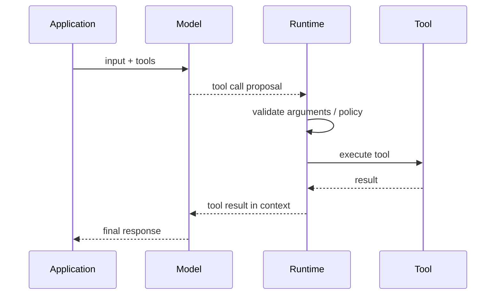

---
tags:
  - engineering
  - architecture
  - tools
  - schemas
type: note
status: evergreen
source: "OpenAI Docs, Anthropic Docs, MCP Official Docs"
parent_note: "[[06 Engineering/Architecture to Code/Architecture to Code - MOC]]"
---

# Architecture - Tool Schemas and Runtime Integration

> โน้ตนี้อธิบายว่า tool schema ไหลเข้า runtime request อย่างไร, runtime ตรวจและ execute อย่างไร, และผลลัพธ์ถูกส่งกลับให้ model แบบไหน

---

## ภาพรวม

ในระบบ tool use จริง model ไม่ได้ run code เอง แต่ทำงานผ่าน contract ระหว่าง:
- model
- tool schema
- runtime / application
- tool result

OpenAI และ Anthropic ใช้แนวคิดคล้ายกันคือ application ส่ง tool definitions เข้า request, model สร้าง tool call ตาม schema, runtime เป็นฝ่าย execute และส่งผลกลับเข้า context

---

## ขอบเขต

โน้ตนี้เน้น runtime contract ของ tool use:
- tool definitions / schemas
- tool call generation
- argument validation
- tool execution boundary
- tool results in conversation

ไม่ได้เน้น syntax helper ของ framework ใด framework หนึ่งโดยเฉพาะ

---

## Tool Schema คืออะไร

ในเชิงระบบ tool schema คือคำอธิบายที่ runtime ส่งให้ model เพื่อบอกว่า:
- tool นี้ชื่ออะไร
- ใช้ทำอะไร
- รับ arguments แบบไหน
- บางระบบอาจกำหนด output shape หรือ contract เพิ่มเติม

ใน OpenAI Responses API tools ถูกส่งผ่าน `tools` parameter
ใน Anthropic tools ก็ถูกส่งผ่าน `tools` parameter เช่นกัน และผลลัพธ์ถูกจัดการผ่าน `tool_use` กับ `tool_result` content blocks

---

## ข้อตกลงของ Runtime

สถาปัตยกรรมนี้ชี้ให้เห็นว่า:
- model เสนอการใช้ tool
- runtime ตรวจสอบและ execute
- tool result ถูกส่งกลับเข้า context ก่อน model จะตอบต่อ

---

## การตรวจ argument สำคัญตรงไหน

tool use ที่ดีไม่จบแค่ model เลือก tool ถูก แต่ต้องมี runtime validation ด้วย เช่น:
- argument types ถูกต้อง
- required fields ครบ
- value ranges ปลอดภัย
- tool นี้ได้รับอนุญาตในสถานการณ์นี้หรือไม่

ดังนั้น schema ไม่ได้มีไว้ “บอก model อย่างเดียว” แต่ยังมีไว้เป็นชั้นควบคุมให้ runtime ใช้ตรวจสอบก่อน execute ด้วย

---

## Tool Results เป็น Context ชนิดหนึ่ง

หลัง execute แล้ว runtime มักส่งผลลัพธ์กลับเข้า conversation/context  
ผลลัพธ์นั้นอาจเป็น:
- structured data
- retrieved text
- status message
- error state

มุมสำคัญคือ model ไม่ได้เห็นแค่ “คำตอบสุดท้าย” แต่เห็นผลลัพธ์ของ tool เป็นบริบทเพิ่ม เพื่อ reasoning ต่อหรือสรุปให้ผู้ใช้

ดังนั้น tool result จึงเป็น:
- input ต่อรอบของโมเดล
- attack surface หนึ่ง
- source ของ grounding หรือ state transition

---

## MCP ต่างจาก Native Tool Interfaces อย่างไร

OpenAI และ Anthropic มี native tool interfaces ใน request schema ของตัวเอง  
MCP เพิ่ม abstraction อีกชั้นโดยนิยาม protocol มาตรฐานสำหรับ tools, resources, prompts และ consent ระหว่าง host/client/server

สรุปเชิงระบบ:
- native tool interface = provider-specific runtime interface
- MCP = protocol layer สำหรับ interoperability ระหว่าง application กับ external capability providers

ดังนั้น MCP ไม่ได้แทน tool use concept แต่ทำให้การเชื่อม capability มีมาตรฐานขึ้น

---

## หลักออกแบบ

- แยก `tool schema` ออกจาก `tool implementation` ให้ชัด
- อย่าปล่อยให้ model execute อะไรโดยไม่มี runtime validation
- มอง tool result เป็นส่วนหนึ่งของ context pipeline
- จัด permission และ policy checks ไว้ที่ runtime boundary ไม่ใช่หวังจาก model อย่างเดียว
- ถ้าต้องการ interoperability ข้ามหลายระบบ ให้พิจารณา MCP เป็น protocol layer

---

## โน้ตที่เกี่ยวข้อง

- [[02 AI Systems/MCP/14 - Tools: การออกแบบและทำงาน|14 - Tools: การออกแบบและทำงาน]]
- [[01 Foundations/Prompt Engineering/13 - Messages, System Prompt และ Chat Templates|13 - Messages, System Prompt และ Chat Templates]]
- [[02 AI Systems/MCP/MCP - MOC|MCP - MOC]]
- [[02 AI Systems/Guardrails/Core/03 - Tool Safety|Guardrails - Tool Safety]]
- [[02 AI Systems/Agent Frameworks/Core/04 - Tool Orchestration|Agent Frameworks - Tool Orchestration]]

---

## แหล่งอ้างอิงทางการ

- OpenAI: Using tools  
  https://platform.openai.com/docs/guides/tools?api-mode=responses
- OpenAI: Responses API  
  https://platform.openai.com/docs/api-reference/responses/compact?api-mode=responses
- Anthropic: Tool Use Overview  
  https://docs.anthropic.com/en/docs/agents-and-tools/tool-use/overview
- MCP: Architecture  
  https://modelcontextprotocol.io/docs/learn/architecture
