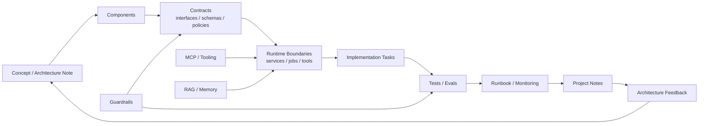

---
tags:
  - engineering
  - architecture
  - moc
type: moc
status: evergreen
source: "vault-local engineering hub"
parent_note: "[[06 Engineering/Engineering - MOC]]"
---

# Architecture to Code - MOC

แปลง architecture หรือ system design ให้เป็น implementation plan

---

## หมายเหตุ

- ควรใช้กับสิ่งที่เริ่มจาก `02 AI Systems/` แล้วต้องลง code จริง
- เหมาะกับ mapping เช่น runtime layers, orchestration, state, persistence, eval, guardrails

---

## Architecture to Implementation Flow

ภาพนี้ใช้เป็นสะพานจาก concept ไป code: เริ่มจาก component และ contract ก่อน runtime/task เพื่อให้ implementation ตรวจ boundary, policy, tests, evals, และ runbook ได้ ไม่ใช่แตกงานจากหัวข้อกว้าง ๆ โดยตรง.

---

## แผนที่โน้ต

- [[06 Engineering/Architecture to Code/Architecture - Tool Schemas and Runtime Integration|Tool Schemas and Runtime Integration]]
- [[06 Engineering/Architecture to Code/Architecture - Multi-Agent Infrastructure|Multi-Agent Infrastructure]]
- [[06 Engineering/Architecture to Code/Architecture - Multi-Agent Ownership and Handoffs|Multi-Agent Ownership and Handoffs]]
- [[06 Engineering/Architecture to Code/Architecture - Multi-Agent Security and Permissions|Multi-Agent Security and Permissions]]
- [[06 Engineering/Architecture to Code/Architecture - Multi-Agent Deployment and Topology|Multi-Agent Deployment and Topology]]
