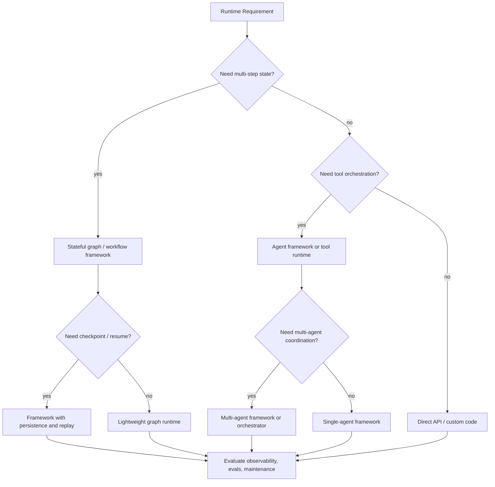

---
tags:
  - engineering
  - decisions
  - framework
  - adr
type: note
status: evergreen
source: "vault-local engineering"
parent_note: "[[06 Engineering/Decisions/Decisions - MOC]]"
---

# Decision - Choose a Framework

decision note สำหรับบันทึกเหตุผลเลือก framework หรือ runtime stack

---

## Framework Decision Tree

ใช้ tree นี้ก่อนดูชื่อ framework: ถ้า runtime ไม่ต้องการ state, tools, checkpoint, หรือ multi-agent coordination มากพอ custom workflow อาจพอ แต่ถ้าต้อง debug/replay/evaluate เป็นระบบ framework จะเริ่มคุ้มกว่า.

---

## Use When

- ต้องเลือก framework สำหรับ agent runtime
- มีหลาย option ที่ tradeoff ต่างกัน
- ต้องกลับมาทบทวนเหตุผลภายหลัง

## Decision Template

- Context: ปัญหาคืออะไร
- Options: มีอะไรให้เลือก
- Criteria: เกณฑ์ที่ใช้ตัดสิน
- Decision: เลือกอะไร
- Consequences: ได้อะไร เสียอะไร
- Follow-ups: สิ่งที่ต้องตรวจหลังเลือก

## Rules

- ตัดสินจาก runtime needs ก่อนชื่อ framework
- แยก architecture requirement ออกจาก brand preference
- ระบุสิ่งที่ยังไม่รู้ให้ชัด
