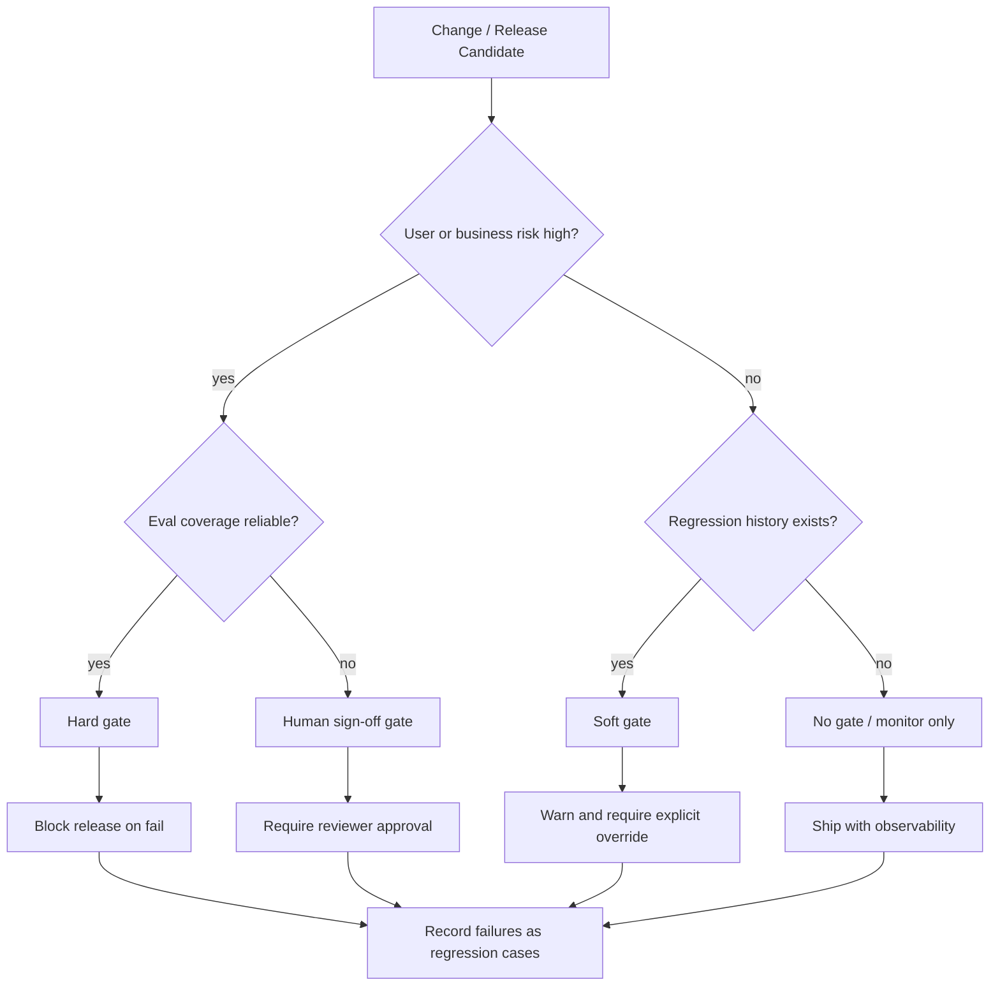

---
tags:
  - engineering
  - evals
  - decision
type: note
status: evergreen
source: "vault-local engineering"
parent_note: "[[06 Engineering/Evals/Evals - MOC]]"
---

# Decision - Choose an Evaluation Gate

decision note สำหรับกำหนดว่า eval ผลไหนต้องผ่านก่อนปล่อยระบบ

---

## Evaluation Gate Decision Flow

gate ที่เข้มขึ้นควรสัมพันธ์กับ risk และความน่าเชื่อถือของ eval เอง ถ้า eval ยังไม่ดีพอแต่ risk สูง ให้ใช้ human sign-off แทน hard gate ที่ให้ false confidence.

---

## Context

- ระบบนี้เสี่ยงแค่ไหน
- release frequency เป็นอย่างไร
- eval ใช้กับ prompt, RAG, agent, หรือทั้งระบบ

## Options

- no gate
- soft gate
- hard gate
- human sign-off gate

## Criteria

- confidence
- release speed
- regression risk
- operational cost

## Decision

บันทึก gate ที่เลือก

## Consequences

- workflow ช้าลงหรือเร็วขึ้น
- reduce regressions
- maintenance overhead
