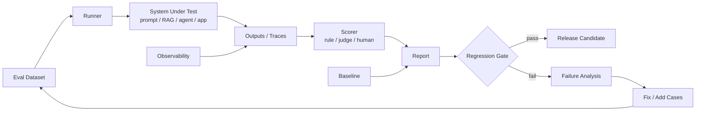

---
tags:
  - engineering
  - evals
  - recipe
type: note
status: evergreen
source: "vault-local engineering"
parent_note: "[[06 Engineering/Evals/Evals - MOC]]"
---

# Recipe - Build an Eval Harness

recipe สำหรับสร้าง eval loop ที่ใช้ซ้ำได้กับ prompt, RAG, หรือ agent workflow

---

## Eval Harness Architecture

eval harness ที่ดีต้องรันซ้ำได้ เก็บ baseline ได้ และเปลี่ยน failure เป็น test case ใหม่ได้เสมอ ถ้าระบบเป็น RAG หรือ agent ควรเก็บ traces ด้วย ไม่ใช่แค่ final answer.

---

## Steps

1. กำหนด task ที่จะวัด
2. สร้างชุด test cases ที่สะท้อนงานจริง
3. กำหนด metric หรือ rubric
4. ทำ harness ให้รันซ้ำได้
5. เก็บผลลัพธ์เป็น baseline
6. เพิ่ม regression comparison กับ baseline
7. ทำรายงานสั้น ๆ สำหรับการตัดสินใจ

---

## Checklist

- มี evaluation dataset
- มี metric ที่สอดคล้องกับ goal
- มี baseline เปรียบเทียบ
- มีทางดูผลลัพธ์ย้อนหลัง
- มี threshold สำหรับ fail/pass
