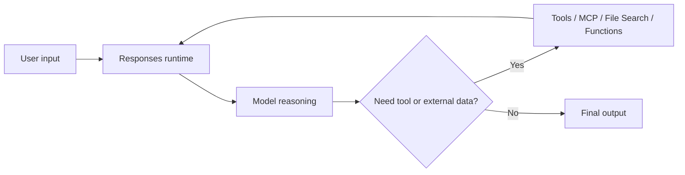
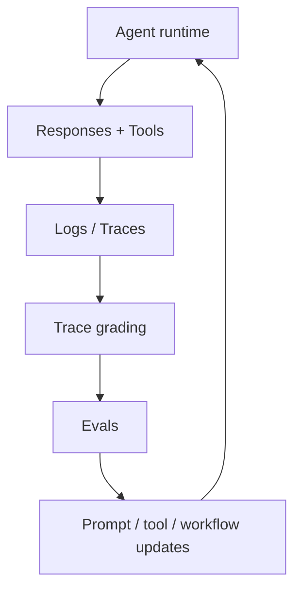

---
tags:
  - engineering
  - frameworks
  - openai
  - responses
type: note
status: draft
source: "OpenAI Agents Guide · OpenAI Responses API · OpenAI Using Tools"
parent_note: "[[06 Engineering/Frameworks/Frameworks - MOC]]"
---

# Framework - OpenAI Agents and Responses Patterns

## Summary

ใน ecosystem ของ OpenAI ตอนนี้ pattern สำคัญไม่ได้เริ่มจาก framework ภายนอกเสมอไป แต่เริ่มจากการประกอบ `Responses API`, `tools`, `stateful interactions`, และ `evaluation/trace features` เข้าด้วยกันให้เป็น agent runtime ที่เหมาะกับงาน

---

## Scope

- Responses API as runtime interface
- tools as capability layer
- workflow vs agent patterns
- traces and evals as optimization layer

---

## สิ่งที่ OpenAI วางไว้เป็นแกน

จากหน้า `Agents` ของ OpenAI แกนหลักของระบบ agent มีองค์ประกอบสำคัญคือ:
- models สำหรับ reasoning และ decision-making
- tools และ MCP สำหรับ external capabilities
- knowledge and memory ผ่าน vector stores, file search, และ embeddings
- logic nodes หรือ orchestration logic
- evals และ trace grading สำหรับ optimization

ในเชิงสถาปัตย์ของ vault นี้ เรามองว่านี่คือ runtime pattern แบบ modular มากกว่าจะเป็น framework เดี่ยวก้อนเดียว

---

## Pattern 1: Responses API เป็น runtime interface กลาง

หน้า `Responses` ระบุว่า API นี้รองรับ:
- text และ image inputs
- stateful interactions โดยใช้ output ก่อนหน้าเป็น input รอบถัดไป
- built-in tools
- function calling

นี่ทำให้ `Responses` ทำหน้าที่เป็น execution surface หลักของ agent runtime ได้

---

## Pattern 2: Tools เป็น capability layer

หน้า `Using tools` ของ OpenAI ระบุชัดว่าระบบสามารถ extend model capabilities ผ่าน:
- web search
- file search
- function calling
- remote MCP servers
- code interpreter
- computer use

ในเชิงสถาปัตย์:
- model ไม่ได้ “มี capability ทุกอย่างใน weights”
- capability ถูกเพิ่มเข้ามาผ่าน runtime tools
- orchestration ที่ดีต้องแยกว่าอะไรคือ reasoning และอะไรคือ tool execution

---

## Pattern 3: Workflow ก่อน agent ถ้างานยังชัด

หน้า `Agent Builder` ของ OpenAI ใช้คำว่า workflow ซ้ำชัดเจน และอธิบายว่าการสร้าง agent ที่มีประโยชน์คือการออกแบบ workflow ของ agents, tools, และ control-flow logic

ดังนั้นมุมมองที่สำคัญคือ:
- agent ไม่ได้ตรงข้ามกับ workflow
- agent มักถูกสร้างขึ้นจาก workflow primitives
- ถ้างานยัง deterministic สูง การใช้ workflow ชัดเจนอาจเหมาะกว่า agent autonomy สูง

---

## Pattern 4: Knowledge และ memory ควรแยกจาก model core

หน้า `Agents` และ `File search` ของ OpenAI แยกชัดว่า knowledge/memory ภายนอกมาจาก:
- vector stores
- file search
- embeddings

นั่นสอดคล้องกับ note ฝั่ง foundations ของ vault นี้ว่า:
- weights = ความสามารถพื้นฐานของโมเดล
- context = สิ่งที่ model เห็นตอนนี้
- retrieval / vector stores = ความรู้ภายนอก

---

## Pattern 5: Optimization ต้องมี traces และ evals

หน้า `Agents`, `Agent evals`, และ `Trace grading` ของ OpenAI ชี้ตรงกันว่า:
- agent performance ควรถูกวัดด้วย evals
- workflow-level failures ควรดูผ่าน traces
- trace grading ช่วย identify regressions และ pinpoint orchestration errors

ดังนั้น pattern ที่สำคัญคือ:
- build runtime
- expose traces
- evaluate behavior
- iterate

---

## Architectural Inference For This Vault

จาก official docs เหล่านี้ เราสรุป pattern กลางของ OpenAI-style agent systems ได้ว่า:
- `Responses` เป็น execution interface
- `tools` เป็น capability extension layer
- `vector stores / file search` เป็น knowledge layer
- `logic/workflows` เป็น orchestration layer
- `traces + evals` เป็น optimization layer

จุดสำคัญคือ OpenAI ไม่ได้ผลักให้คิดเรื่อง agent เป็น “โมเดลเดี่ยวอัจฉริยะ” แต่เป็นระบบประกอบจากหลายชั้น

---

## When This Pattern Fits

เหมาะเมื่อ:
- ต้องการประกอบ tools หลายประเภทผ่าน runtime เดียว
- ต้องการใช้ hosted retrieval / file search
- ต้องการ evaluate agent behavior ระดับ workflow
- ต้องการ path จาก prototype ไป production ที่ยังอยู่ในชุด primitives เดียวกัน

ไม่เหมาะเมื่อ:
- งานยัง deterministic ง่ายมากจน workflow ธรรมดาพอ
- ทีมไม่ต้องการ abstraction/runtime layer เพิ่ม
- use case ไม่ได้ต้องการ tool use หรือ orchestration จริง

---

## Design Rules

- เริ่มจาก workflow ที่ชัดก่อนเพิ่ม autonomy
- แยก reasoning layer ออกจาก tool capability layer
- ใช้ retrieval / file search สำหรับ external knowledge แทนการยัดทุกอย่างใน prompt
- เก็บ traces ตั้งแต่แรกถ้าระบบมีหลาย step
- อย่าดู final answer อย่างเดียวเมื่อวัด agent quality

---

## Cross Links

- [[02 AI Systems/AI Agent Fundamentals/04 - สถาปัตยกรรม Agent: Model + Tools + Orchestration]]
- [[02 AI Systems/AI Agent Fundamentals/08 - Workflow vs AI Agent]]
- [[02 AI Systems/MCP/MCP - MOC]]
- [[02 AI Systems/Evals/Core/09 - Observability and Feedback Loops]]
- [[04 Synthesis/Synthesis - Agent Runtime Layers]]
- [[Home]]

---

## Official References

- OpenAI Agents: https://platform.openai.com/docs/guides/agents
- OpenAI Responses API: https://platform.openai.com/docs/api-reference/responses/compact?api-mode=responses
- OpenAI Using Tools: https://platform.openai.com/docs/guides/tools?api-mode=responses
- OpenAI File Search: https://platform.openai.com/docs/guides/tools-file-search/
- OpenAI Agent Evals: https://platform.openai.com/docs/guides/agent-evals
- OpenAI Trace Grading: https://platform.openai.com/docs/guides/trace-grading

