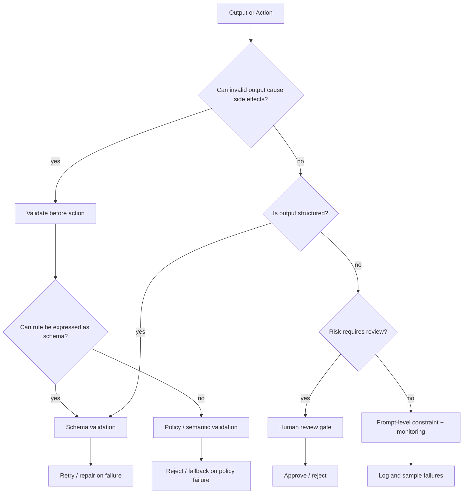

---
tags:
  - engineering
  - guardrails
  - decision
type: note
status: evergreen
source: "vault-local engineering"
parent_note: "[[06 Engineering/Guardrails/Guardrails - MOC]]"
---

# Decision - Choose a Validation Boundary

decision note สำหรับกำหนดว่าจะ validate อะไร ที่ชั้นไหน ก่อนหรือหลัง action

---

## Validation Boundary Decision Flow

boundary ที่สำคัญที่สุดคือก่อน side effect ถ้าการกระทำเปลี่ยนข้อมูล เรียก tool สำคัญ หรือส่งข้อมูลออกนอก scope ต้อง validate ก่อน action เสมอ ไม่ใช่หลังจากเกิดผลแล้ว.

---

## Context

- output มีโครงสร้างชัดแค่ไหน
- invalid output เสียหายระดับใด
- validation ควรเกิดก่อน side effects หรือหลัง

## Options

- prompt-level validation
- schema validation
- policy validation
- human review gate

## Criteria

- safety
- reliability
- friction
- automation level

## Decision

บันทึก boundary ที่เลือก

## Consequences

- latency
- failure handling
- user experience
