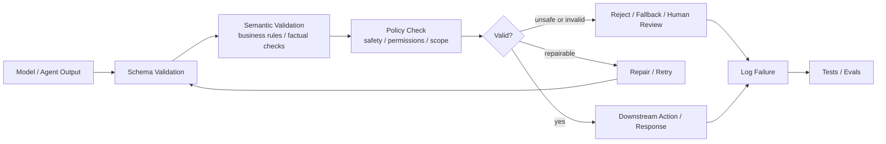

---
tags:
  - engineering
  - guardrails
  - recipe
type: note
status: evergreen
source: "vault-local engineering"
parent_note: "[[06 Engineering/Guardrails/Guardrails - MOC]]"
---

# Recipe - Add Output Validation

recipe สำหรับเพิ่ม validation layer ให้ output ของระบบก่อนจะส่งต่อไปขั้นถัดไป

---

## Validation Boundary Flow

validation boundary ควรแยก schema, semantic rule, และ policy ออกจากกัน เพราะ failure แต่ละแบบมี fallback ไม่เหมือนกัน บางกรณี retry ได้ บางกรณีต้อง reject หรือส่ง human review.

---

## Steps

1. ระบุ output contract ที่ต้องการ
2. แยก field ที่ต้อง valid แน่นอนออกจาก field ที่ยืดหยุ่นได้
3. เลือก validator หรือ schema ที่เหมาะกับรูปแบบข้อมูล
4. กำหนดว่าถ้า validate ไม่ผ่านจะ retry, repair, หรือ reject
5. ใส่ logging สำหรับ failure ที่ validate ไม่ผ่าน
6. เพิ่ม test cases ของ invalid output

---

## Checklist

- schema ชัดเจน
- failure path ชัดเจน
- มี test coverage สำหรับ bad output
- มีจุดตัดสินใจว่าเมื่อไรต้องหยุด
