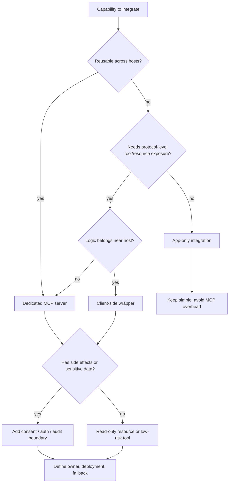

---
tags:
  - engineering
  - mcp
  - decision
type: note
status: evergreen
source: "vault-local engineering"
parent_note: "[[06 Engineering/MCP/MCP - MOC]]"
---

# Decision - Choose MCP Integration Boundary

decision note สำหรับเลือกขอบเขตการเชื่อม MCP ระหว่าง app, client, และ server

---

## MCP Boundary Decision Tree

ใช้ MCP เมื่อ integration benefit มาจาก standard boundary, reuse, consent, หรือ capability exposure ข้าม host ถ้าเป็น logic เฉพาะแอปเดียวและไม่มี reuse ชัดเจน app-only integration อาจง่ายกว่า.

---

## Context

- capability อยู่ฝั่งไหน
- logic ไหนควรอยู่ใน app
- logic ไหนควร expose เป็น server capability

## Options

- app-only integration
- client-side wrapper
- dedicated MCP server
- hybrid boundary

## Criteria

- reuse
- security
- operational complexity
- ownership

## Decision

บันทึก boundary ที่เลือก

## Consequences

- maintainability
- consent flow
- deployment complexity
