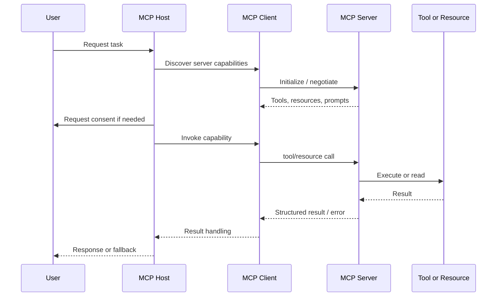

---
tags:
  - engineering
  - mcp
  - recipe
type: note
status: evergreen
source: "vault-local engineering"
parent_note: "[[06 Engineering/MCP/MCP - MOC]]"
---

# Recipe - Add MCP Server Integration

recipe สำหรับเพิ่ม MCP server ให้ application ใช้งานได้

---

## MCP Integration Sequence

ใช้ sequence นี้ตรวจ integration boundary: discovery, lifecycle, consent, invocation, result handling, error path, และ fallback ต้องชัดก่อนถือว่า MCP integration พร้อมใช้ในระบบจริง.

---

## Steps

1. ระบุ capability ที่ต้อง expose หรือ consume
2. เลือก boundary ว่าจะเป็น server หรือ client side
3. เชื่อม transport และ lifecycle ของ integration
4. map capability ให้เข้ากับ tool หรือ resource ที่ใช้จริง
5. ตรวจ consent และ permission boundary
6. ทดสอบ error path และ disconnect path
7. บันทึกว่าอะไรเป็น read-only และอะไรมี side effects

---

## Checklist

- รู้ว่า client/server ฝั่งไหนเป็น owner ของ capability
- มี consent path ชัด
- มี logging / observability
- มี fallback เมื่อ server ไม่พร้อม
