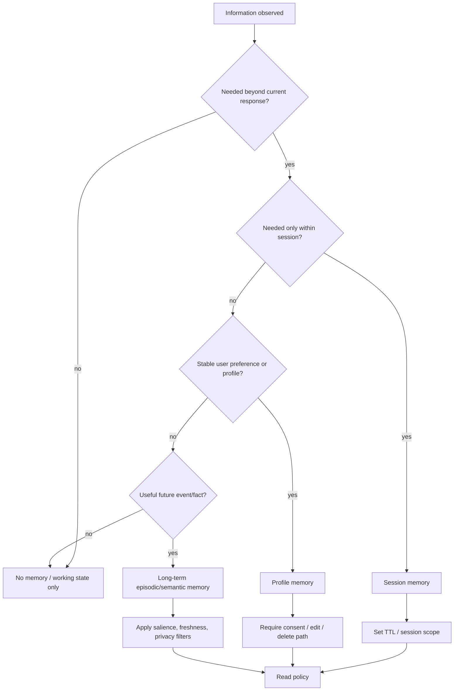

---
tags:
  - engineering
  - memory
  - decision
type: note
status: evergreen
source: "vault-local engineering"
parent_note: "[[06 Engineering/Memory/Memory - MOC]]"
---

# Decision - Choose a Memory Policy

decision note สำหรับเลือกว่าจะเก็บอะไรเป็น memory และเก็บอย่างไร

---

## Memory Policy Decision Tree

memory policy ควรเริ่มจากเหตุผลที่จะจำ ไม่ใช่จาก store ที่ใช้ ถ้าข้อมูลไม่เพิ่มคุณค่าในอนาคตหรือมี privacy risk สูงกว่าประโยชน์ ให้เก็บเป็น working/session state หรือไม่เก็บเลย.

---

## Context

- ข้อมูลนี้ต้องจำข้าม turn หรือไม่
- transient state พอไหม
- privacy หรือ retention constraint มีไหม

## Options

- no memory
- session memory
- profile memory
- long-term memory

## Criteria

- usefulness
- freshness
- privacy
- retrieval quality

## Decision

บันทึก policy ที่เลือก

## Consequences

- personalization
- stale memory risk
- storage and governance overhead
