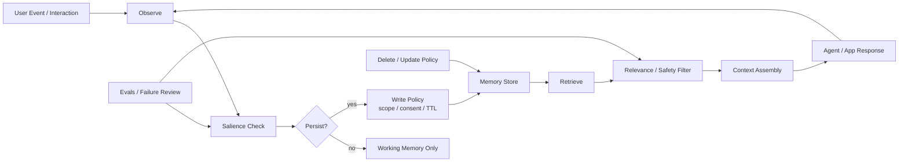

---
tags:
  - engineering
  - memory
  - recipe
type: note
status: evergreen
source: "vault-local engineering"
parent_note: "[[06 Engineering/Memory/Memory - MOC]]"
---

# Recipe - Add a Memory Layer

recipe สำหรับเพิ่ม memory layer ให้ระบบ agent หรือ application

---

## Memory Read / Write Pipeline

memory layer ต้องมีทั้ง read policy และ write policy ไม่ใช่แค่ store ข้อมูลเพิ่ม จุดที่ต้องตัดสินใจคืออะไรควรจำ, จำนานแค่ไหน, ใครมีสิทธิ์อ่าน, และ retrieved memory ผ่าน safety/relevance filter หรือยัง.

---

## Steps

1. แยกว่าอะไรควรเป็น transient state และอะไรควร persist
2. กำหนด memory object หรือ store ที่ใช้จริง
3. ออกแบบ write policy ว่าจะบันทึกอะไรเมื่อไร
4. ออกแบบ read policy ว่าจะดึงอะไรกลับมาเมื่อไร
5. เพิ่ม guardrails สำหรับ stale หรือ noisy memory
6. ทดสอบกับ use case ที่ต้อง reuse context ข้าม turn

---

## Checklist

- มี policy สำหรับ write/read ชัด
- ไม่ใช้ memory แทน context ทุกกรณี
- มีทางลบหรือแยกข้อมูลที่ไม่ควรจำ
- มี test สำหรับ retrieval quality
