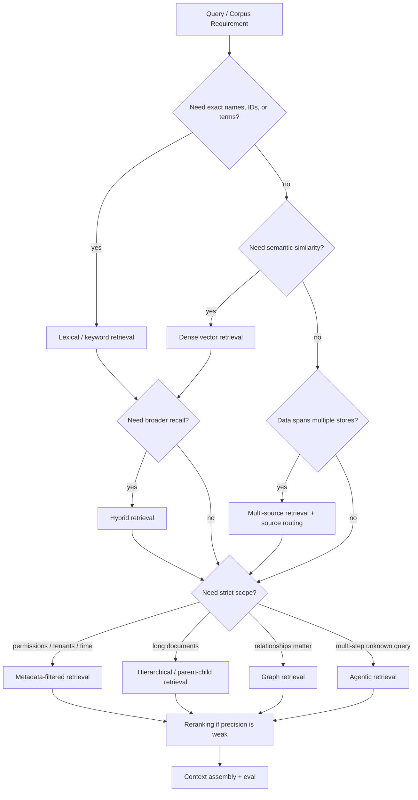

---
tags:
  - engineering
  - rag
  - decision
type: note
status: evergreen
source: "vault-local engineering"
parent_note: "[[06 Engineering/RAG/RAG - MOC]]"
---

# Decision - Choose a Retrieval Strategy

decision note สำหรับเลือกว่า RAG ควรใช้ retrieval แบบไหนในระบบนี้

---

## Retrieval Strategy Decision Tree

เลือก strategy จากข้อจำกัดของ query/corpus ก่อน แล้วค่อยเพิ่ม hybrid, filtering, hierarchy, graph, agentic retrieval หรือ reranking เท่าที่จำเป็น เพราะแต่ละชั้นเพิ่ม latency, cost, และ implementation complexity.

---

## Context

- ข้อมูลอยู่ที่ไหน
- query มีลักษณะแน่นอนหรือกว้าง
- ต้องการ recall หรือ precision มากกว่า
- token budget จำกัดแค่ไหน

## Options

- lexical retrieval
- dense retrieval
- hybrid retrieval
- multi-source retrieval
- metadata-filtered retrieval
- hierarchical / parent-child retrieval
- graph retrieval
- agentic retrieval
- reranking

## Criteria

- accuracy
- latency
- cost
- maintainability
- integration complexity
- permission / trust boundary
- source freshness

## Decision

บันทึกทางเลือกที่เลือกและเหตุผล

## Consequences

- ได้อะไร
- เสียอะไร
- สิ่งที่ต้อง monitor

---

## Related System Notes

- [[02 AI Systems/RAG/Retrieval/RAG - Hybrid Retrieval]]
- [[02 AI Systems/RAG/Retrieval/RAG - Multi-Source Retrieval]]
- [[02 AI Systems/RAG/Retrieval/RAG - Metadata Filtering and Permission-Aware Retrieval]]
- [[02 AI Systems/RAG/Retrieval/RAG - Hierarchical and Parent-Child Retrieval]]
- [[02 AI Systems/RAG/Retrieval/RAG - Knowledge Graph RAG]]
