---
tags:
  - engineering
  - rag
  - recipe
type: note
status: evergreen
source: "vault-local engineering"
parent_note: "[[06 Engineering/RAG/RAG - MOC]]"
---

# Recipe - Build a RAG Pipeline

recipe สำหรับเริ่มจาก RAG concept แล้วค่อยลง implementation แบบเป็นลำดับ

---

## Implementation Pipeline

```mermaid
flowchart LR
    A["Connector<br/>source systems"] --> B["Parser"]
    B --> C["Cleaner / Normalizer"]
    C --> D["Chunker"]
    D --> E["Metadata Validator<br/>permissions / source / lifecycle"]
    E --> F["Embedder"]
    F --> G["Index Writer<br/>vector / keyword / hybrid"]
    G --> H["Retrieval API"]
    H --> I["Reranker / Filters"]
    I --> J["Context Assembler"]
    J --> K["Answer Service"]
    K --> L["Citations / Logging / Evals"]
    L --> M["Refresh / Delete / Reindex"]
    M --> A
```

ใช้ pipeline นี้เป็น checklist สำหรับ implementation จริง: ingestion ต้อง preserve structure และ metadata ก่อน embed/index ส่วน runtime ต้องแยก retrieval, reranking, context assembly, answer generation, citation, logging, และ lifecycle maintenance ออกจากกันให้ตรวจได้.

---

## Steps

1. กำหนด retrieval goal ให้ชัด
2. เลือกข้อมูลต้นทางและขอบเขตของ corpus
3. ออกแบบ ingestion pipeline: parse, clean, normalize, และ preserve structure
4. ออกแบบ chunking strategy ให้เหมาะกับข้อมูล
5. เติม metadata สำหรับ filtering, permission, citation, และ lifecycle
6. เลือก embedding model และ indexing backend
7. เลือก retrieval mode ที่ใช้จริงในระบบ
8. เพิ่ม reranking หรือ filtering ถ้าต้องการ precision สูงขึ้น
9. จัด context assembly ให้เหมาะกับ token budget
10. วาง grounding / citation / answer formatting
11. ทดสอบกับชุด queries ที่แทน use case จริง
12. เพิ่ม monitoring สำหรับ ingestion, retrieval, answer quality, และ stale index

---

## Checklist

- มี source of truth สำหรับ corpus แล้ว
- รู้ว่า retrieval success วัดจากอะไร
- มี lifecycle สำหรับ refresh, delete, expiration, และ reindex
- มี policy ว่าจะส่งอะไรเข้า context และไม่ส่งอะไร
- มี fallback เมื่อ retrieval ไม่พอ
- มี eval case สำหรับ regressions

---

## Related System Notes

- [[02 AI Systems/RAG/Core/RAG - Ingestion and Indexing Pipeline]]
- [[02 AI Systems/RAG/Retrieval/RAG - Metadata Filtering and Permission-Aware Retrieval]]
- [[02 AI Systems/RAG/Core/02 - Chunking Strategies]]
- [[02 AI Systems/RAG/Core/06 - Context Assembly]]
