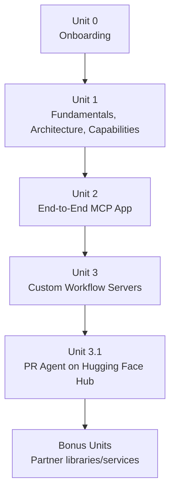
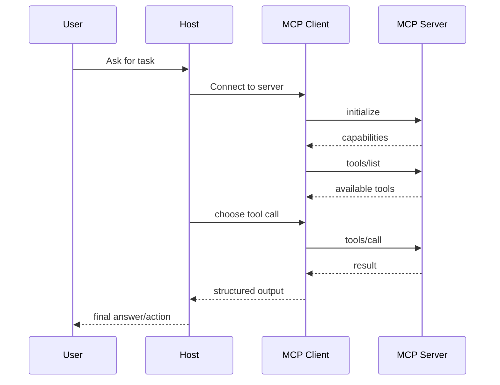
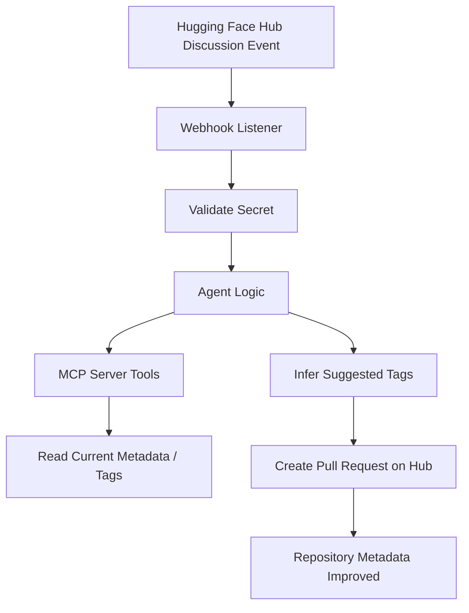
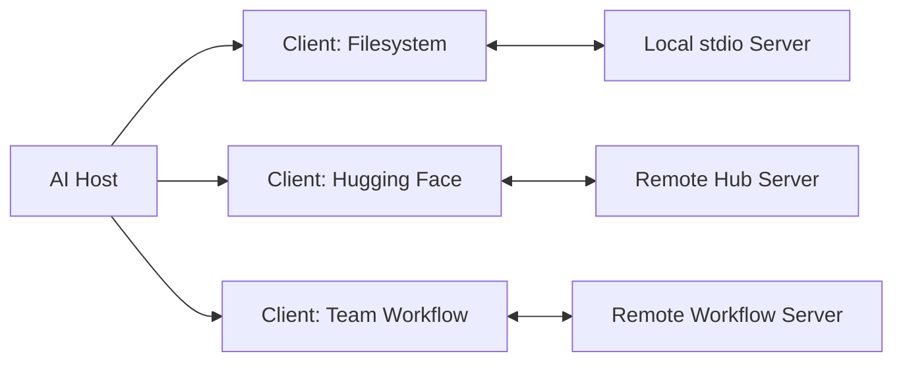

---
tags:
  - mcp
  - huggingface
  - gradio
  - implementation
  - course
  - synthesis
  - derived
type: note
status: evergreen
source: "https://huggingface.co/learn · MCP/MCP_Knowledge_Base.md (sections 10–18)"
parent_note: "[[06 Engineering/Recipes/Recipes - MOC]]"
---

# Recipe - HuggingFace MCP Course และ Implementation Guide

---

## HuggingFace MCP Course — ภาพรวม

> This is a derived implementation guide based on the course material, not a raw dump of the course itself.

คอร์สนี้สร้างร่วมกับ Anthropic พาผู้เรียนจากระดับเริ่มต้นไปสู่การใช้งานและสร้างแอป MCP จริง

**ผลลัพธ์ที่คาดหวัง:** เข้าใจ MCP เชิงแนวคิดและสถาปัตยกรรม, ใช้ MCP SDKs ได้, สร้าง MCP applications ที่ใช้งานได้จริง

---

## โครงสร้างคอร์ส

### Unit 0: Onboarding
- แนะนำคอร์ส, syllabus, certification
- Pace แนะนำ ~3-4 ชั่วโมงต่อสัปดาห์
- พื้นฐานที่ควรมี: AI/LLM, API concepts, Python/TypeScript เบื้องต้น

### Unit 1: MCP Fundamentals, Architecture and Core Concepts
หัวข้อ: Introduction to MCP, Key Concepts, Architecture, Communication Protocol, Capabilities, MCP SDK, MCP Clients, HuggingFace MCP Server, Gradio MCP Integration

**ผลลัพธ์:** อ่าน architecture ออก, เข้าใจคำศัพท์หลัก, รู้จัก primitives และ control boundaries, เริ่มทดลองเชื่อม client/server ได้

### Unit 2: End-to-End MCP Application
สิ่งที่สร้าง: MCP server ด้วย Gradio, sentiment analysis tool, client หลายแบบ (HuggingFace.js, smolagents), deployment ไป Hugging Face Spaces

**ผลลัพธ์:** มี project MCP แบบครบวงจร, เห็นภาพการต่อ server-host-client จริง

### Unit 3: Advanced MCP Development — Custom Workflow Servers
โจทย์: สร้าง MCP server สำหรับ development workflow, ใช้ Claude Code เป็น host ตัวอย่าง, integrate กับ GitHub Actions และ Slack

**ผลลัพธ์:** เข้าใจ MCP ใน production/team workflow context

### Unit 3.1: Build a Pull Request Agent on the Hub
Stack: Python, FastAPI, Hugging Face Hub API, webhook-driven workflow

โจทย์: monitor discussion/comment events → วิเคราะห์หา tag suggestions → สร้าง PR เพื่ออัปเดต metadata

**ผลลัพธ์:** เข้าใจ event-driven MCP workflow, pattern ที่รวม webhook + MCP server + agent logic



---

## Hugging Face MCP Server

- เชื่อม MCP-compatible assistants เข้ากับ Hugging Face Hub โดยตรง
- ใช้ได้กับ VS Code, Cursor, Zed, Claude Desktop
- Built-in tools: ค้นหา models, datasets, Spaces, papers
- ตั้งค่าผ่าน `https://huggingface.co/settings/mcp` → ระบบ generate config snippet ตาม client ให้
- รองรับ community tools ผ่าน MCP-compatible Gradio Spaces

---

## Gradio + MCP: ทางลัดสร้าง MCP Server

```bash
uv pip install "gradio[mcp]"
```

```python
import gradio as gr

def my_tool(input: str) -> str:
    """docstring กำหนด schema อัตโนมัติ"""
    return result

demo = gr.Interface(fn=my_tool, ...)
demo.launch(mcp_server=True)
```

- Gradio function ถูก map เป็น MCP tools อัตโนมัติ
- schema ของ arguments ถูก derive จาก input components / type hints / docstrings
- deploy ไป Hugging Face Spaces ได้

**เมื่อใช้ Gradio:** prototype เร็ว, ไม่ซับซ้อน
**เมื่อใช้ FastMCP/custom:** custom workflow, event-driven logic ซับซ้อน

---

## Implementation Guide

### ถ้าเป็น Host/Application Developer

**ควรทำ:**
- implement client connection management
- ทำ approval UI สำหรับ tools/sampling
- รองรับ version negotiation และ dynamic discovery
- แสดง source/provenance ให้ผู้ใช้รู้ว่า context มาจากไหน

**ควรระวัง:**
- อย่าให้ server เข้าถึง data แบบ implicit มากเกินไป
- อย่า auto-run tools ที่มี side effects โดยไม่มี consent
- แยก trusted/untrusted servers

### ถ้าเป็น MCP Server Developer

**ควรทำ:**
- define capabilities ให้ชัด, ทำ input schema ให้แม่น
- ตั้งชื่อ tool/resource/prompt ให้สื่อความหมาย
- ออกแบบ tool ให้แคบและ composable
- ทำ error handling แบบคาดเดาได้
- คิดเรื่อง auth และ secret management ตั้งแต่แรกสำหรับ remote server

**ควรระวัง:**
- อย่าใส่ side effects ที่ไม่ชัดเจนไว้ใน tool description
- อย่า expose data กว้างเกินความจำเป็น

---

## Pattern เลือก Primitive ให้ถูก

| สถานการณ์ | Primitive ที่เหมาะ |
|---|---|
| Read-only context | `Resources` |
| Action หรือ computation | `Tools` |
| Reusable interaction template | `Prompts` |
| Server ต้องให้ host ช่วยคุยกับ LLM | `Sampling` |
| จำกัด workspace/filesystem | `Roots` |
| ขอข้อมูลเพิ่มจากผู้ใช้ | `Elicitation` |

---

## Implementation Blueprint

### Minimal Design Checklist

1. ระบุ role ก่อน — host, client, server หรือหลายอย่างร่วมกัน
2. เลือก transport — local = `stdio`, remote = `Streamable HTTP`
3. นิยาม capabilities — tool, resource, prompt อะไรบ้าง
4. ออกแบบ trust boundary — approval จุดไหน, auth แบบไหน
5. ออกแบบ discovery และ runtime UX — list เมื่อไร, cache ไหม
6. วาง observability — logging, error reporting, progress/cancellation

### Build Paths

| Path | สำหรับ | Stack |
|---|---|---|
| **A: Prototype เร็ว** | ทดลองใช้งาน | Gradio MCP → HuggingFace Spaces |
| **B: Production Workflow** | ระบบ team/enterprise | MCP SDK / FastMCP, auth, approval, webhook |
| **C: Research/Knowledge** | Knowledge-heavy tools | เน้น Resources + search tools + domain Prompts |

---

## Reference Flows

### Discovery + Execution Flow



### Event-Driven PR Agent Flow (Unit 3.1)



### Host with Multiple Servers



---

## เมื่อใช้และเมื่อไม่ใช้ MCP

**MCP เหมาะมากเมื่อ:**
- ต้องให้ AI ใช้เครื่องมือหลายตัวแบบ standardized
- ต้องการเปลี่ยน host/client/server ได้โดยไม่เขียน integration ใหม่
- ต้องการแยก tool provider ออกจาก app provider
- ต้องการ workflow ที่มี consent ชัดเจน

**MCP อาจยังไม่จำเป็นเมื่อ:**
- ระบบมีเพียง host เดียว tool เดียว ไม่มีแผนขยาย
- integration เป็น internal-only ไม่ต้องการ ecosystem/interoperability

---

## ดูต่อ

- [[02 AI Systems/MCP/Core/01 - MCP คืออะไรและแก้ปัญหาอะไร]]
- [[02 AI Systems/MCP/Core/02 - Architecture_ Host, Client, Server]]
- [[02 AI Systems/MCP/Core/03 - Core Primitives_ Tools, Resources, Prompts]]
- [[02 AI Systems/MCP/MCP - MOC|MCP - MOC]]
